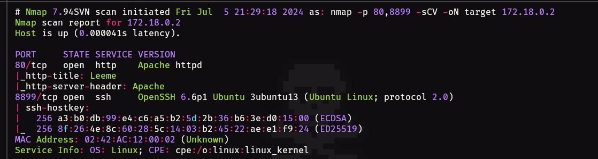
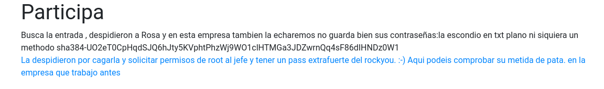
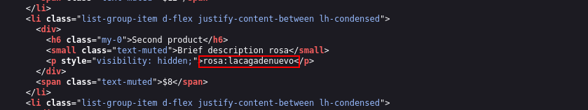
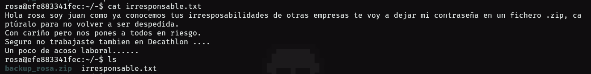
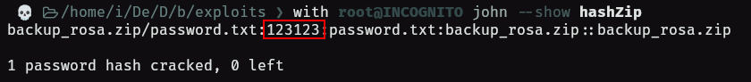
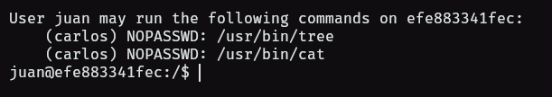
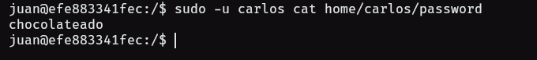
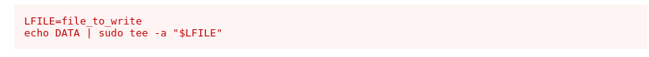

- Tags: #InformationLeakage #tee #zip2john 
_____
comenzamos la maquina con el escaneo típico de nmap en el cual se descubrieron dos puertos, el puerto 80 y el puerto 8899 el cual es el puerto de ssh y tiene la peculiaridad de que no es el típico puerto 22.
____

_______
tenemos una web la cual ya desde el comienzo nos muestra mensaje sobre lo pésimo que maneja rosa la seguridad en la empresa.
_____

_____
existe un apartado de formulario y si accedemos al mismo y verificamos el código fuente veremos lo siguiente.
_____

_____
parece ser unas credenciales por lo que procedemos a intentar conectarnos con ssh, pero como tiene un puerto diferente, debemos aplicar el parámetro **-p** y especificar el puerto por el cual corre el servicio.

```shell
ssh rosa@172.18.0.2 -p 8899
```

ingresamos y nos encontramos el siguiente fichero .txt
____

_______
también tenemos un archivo .zip el cual nos descargaremos para extraer su hash y aplicar fuerza bruta con john.
_____

____
y obtenemos una clave, la cual nos sirve para extraer el archivo, el archivo nos deja un fichero .txt el cual contiene lo que parece ser una contraseña, es esta lo que usaremos con el usuario juan.

con el usuario juan tenemos la oportunidad de pivotar al usuario carlos puesto que podemos ejecutar dos binarios como el usuario carlos sin proporcionar contraseña.
____

____
estos binarios los usaremos, primero para con el comando tree listaremos el contenido de la carpeta del usuario carlos, para posteriormente utilizar cat y poder leerlos.

si hacemos eso podremos obtener una contraseña.
_____

_____
para poder pivotar al usuario carlos, y ver de que forma podemos escalar a root.

tenemos que podemos ejecutar el comando tee como root sin proporcionar contraseña.

por lo que la escalada de privilegios luce de la siguiente forma.
____

______
lo tendremos que adaptar a nuestro escenario.

```bash
LFILE=/etc/sudoers
echo "carlos ALL=(ALL) NOPASSWD: ALL" | tee -a $LFILE
```

el comando tee toma la entrada del primer comando y la guarda en la ruta que le especifiquemos, por lo que este comando agrega una línea al archivo sudoers que permite al usuario `carlos` ejecutar cualquier comando como superusuario sin necesidad de una contraseña.

aplicamos el sudo su y obtendremos root al instante. fin
