- Tags: #flask #python #sha1 #hydra 
______
comenzamos la maquina aplicando un escaneo de nmap para ver que puertos se encuentran abiertos.

seguimos con el escaneo de servicios y versiones.
____
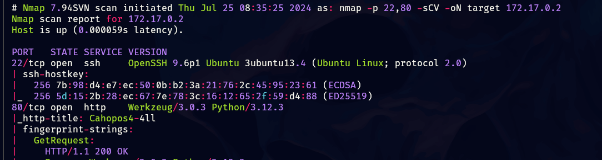
_____
obtenemos dos puertos abiertos, investigaremos primeramente el puerto 80 y vemos que encontramos.
____
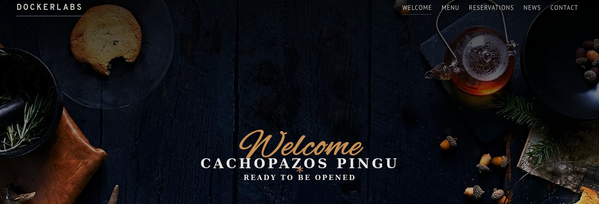
_____
tenemos una pagina web sobre algún restaurante, por lo que investigaremos a ver que encontramos.

no encontramos nada relevante, intentamos aplicar fuzzing pero sin éxito.

tenemos una clase de formulario al cuales ingresaremos datos y capturaremos la petición con BurpSuite.
_____
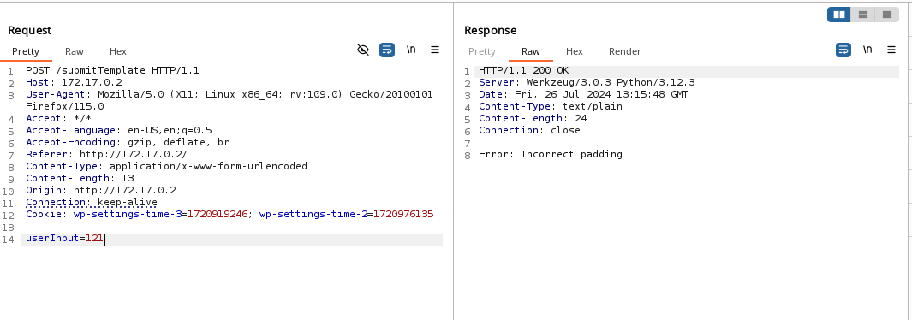
_____
enviamos la petición al repeter y vamos probando, como es bien sabido los errores nos pueden dar pista de a que nos enfrentamos.
______
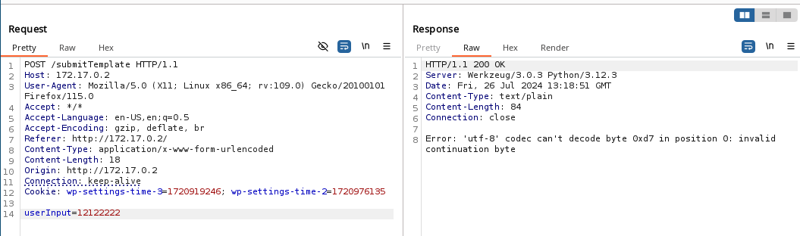
_______
si probamos con solo números nos sale el siguiente error, pero si colocamos una combinación alfanumérica nos aparece lo siguiente.
_____
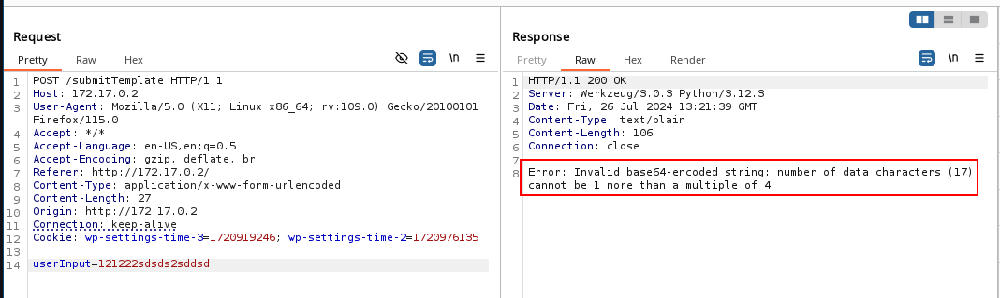
_____
nos indica que hubo un error al codificar la cadena en base64, lo siguiente que haremos es codificar un comando en base64 y colocarlo como imput para ver como reacciona.
____
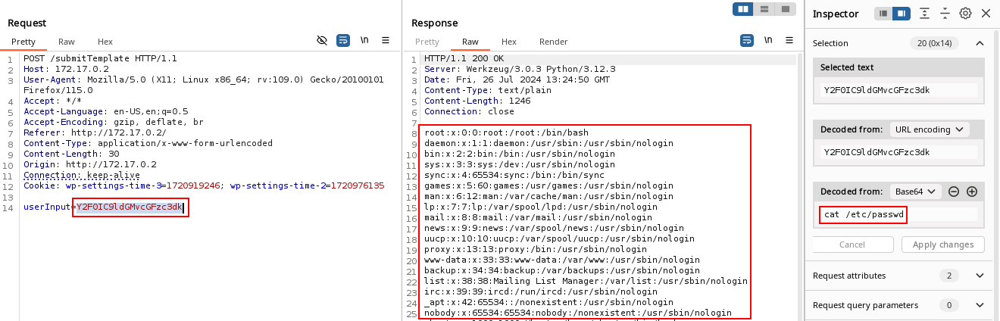
______
como podemos ver estamos viendo el contenido del /etc/passwd usando el comando cat, todo el comando codificado en base64.

tenemos usuarios por lo que podemos aplicar fuerza bruta para ssh con hydra, o también podemos mandarnos una reverse shell.

la primer opción fue la que elegí.
______
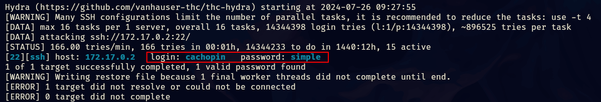
____
una vez dentro buscaremos la forma de escalar privilegios.

encontramos el código el cual permite que la pagina web sea vulnerable.
_____
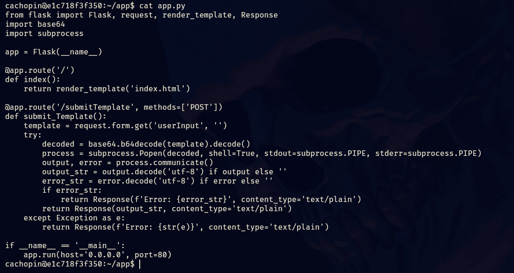
________
nos sirve para entender como funciona la vulnerabilidad.

La función `submit_Template` permite la ejecución de comandos arbitrarios enviados por el usuario debido al uso inseguro de `subprocess.Popen` con `shell=True`. Al decodificar el `userInput` y ejecutarlo sin validación ni sanitización, cualquier comando enviado en el `userInput` será ejecutado con los permisos del usuario que ejecuta la aplicación.

en directorio encontramos una fichero que contiene hashes
_____
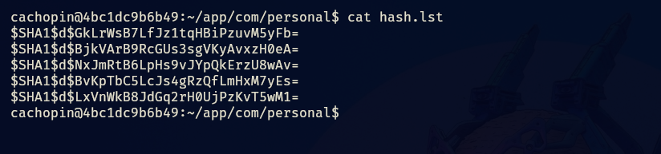
_____
utilizaremos una herramienta patxacSec la cual nos permitirá descifrar los hashes.
______
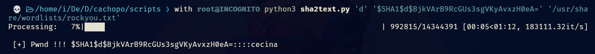
______
logramos crackear un hash el cual nos da la contraseña para root
_____
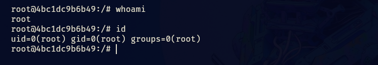