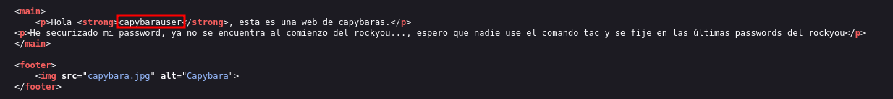
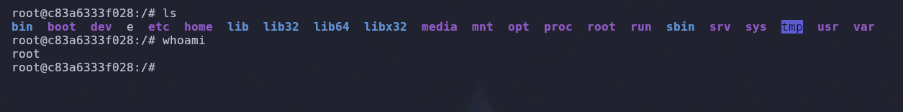

- Tags: #hydra #mysql #escalarPrivilegios #linux
______
comenzamos esta nueva maquina con un escaneo basico de reconocimiento en nmap, para luego realizar el escaner con los scripts basicos de reconocimiento.

tenemos una pagina que nos muestra un imagen, pero si nos vamos al codigo fuente de la pagina podemos observar lo siguiente.
____

____
vemos que **capybarauser** parece ser un usuario, y el escrito que aparece ahí nos dice que la contraseña no se encuentra al comienzo del diccionario de **rockyou** por que usaremos el comando **tac** para invertir el diccionario y asi poder conseguir la contraseña de forma mas rapido.

para aplicar el ataque de fuerza bruta utilizaremos hydra, con el siguiente comando podemos aplicar la fuerza bruta

``` shell
hydra -l <user> -P <diccionario> mysql://<direccion_ip> -t 4
```

obtenemos una contraseña la cual nos sirve para conectarnos a la base de datos, de esa base de datos obtenemos unas credenciales.
_____

_____
las cuales usaremos para conectarnos por ssh a la maquina victima.

una vez dentro de la maquina, aplicaremos el comando sudo -l para ver que permisos tenemos.
_____

_____
podemos ejecutar con sudo el nano, y nos aprovecharemos de ello para poder escalar privilegios.

```shell
sudo nano
R^X^ (CTRL+R - CTRL+X)
reset; bash 1>&0 2>&0
```

aplicando esos comando podremos llegar a ser root en la maquina.
_____


