- Tags: #pivoting #chisel #socks5 #curl
___
comenzamos la maquina aplicando un reconocimiento de puerto con nmap.

encontramos que los puertos 80 y 22 están abiertos por lo que investigamos la pagina web para ver que tenemos.

____
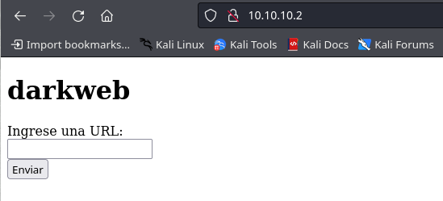
___
tenemos la siguiente pagina que nos dice que ingresemos una url, haciendo la prueba no nos arroja nada, por lo que aplicaremos fuzzing de directorios para ver que encontramos.
_____
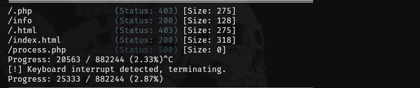
____
encontramos un directorio llamado info, si accedemos al mismo veremos la siguiente información.
___
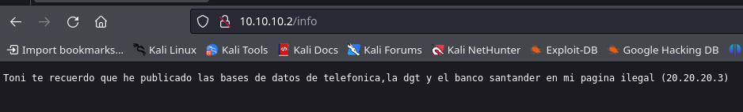
____
tenemos a un supuesto usuario, llamado toni, ademas tenemos una ip de un segmento de red diferentes. 

para este usuario aplicaremos fuerza bruta utilizando hydra para ssh.
_____

____
y tenemos una credencial valida para ssh, por lo nos conectaremos a la maquina y buscaremos pivotar a otra maquina.
_____
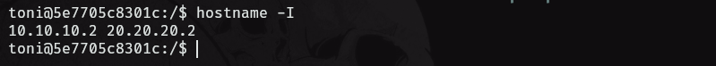
_____
si aplicamos un hostname veremos que la maquina victima tiene dos segmentos de red, el segundo segmento nos servirá como puente para el pivoting.

por mas que busquemos escalar privilegios en la maquina, no sera posible. por lo que igualmente el pivoting lo podemos hacer sin llegar a ser root.

para el pivoting utilizamos chisel, junto con el proxychains para configurar el túnel, ademas de usar foxyproxy para poder acceder a la web del segmento de red al que pivotemos.

## Pivoting 
______
empezamos descargando el chisel, una vez descargado utilizaremos el comando scp para subir el archivo por ssh al directorio /tmp.

podemos aplica un **upx** para bajar un poco el tamaño del chisel y así facilitar su transferencia.

configuramos el cliente de chisel del lado de la maquina victima y el servidor del lado de la maquina atacante.
____
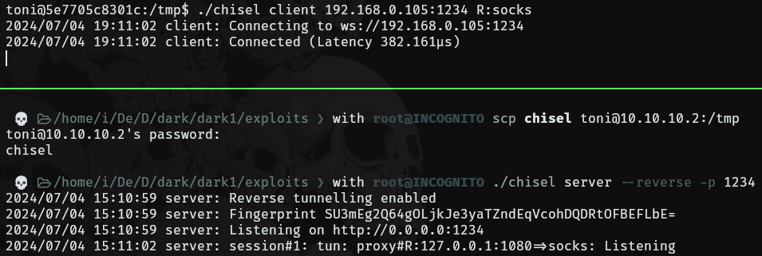
____
debemos configurar el archivo de proxychains y agregar el socks5, eso lo hacemos en el directorio **/etc/proxychains.conf**

ademas debemos configurar el foxyproxy para que nos muestre la pagina web del segmento de red en el que estamos.
_____
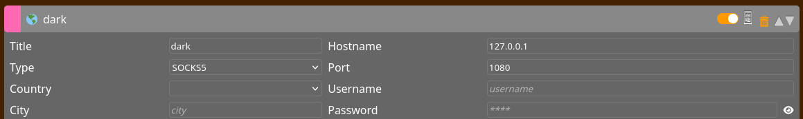
____
ahora si podemos acceder a la pagina web y ver que tal, accediendo a la ip que nos encontramos al principio.
____
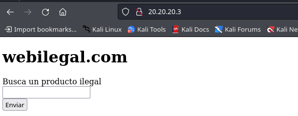
____
si aplicamos un curl a esta dirección URL veremos lo siguiente.
____
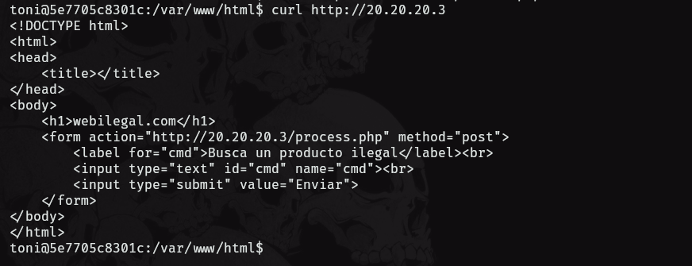
_____
tenemos un parámetro cmd lo cual no es muy habitual, verifiquemos comandos en la pagina para ver que tal.
____
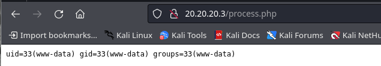
____
aplicamos el comando id y vemos la salida del comando, es hora de aplicar una reverse shell pero no a nuestra maquina, si no al segmento de red 20.20.20.2.
____
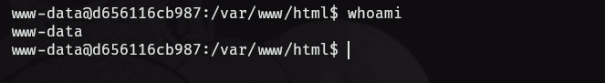
___
ganamos acceso a la maquina y aplicamos el tratamiento de la tty ahora busquemos la forma de escalar privilegios.
____
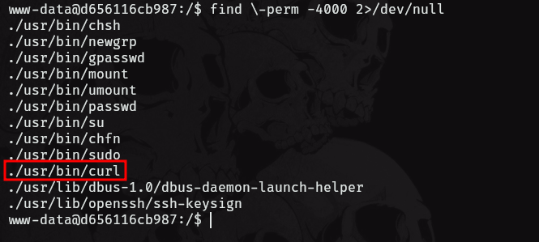
____
vemos que curl tiene permisos SUID por lo que alteraremos el archivo passwd el cual esta alojado en el directorio /etc. 

para esto haremos una copia del archivo al directorio tmp y lo modificaremos.

después aplicaremos el siguiente comando:

```shell
curl file:///tmp -o /etc/passwd
```

posteriormente aplicaremos un cat al archivo en el directorio /etc y verificaremos que se hayan guardado las modificaciones, para posteriormente aplicar un `su root`. 
___
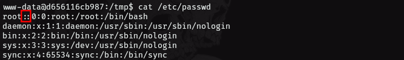
___
vemos que si hemos retirado la x por lo que ya tendríamos usuario root 