- tags: #esteganografía #fuerzaBruta #hydra #zip2john #stegcraker #steghide  
_______
comenzamos la maquina con un escaneo básico de reconocimiento con nmap, para reconocer tanto versiones como servicios que estén corriendo.

descubrimos que tenemos dos puertos abiertos.
____
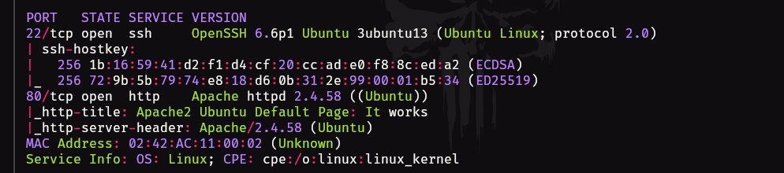
_____
el 22 - SSH y el 80 - http, tenemos una versión un poco antigua de ssh, pero buscando vulnerabilidades no encontramos nada relevante por donde tirar.

entonces verificamos el puerto 80 y veamos si encontramos algo.
_____
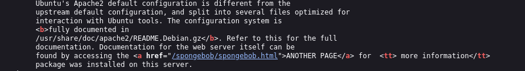
______
es una instalación reciente de apache y revisando su código fuente vemos algo que no debería de estar ahí, un link que dice spongebob.

si hacemos click nos llevara a la siguiente pagina.
____
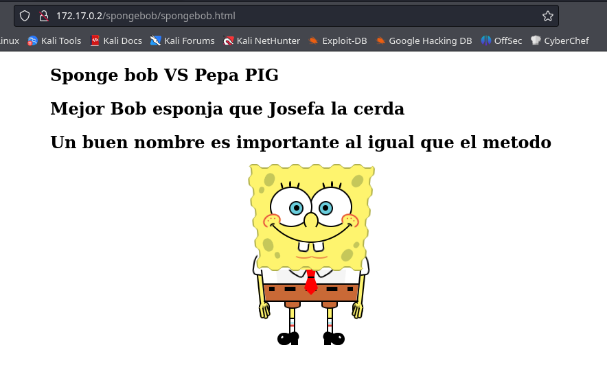
____
en el código fuente de este nuevo directorio no se nos comparte información.

por lo que procedemos a aplicar fuzzing para ver si encontramos otro directorios, para esto utilizaremos gobuster.
____
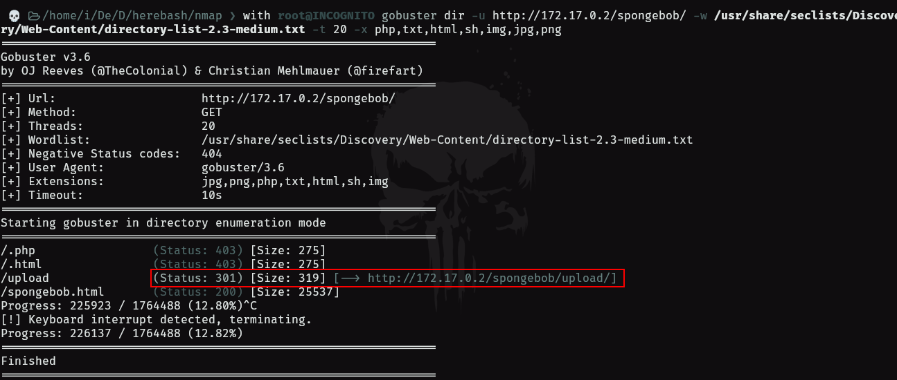
______
tenemos un directorio llamado upload pero nos marca un código 301 eso puede significar que existe contenido pero no lo podemos ver.
_____
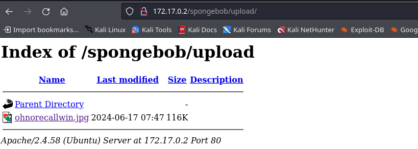
_____
vemos que tenemos una imagen dentro, esto se puede tratar de esteganografía, verificamos la imagen y la descargamos.
_____

____
verificaremos la imagen con `steghide info imagen` y nos dice que existe contenido en la imagen pero nos hace falta una contraseña para poder acceder al contenido.

podemos aplicar fuerza bruta con `stegcraker` para ver si encontramos la contraseña con la siguiente sintaxis.

```shell
stegcraker imagen <diccionario_a_utilizar>
```

_____
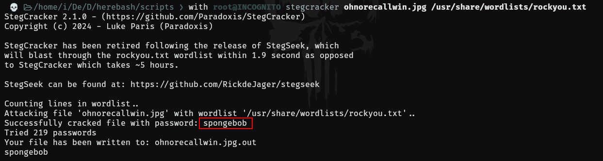
____
tenemos que la contraseña para el archivo es **spongebob**, aplicamos la contraseña y vemos que nos descomprime.

podemos utilizar **steghide** para extraer lo que haya dentro.

```shell
steghide extract -sf <imagen>
```

nos extrajo un comprimido con .zip el cual también requiere contraseña para acceder al mismo. 

utilizaremos **zip2john** para extraer el hash de contraseña del comprimido .zip para posteriormente utilizar **john** para descifrar ese hash.

```shell
zip2john archivo.zip > hashZip
```

de esa forma tendremos el hash para poder procesarlo con john.

```shell
john --wordlist=/ruta/del/diccionario hashZip
```

_____
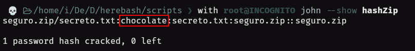
______
tenemos que para descomprimir el comprimido .zip utilizaremos la credencial **chocolate**.

al descomprimir el archivo no dejara un fichero .txt el cual en su interior tendrá la palabra **aprendemos**, por lo que ahora nos toca aplicar fuerza bruta para encontrar una contraseña suponiendo que lo que encontramos es un usuario o encontrar un usuario suponiendo que lo que encontramos en una contraseña.

adelanto que no es un usuario, por lo que utilizamos hydra para realizar fuerza bruta aplica a la obtención de usuario.

```shell
hydra -L /diccionario -p aprendemos 172.17.0.2 ssh -f -t 16 
```

el parámetro -f es para que a la primera coincidencia se detenga hydra.
______
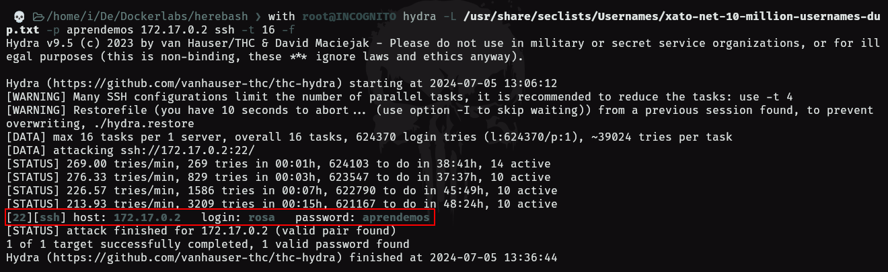
____
de esta forma tenemos las siguientes credenciales **rosa:aprendemos**, esto lo usaremos para conectarnos por ssh.

entramos como el usuario rosa, verificaremos si exiten mas usuario utilizando `cut -d: -f1 /etc/passwd`.
____
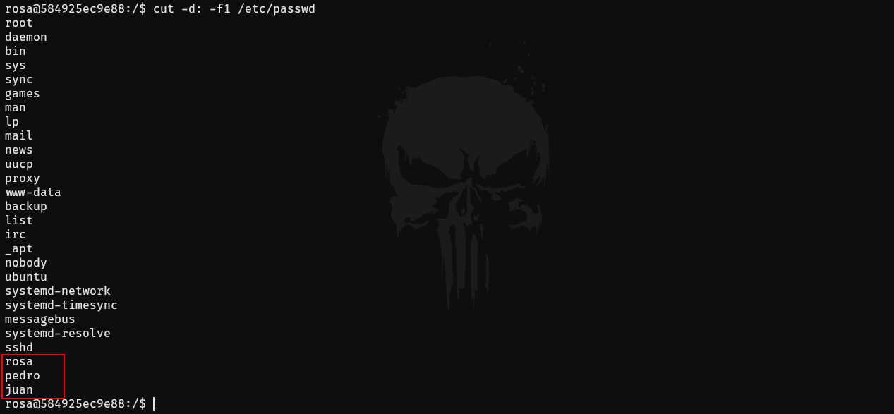
_____
tenemos 3 usuarios, ahora busquemos por los permisos SUID.

buscamos los ficheros de cada usuario pero no obtuvimos nada. 

pero si nos vamos al directorio **/home/rosa** veremos que existe un directorio **-** por lo que para acceder aplicamos **cd ./-**.

dentro de ese directorio encontraremos muchas carpetas ademas de un script el cual luce así.
____
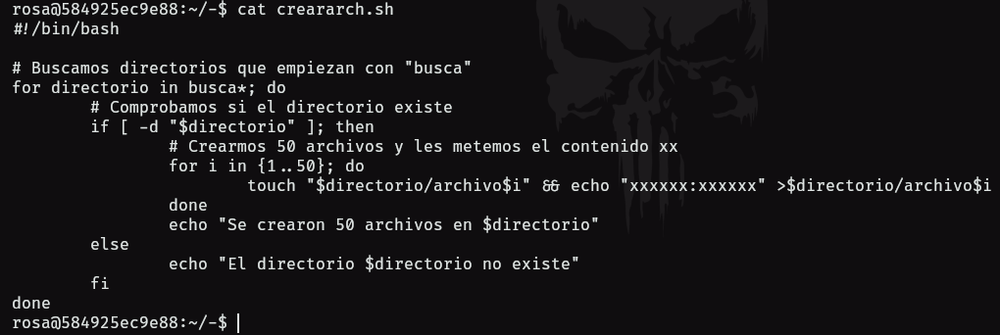
____
este script lo que es es crear por cada carpeta 50 archivos con la cadena de texto **xxxxxx:xxxxxx** debemos filtrar por el archivo que no contiene esas cadenas de texto.

podemos usar el método fácil el cual luce de la siguiente forma.

```bash
grep -rv "xxxxxx:xxxxxx" .
```

lo que hace buscar recursivamente por cada directorio **-r** mientras que excluye la cadena **xxxxxx:xxxxxx** con el parámetro **-v**. 

por otro lado podemos practicar bash scripting y podemos hacer un script en el cual por medio de un **blucle for** y condicionales **if then fi** podemos llegar al mismo resultado.

```bash
#!/bin/bash
for dir in */; then
	for file in $dir/*; then
		if grep -q "xxxxxx:xxxxxx" "$file"; then
			continue
		fi 
			echo "$file" | cat "$file"
	done
done
```

Primero, el comando `grep -q "xxxxxx:xxxxxx" "$file"` busca la cadena de texto "xxxxxx:xxxxxx" dentro del archivo especificado por la variable `file`. La opción `-q` (quiet) hace que `grep` no imprima nada en la salida estándar; en su lugar, `grep` simplemente devuelve un estado de salida que indica si se encontró o no la cadena de texto. Si la cadena se encuentra dentro del archivo, `grep` devuelve un estado de salida de éxito (0).

En el contexto de los comandos de shell en sistemas Unix-like, `*/` y `/*` tienen significados muy diferentes debido a su uso en la expansión de nombres de archivos y patrones de coincidencia:

- `*/` se utiliza para hacer referencia a todos los directorios dentro del directorio actual. El asterisco (`*`) actúa como un comodín que coincide con cualquier cadena de caracteres, y la barra al final ([`/`](vscode-file://vscode-app/usr/share/code/resources/app/out/vs/code/electron-sandbox/workbench/workbench.html "/home/incognito/Desktop/bash/")) especifica que solo se deben incluir los directorios. Por lo tanto, cuando se usa en un script de shell o en la línea de comandos, `*/` expandirá a la lista de todos los directorios en el directorio actual, excluyendo archivos y enlaces simbólicos que no sean directorios.
    
- `/*`, por otro lado, se utiliza para hacer referencia a todos los archivos y directorios en la raíz (`/`) del sistema de archivos. Aquí, la barra inicial (/) especifica el directorio raíz del sistema de archivos, y el asterisco (`*`) nuevamente actúa como un comodín que coincide con cualquier nombre de archivo o directorio. Por lo tanto, `/*` expandirá a la lista de todos los archivos, directorios y enlaces simbólicos directamente bajo el directorio raíz del sistema.
____
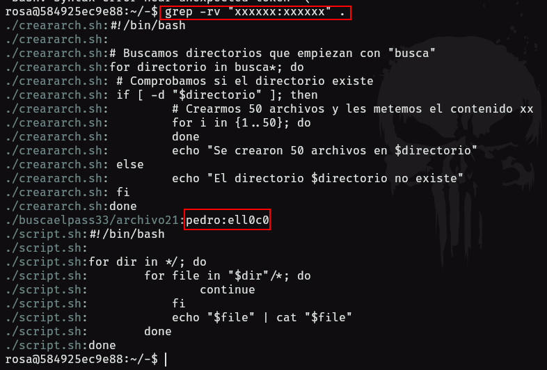
____
con las credenciales obtenidas podemos pivotar de usuario al usuario pedro.

verificamos que ficheros podemos leer o escribir y conseguimos lo siguiente.
____
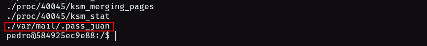
____
por lo que si lo leemos con cat podremos ver una credencial que nos servirá para pivotar al usuario juan.

juan tiene un directorio de usuario pero al parecer es vació pero si aplicamos un ls -la podremos ver lo siguiente.
____
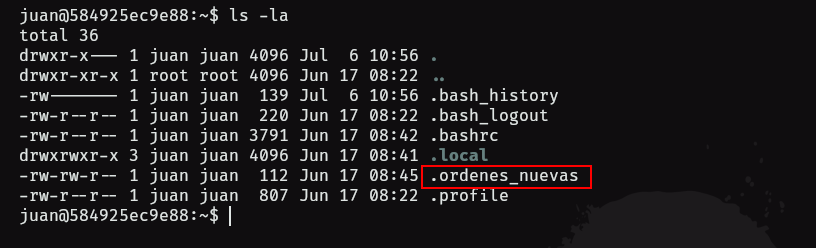
___
podemos revisar y nos dice lo siguiente.
_____
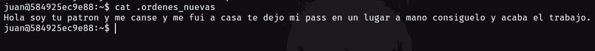
____
en la misma carpeta existe otro archivo oculto llamado .bashrc si comprobamos los alias encontraremos lo siguiente.
___
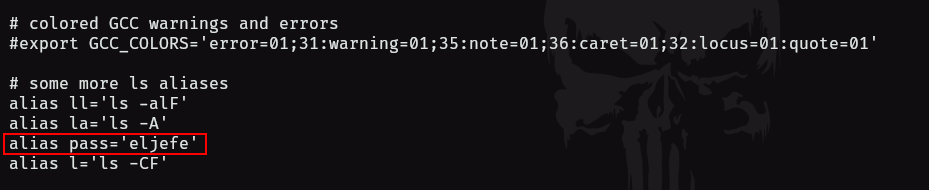
____
si aplicamos esa credencial para pivotar al usuario root lo podremos hacer sin problemas. 