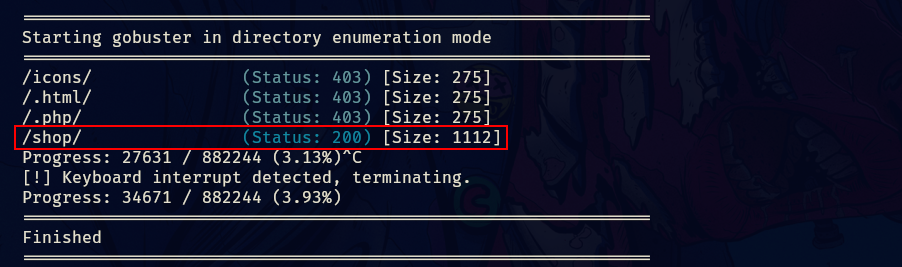
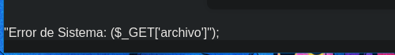
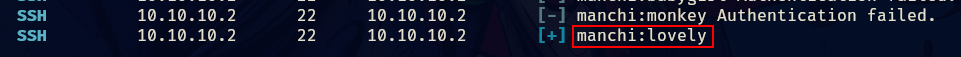
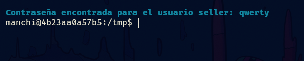

- Tags: #LFI #fuerzaBruta 
______
comenzamos la maquina con el escaneo típicos de nmap en el cual conoceremos los puertos abiertos.

```
nmap -p- --open -sS --min-rate 5000 -vvv -n -Pn 10.10.10.2 -oG allport
```

para posteriormente aplicar el escaneo de versiones y servicios del mismo nmap por lo que continuemos.

```
nmap -p 80,22 10.10.10.2 -sCV -oN target 
```

tenemos una pagina web la cual tiene la page de apache2 cuando esta recién instalado.

aplicando fuzzing con gobuster encontramos que tiene un directorio. 
_____

______
si vemos el directorio nos encontraremos con lo siguiente.
_____

_____
esto ya es un indicativo que nos permitirá guiarnos y lograr conseguir algo. 
____

______
tenia pinta de ser un RCE por como estaba representado en la imagen anterior pero resulto ser un escenario para explotar un Local File Inclusión.

esto nos da a conocer dos usuarios a los cuales aplicaremos fuerza bruta para ver si podemos acceder por ssh.
_____

____
utilice hydra al principio pero estaba tardando mucho por lo que al final opte por crackmapexec. 

lo importante es que tenemos credenciales por lo que accedemos a la maquina por ssh.
____

______
tenemos el usuario manchi y debemos pivotar al usuario seller, no vemos vectores obvios que nos permitan pivotar al usuario seller por lo que usaremos fuerza bruta para encontrar sus credenciales.

con un script de mario y una parte de diccionario de rockyou puesto que el original es muy pesado, separe una parte de mil contraseñas y ese fue el que utilice.

```shell
split -l 1000 /ruta/del/diccionario part_
```

utilizando ese comando para dividirlo.
____

_____
tenemos una contraseña para el usuario seller, por lo que ahora veremos como escalar a root.
____

_____
podemos ejecutar php sin proporcionar contraseña, por lo que aplicamos el siguiente comando de php.

```php
sudo su php -r "system('/bin/bash')"
```

____

____
y es así que logramos completar la maquina 