- Tags: #sqli #wordpress #PluguinWordPress #PHP 
_____
empezamos escaneando la dirección ip con nmap para ver que nos encontramos.

tenemos el puerto 80 abierto, procedemos a escanear el puerto con nmap para conocer el servicio y version que corre por el mismo.
_____

_____
tenemos una web que parece ser una academia, por lo que utilizando wappalyzer podremos ver que tenemos en la web.
____
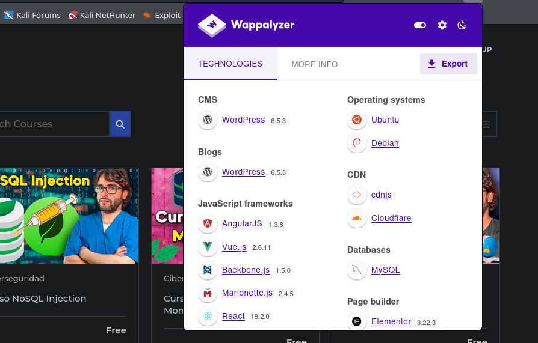
____
tenemos un wordpress pero listando los plugins instalados no encontramos un vector de taque solido. 

investigando por el código fuente podemos encontrar un posible usuario.
_____
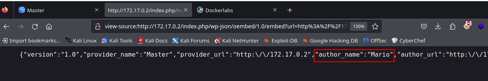
____
por lo que ahora solo nos falta una credencial, pero adelanto que no llegaremos a nada por esta vía.

investigando la pagina encontramos lo siguiente.
_____

_______
tenemos wp-automatic y una versión, por lo que si investigamos veremos que esa versión está sujeta a una vulnerabilidad en la base de datos, donde nos permite crear un usuario y ademas otorgarle permisos de administrador, de esa forma nos podremos conectar por el panel de login con el usuario recién creado.

la vulnerabilidad es la siguiente: CVE-2024-27956

si buscamos en la web encontraremos exploits automatizados para lograr explotar esta vulnerabilidad. 
_____
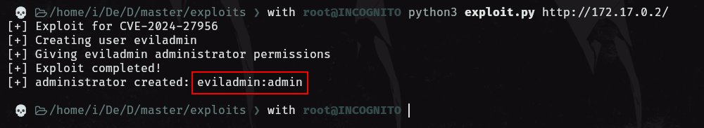
_______
tenemos credenciales confirmadas, con esas nuevas credenciales podremos ingresar por el panel de login.
_____
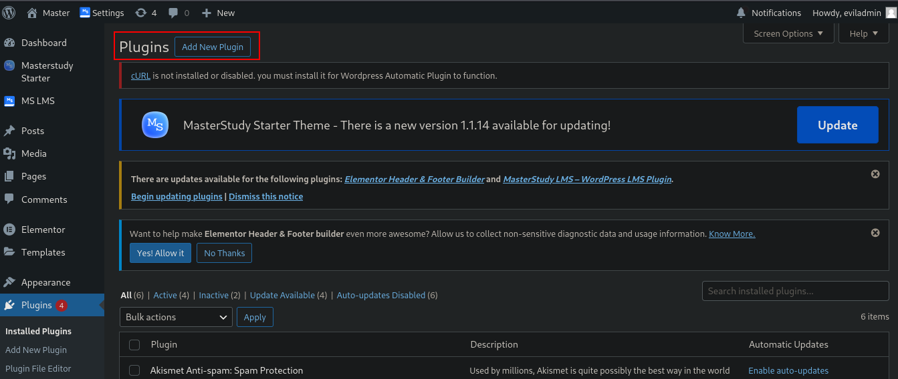
_____
estamos en el panel de administrador del wordpress y podemos subir plugin por lo que el siguiente paso sera crear un plugin malicioso, subir y activarlo.

para esto nos ayudaremos también de un exploit automatizado que utiliza msfvenom para crear el plugin.

una vez creado el plugin lo subimos, lo activamos y nos colocamos a la escucha con netcat para después dirigirnos a la ruta donde se aloja el plugin y de esa forma deberíamos de ganar acceso a la maquina.
______
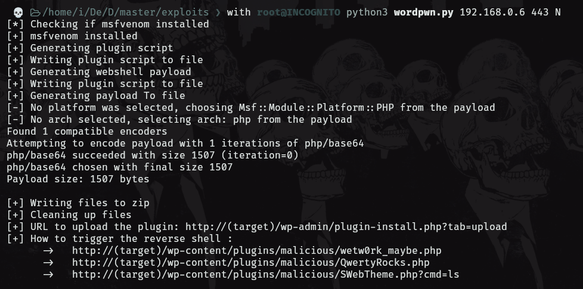
_______
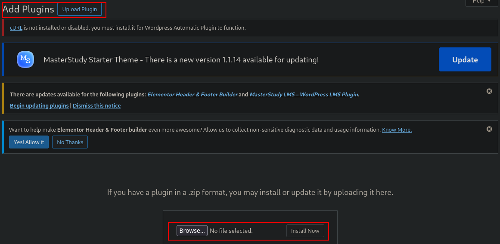
______
activamos el plugin
_____
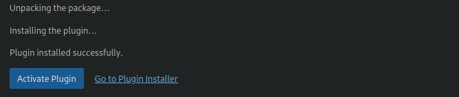
_____
el plugin creo un archivo malicioso php que nos permite ejecutar comandos desde la URL 
_____
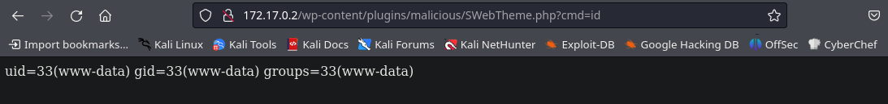
_____
el archivo php malicioso dede tener la siguiente estructura.

```php
<?php
	system($_GET['cmd']);
?>
```

esto es lo que nos permite ejecutar los comandos.

ahora enviemos una reverse shell para conectarnos a la maquina.
____
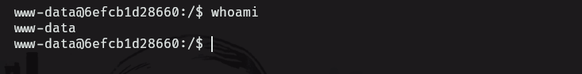
___
estamos dentro, aplicamos el tratamiento de la tty y posteriormente aplicaremos reconocimiento del sistema para buscar vectores para la escalada de privilegios.
____
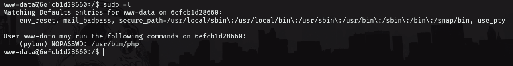
______
tenemos que podemos ejecutar php como el usuario pylon sin proporcionar contraseña.

por lo que escalaremos privilegios de la siguiente forma.

```php
sudo -u pylon php -r "system('/bin/bash');"
```

______
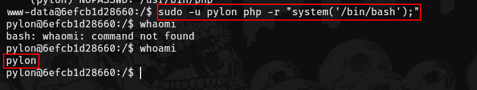
_____
somos el usuario pylon, pero si ejecutamos el comando sudo -l nuevamente veremos lo siguiente.
____
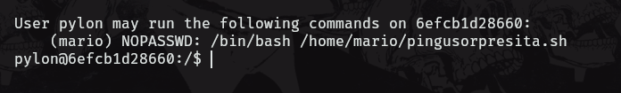
_____
acá usaremos una técnica explicada por mario en su canal de youtube para pivotar al usuario mario
_____
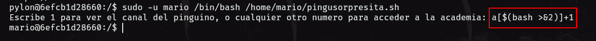
______
```bash
a[$(bash  >&2)]+1
```

de esta forma pivotamos a mario, por lo que aplicamos nuevamente el comando sudo -l y vemos lo siguiente.
______
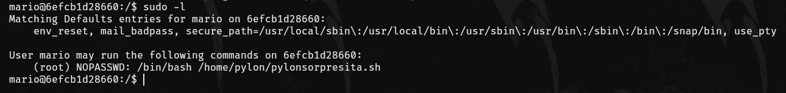
______
para obtener root haremos el mismo proceso que hicimos para pivotar al usuario mario.
______
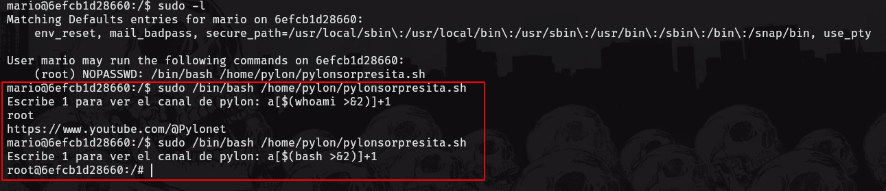
_____
logramos el root.