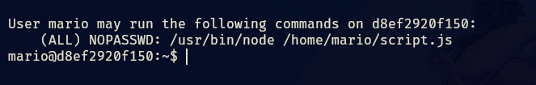

- Tags: #FTP #javascript #nodejs
____
comenzamos la maquina aplicando el típico escaneo de nmap y nos reporta lo siguiente.
_____

_____
vemos de una que el puerto 21 (ftp) es vulnerable a utilizar el usuario de invitado anonymous, por lo que nos conectamos al servicio solamente proporcionando el usuario anonymous.
_____

___
vemos que tenemos un comprimido el cual tiene contraseña para poder acceder a su contenido por lo que utilizaremos zip2john para poder extraer su hash y con john poder crakear la contraseña.
_____

____
tenemos la contraseña, podemos descomprimir el archivo y a ver que tiene en su interior.
___

_____
tiene credenciales que usaremos para conectarnos por ssh.
____

_____
entramos como el usuario mario y vemos que en nuestro directorio existe un script.js y también noto que tiene permisos de escritura.

si aplicamos un sudo -l veremos lo siguiente.
______

____
podemos ejecutar dicho script como super usuario sin proporcionar contraseña, por lo que nos disponemos en cambiar los permisos de la /bin/bash.

el script tendrá el siguiente contenido:

```javascript
const { exec } = require('child_process');

exec('chmod u+s /bin/bash', (error, stdout, stderr) => {
    if (error) {
        console.error(`Error: ${error.message}`);
        return;
    }
    if (stderr) {
        console.error(`Stderr: ${stderr}`);
        return;
    }
    console.log(`Stdout: ${stdout}`);
});
```

_____
ejecutamos el script y aplicamos un bash -p para obtener root.
_____

