- Tags: #inyeccionComandoPython #knock #Portknocking #wireshark #tcpdump 
____
comenzamos la maquina aplicando el escaneo de nmap.

```shell
nmap -p- --open -sS --min-rate 5000 -vvv -n -Pn 17.18.0.2 -oG allport 
```

para después aplicar el escaner de servicios y versiones a los puertos abiertos.

nmap nos reporta lo siguiente.
_____
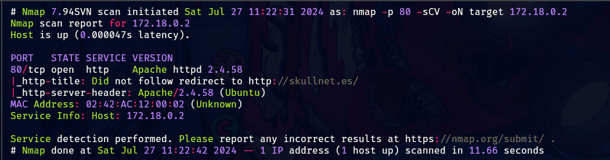
______
tenemos el puerto 80 abierto, veremos que tenemos y posteriormente tomaremos acciones.

de primera debemos aplicar virtual hosting, agregando el dominio de skullnet.es al hosts de nuestra maquina, para que nos resuelva el contenido de la misma y nos muestre dicho contenido.
_____

_____
tenemos lo siguiente, si apretamos el botón o intentamos capturar su petición con burpSuite, no pasara nada puesto que simplemente es un botón de adorno.

por lo que nos disponemos aplicar fuzzing luego de haber revisado el código fuente y no encontrar nada relevante.

se aplico fuzzing con herramientas como wfuzz y gobuster en las cuales no tuve resultados sólidos, por lo que opte utilizar `dirb`, esta herramienta me reporto lo siguiente.
_____
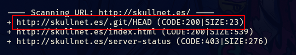
_____
tenemos lo que viene siendo un repositorio, por lo que usando `wget` de forma recursiva nos traemos todos lo archivos del repositorio y ahora podemos explorar los logs de git y ver que encontramos.
_____
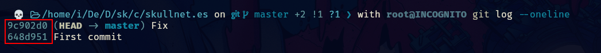
____
tenemos dos commits el primero de abajo contiene lo siguiente.
_____
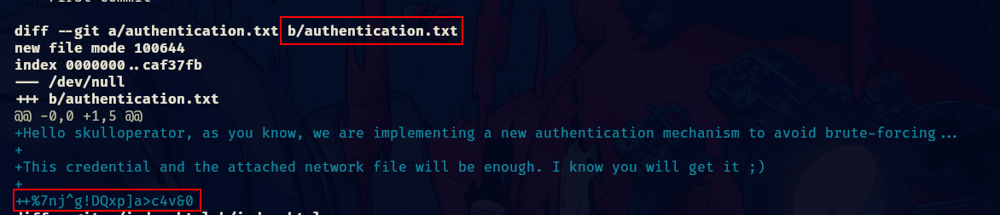
_____
contiene un mensaje y al parecer hay un fichero .txt eliminado el cual veremos si podemos recuperar.

encontramos un segundo archivo.
_____
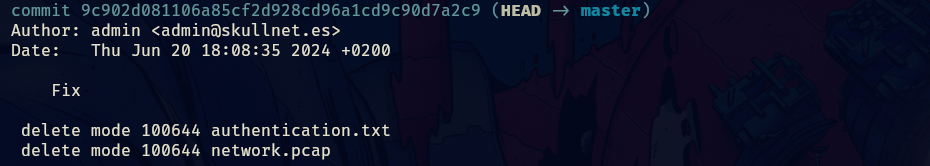
_______
podremos recuperar esos archivo si aplicamos el siguiente comando de git.

```shell
git checkout 9c902d081106a85cf2d928cd96a1cd9c90d7a2c9^ -- network.pcap
```

este mismo comando también aplica al otro, ahora veamos los archivo.
_____
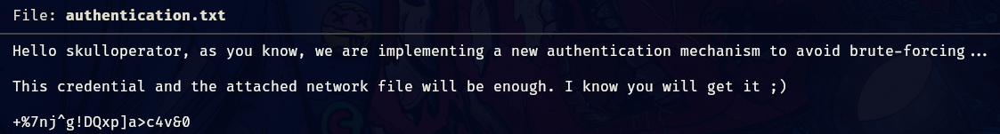
______
el fichero .txt contiene el mensaje que ya vimos anteriormente, pero el otro archivo parecer una captura de trafico de red, para poder abrirla podemos utilizar tcpdump o wireshark.

en esta ocasión utilice tcpdump, el output suele ser un poco mas difícil de entender, por lo que se recomienda wireshark si quieres hacer un análisis mas completo de la captura de red.
_____
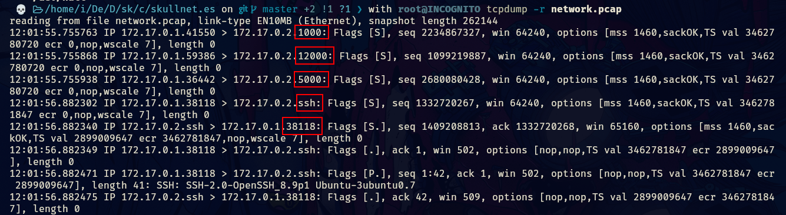
______
se pueden ver nuevos puertos y lo que parece ser una conexión por ssh, por lo que esto podría ser algo que ya se vio anteriormente y es el port knocking, podemos tocar los puertos que ahí se nos muestran con knock para ver si se nos abre otro puerto como el 22 por ejemplo.

aplicando regex para filtrar solo por las ip y sus puertos, ademas de aplicar un sort -u para evitar las repeticiones.

```bash
tcpdump -r network.pcap | grep -oP '\b\d{1,3}\.\d{1,3}\.\d{1,3}\.\d{1,3}\.\d{1,5}\b'| sort -u
```

obtenemos lo siguiente.
______
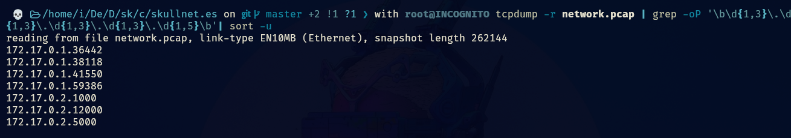
______
con knock probaremos todos eso puertos para ver si se nos abre otro.

aplicando el escaneo con nmap obtenemos que en efecto se nos abre el puerto 22, ahora podemos acceder mediante ssh, utilizando las credenciales que ya habíamos encontrado.
______
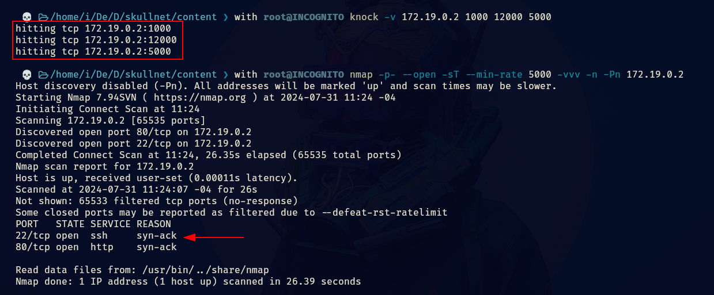
_____
ingresamos al sistema y obtenemos la flag de usuario.
____
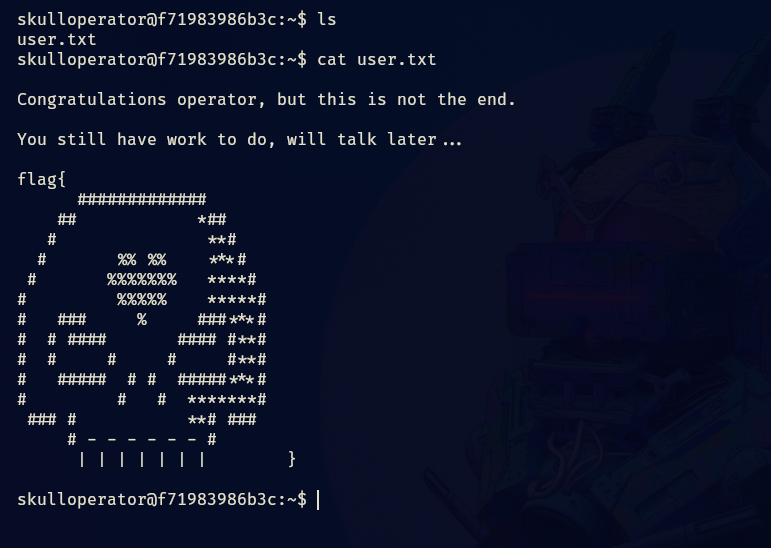
_____
ahora veremos como escalar privilegios y llegar a root.

si enumeramos los servicios que corren en el sistema encontraremos lo siguiente.
_____
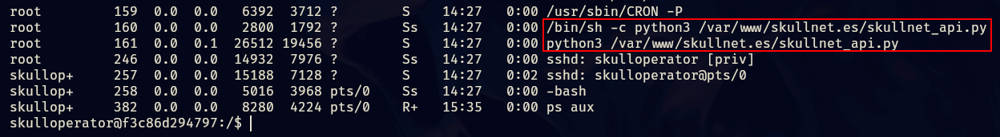
_______
se esta ejecutando un fichero .py, veamos su contenido.

```python
import http.server
import socketserver
import urllib.parse
import subprocess
import base64
import os

PORT = 8081

AUTH_KEY_BASE64 = "d2VfYXJlX2JvbmVzXzUxMzU0NjUxNjQ4NjQ4NA=="

class Handler(http.server.SimpleHTTPRequestHandler):
    def do_GET(self):
        
        auth_header = self.headers.get('Authorization')

        if auth_header is None or not auth_header.startswith('Basic' ):
            self.send_response(401)
            self.send_header("Content-type", "text/plain")
            self.end_headers()
            self.wfile.write(b"Authorization header is missing or incorrect")
            return
        
        clear_text_key = auth_header.split('Basic ')[1]
        
        decoded_key = base64.b64decode(AUTH_KEY_BASE64).decode()
        
        if clear_text_key != decoded_key:
            self.send_response(403)
            self.send_header("Content-type", "text/plain")
            self.end_headers()
            self.wfile.write(b"Invalid authorization key")
            return

        parsed_path = urllib.parse.urlparse(self.path)
        query_params = urllib.parse.parse_qs(parsed_path.query)

        if 'exec' in query_params:
            command = query_params['exec'][0]
            try:
                allowed_commands = ['ls', 'whoami']
                if not any(command.startswith(cmd) for cmd in allowed_commands):
                    self.send_response(403)
                    self.send_header("Content-type", "text/plain")
                    self.end_headers()
                    self.wfile.write(b"Command not allowed.")
                    return

                result = subprocess.check_output(command, shell=True, stderr=subprocess.STDOUT)
                self.send_response(200)
                self.send_header("Content-type", "text/plain")
                self.end_headers()
                self.wfile.write(result)
            except subprocess.CalledProcessError as e:
                self.send_response(500)
                self.send_header("Content-type", "text/plain")
                self.end_headers()
                self.wfile.write(e.output)
        else:
            self.send_response(400)
            self.send_header("Content-type", "text/plain")
            self.end_headers()
            self.wfile.write(b"Missing 'exec' parameter in URL")

with socketserver.TCPServer(("", PORT), Handler) as httpd:
    httpd.serve_forever()
```


## Explicación del codigo
________
veamos el codigo por partes.

```python
import http.server
import socketserver
import urllib.parse
import subprocess
import base64
import os

PORT = 8081

AUTH_KEY_BASE64 = "d2VfYXJlX2JvbmVzXzUxMzU0NjUxNjQ4NjQ4NA=="
```

- Se importan los módulos necesarios para el servidor HTTP, manejo de URLs, ejecución de comandos, codificación y decodificación en base64, y manejo de procesos del sistema.
- Se define el puerto en el que el servidor escuchará (`8081`).
- Se define una clave de autenticación codificada en base64 (`AUTH_KEY_BASE64`).

si decodificamos la cadena en base64 obtenemos lo siguiente.
____
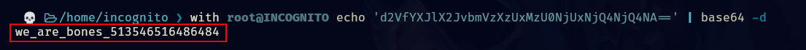
_____
esa es la clave que utilizaremos mas adelante.

```python
class Handler(http.server.SimpleHTTPRequestHandler):
    def do_GET(self):
        auth_header = self.headers.get('Authorization')

        if auth_header is None or not auth_header.startswith('Basic' ):
            self.send_response(401)
            self.send_header("Content-type", "text/plain")
            self.end_headers()
            self.wfile.write(b"Authorization header is missing or incorrect")
            return
        
        clear_text_key = auth_header.split('Basic ')[1]
        decoded_key = base64.b64decode(AUTH_KEY_BASE64).decode()
        
        if clear_text_key != decoded_key:
            self.send_response(403)
            self.send_header("Content-type", "text/plain")
            self.end_headers()
            self.wfile.write(b"Invalid authorization key")
            return

        parsed_path = urllib.parse.urlparse(self.path)
        query_params = urllib.parse.parse_qs(parsed_path.query)

        if 'exec' in query_params:
            command = query_params['exec'][0]
            try:
                allowed_commands = ['ls', 'whoami']
                if not any(command.startswith(cmd) for cmd in allowed_commands):
                    self.send_response(403)
                    self.send_header("Content-type", "text/plain")
                    self.end_headers()
                    self.wfile.write(b"Command not allowed.")
                    return

                result = subprocess.check_output(command, shell=True, stderr=subprocess.STDOUT)
                self.send_response(200)
                self.send_header("Content-type", "text/plain")
                self.end_headers()
                self.wfile.write(result)
            except subprocess.CalledProcessError as e:
                self.send_response(500)
                self.send_header("Content-type", "text/plain")
                self.end_headers()
                self.wfile.write(e.output)
        else:
            self.send_response(400)
            self.send_header("Content-type", "text/plain")
            self.end_headers()
            self.wfile.write(b"Missing 'exec' parameter in URL")
```
_____
- **Autenticación:**
    
    - Se obtiene el encabezado de autorización de la solicitud (`Authorization`).
    - Si el encabezado no está presente o no empieza con `'Basic'`, se devuelve un error 401.
    - Se decodifica la clave de autenticación base64 y se compara con la clave proporcionada en el encabezado. Si no coinciden, se devuelve un error 403.
- **Ejecución de Comandos:**
    
    - Se analiza la URL para extraer parámetros de consulta.
    - Si el parámetro `'exec'` está presente, se toma el comando asociado.
    - Se verifica que el comando empiece con uno de los comandos permitidos (`'ls'` o `'whoami'`).
    - Si el comando es permitido, se ejecuta y se envía el resultado. En caso de error, se devuelve un error 500.
    - Si el parámetro `'exec'` está ausente, se devuelve un error 400.
_____
ahora con curl podemos probar y ver que sucede.
_____
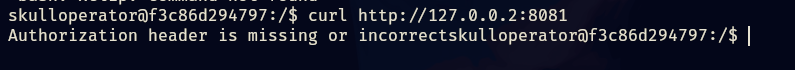
______
nos falta el encabezado, se lo colocamos y probamos nuevamente.
____
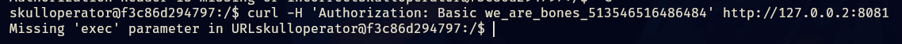
______
ahora nos dice que nos falta el parámetro exec, y con el parámetro exec podremos ejecutar el comando ls o whaomi.
____
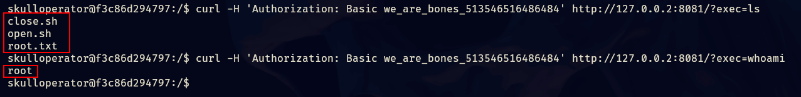
_____
este código es vulnerable a inyección de comandos, por lo que colocamos un ; para indicar que ahí termina el primer comando y le podemos indicar que ejecute otro, pero el siguiente comando que queramos ejecutar debe de estar urlencodeado.

para eso nos ayudamos de la herramienta `urlencode` desde consola.
_____
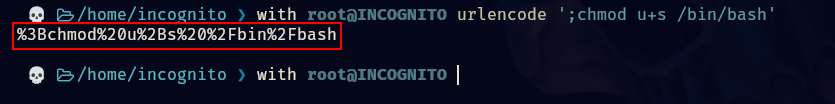
______
aplicamos el comando.
____
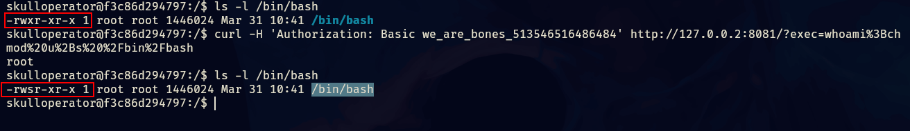
______
finalmente aplicamos bash -p y obtenemos root.
_____
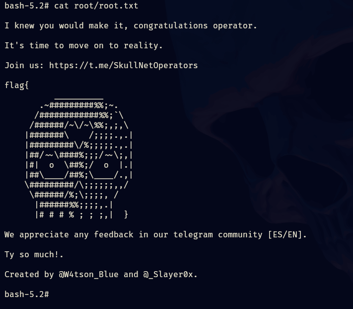
