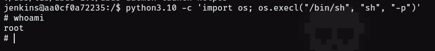

- Tags: #fuerzaBruta #BurpSuite #python 
_____
comenzamos la maquina con los tipicos escaneos de nmap.

se nos reporta un puerto abierto, por lo que aplicamos otro escaneo de nmap para determinar la version y el servicio que corre en ese puerto.
______

___
si ingresamos veremos que tenemos un panel de login de jenkins por lo que nos disponemos a ver su código fuente y comprobar si existe información útil.

no encontramos nada por lo que haremos fuzzing de directorios, pero tampoco obtenemos nada solido.

nos queda aplicar fuerza bruta al panel de login usando BurpSuite, por lo que capturamos una petición y la enviamos al repeter.
_____

______
seleccionamos el campo al que queremos aplicar fuerza bruta, en este caso aplicaremos fuerza bruta a la contraseña y emplearemos un ataque de tipo sniper utilizando un diccionario como rockyou.
____

_______
a su vez podemos configurar que tipo de error nos arroja cuando la credencial no es correcta, esto nos ayudara para saber la credencial que si es correcta, puesto que al no aparecer el error sabremos que el correcta.
______

______
empezamos el ataque y el mismo nos reportara una contraseña para el usuario admin:rockyou.

ingresamos y buscaremos la siguiente opcion.
____

_____
esto nos dará una consola donde podremos ejecutar código, pero no cualquier código, tenemos que utilizar groovy.

por lo que utilizaremos reverse shell generator para crear una reverse shell con nuestra ip y puerto.
_____

_____
aplicando esta reverse shell obtendremos acceso a la maquina victima.
_____

_______
buscamos por permisos SUID y vemos que tenemos a python por lo que buscaremos en gtfobins para ver como podemos escalar privilegios y utilizando python.
____

_______
aplicando ese comando de python podremos escalar privilegios a root.
_____

