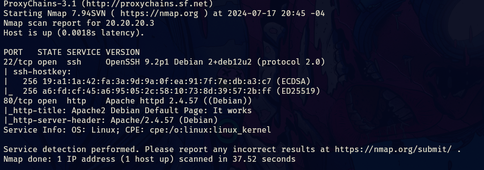
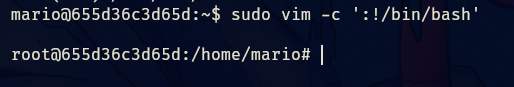

- tags: #ssh #pivoting #vim 
___
comenzamos aplicando el escaneo básico de nmap en este caso con el proxychains porque esta maquina se puede resolver normal o en un laboratorio de pivoting es lo mismo que el laboratorio normal, lo único que cambia son los comandos y sus sintaxis del lado del atacante.
___

_____
tenemos dos puertos abiertos, procedemos a aplicar los scripts basicos de reconocimiento.
____

_____
investigando la web no encontramos nada interesante por lo que aplicaremos fuzzing con gobuster para ver que encontramos. 
_____

_____
tenemos un fichero .php que al entrar en el mismo nos aparece lo siguiente.
___

____
por lo que mario es un posible usuario, probemos y apliquemos fuerza bruta con hydra.
____

_____
tenemos una credencial par el usuario mario y podemos conectarnos por ssh.
____

____
aplicando el sudo -l vemos que podemos ejecutar vim sin proporcionar contraseña por lo que veamos la forma de escalar privilegios.
______

____
tenemos que aplicando el siguiente comando ya podremos ser root.

```bash
sudo vim -c ':!/bin/bash'
```

