- Tags: #InformationLeakage #LibraryHijackingPython 
_________
comenzamos la maquina con los escaneos de nmap que nos reportan 4 puertos abiertos en lo que destacan los servicios de smb.
____
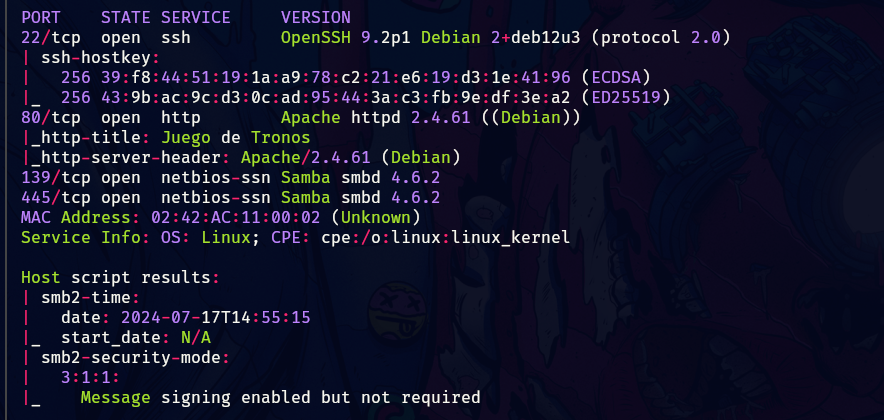
____
investiguemos primero el puerto 80, para ver que encontramos.
_____

____
tenemos de inicio un escrito donde se pueden apreciar 3 posibles usuarios, sigamos investigando para ver que mas nos encontramos.
_____
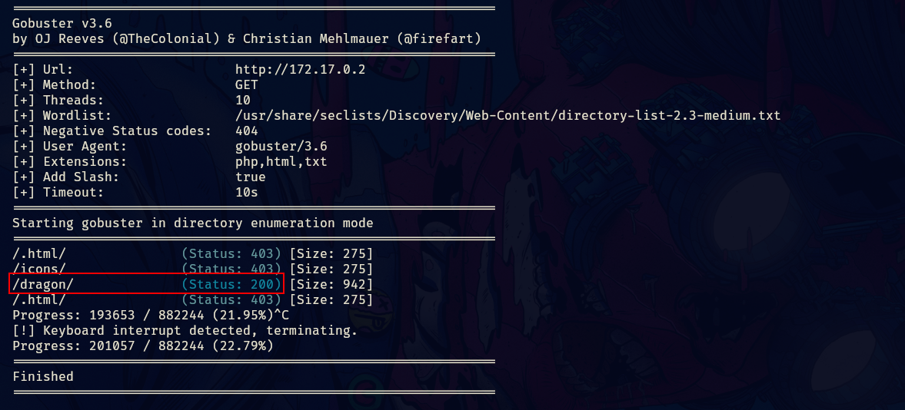
______
tenemos un directorio llamada dragon, por lo que accedamos para ver que contiene.
_____
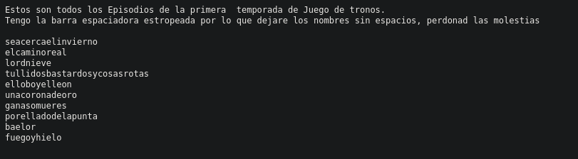
_____
contenía un archivo con este texto, podemos armar un diccionario pues no es casualidad que todas las palabras estén juntas.

esto es todo lo que encontraremos en la web, ahora podemos enumerar el servicio de samba, porque obviamente probamos los usuarios con las posibles contraseñas pero no obtuvimos resultados.

por lo que procedamos con samba y ver si podemos enumerar usuarios de ese servicio.

podemos utilizar rpcclient para ver si nos reporta usuarios.

```bash
rpcclient -U "" -N 172.17.0.2 
enumdomusers
```

utilizando `enumdomusers` para listar usuarios disponibles.
_____
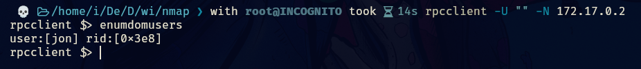
___
por lo que confirmamos un usuario de los 3 presuntos anteriores.

podemos utilizar crackmapexec para aplicar fuerza bruta al servicio de smb con el diccionario que creamos, para ver si podemos acceder al servicio en si.
_____
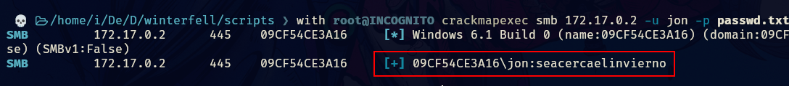
______
podemos acceder al servicio con esas credenciales.
_____
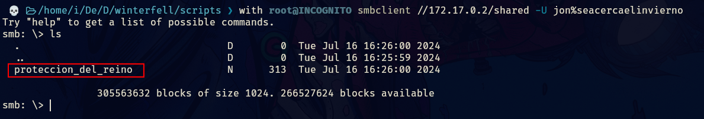
_____
podemos descargar el archivo con get y ver que contiene.
______
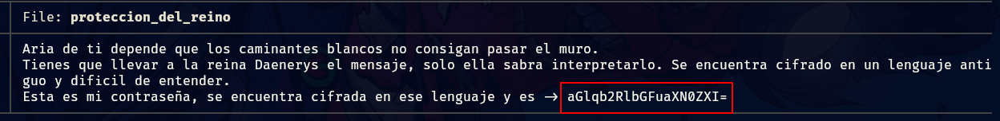
_______
tenemos una credencial codificada en base64 por lo que aplicaremos `base64 -d` para decodificar la credencial.
______
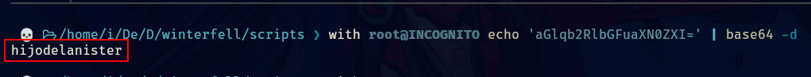
_____
obtenemos la clave vemos si podemos acceder por ssh con el usuario jon
____
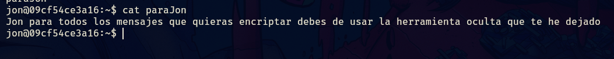
_____
ahora tenemos que ver como pivotar entre usuarios.
_____
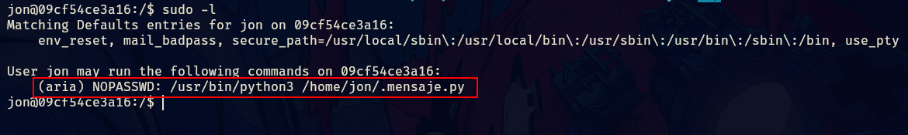
_____
podemos observar el contenido de mensaje.py para ver que nos encontramos.
_____
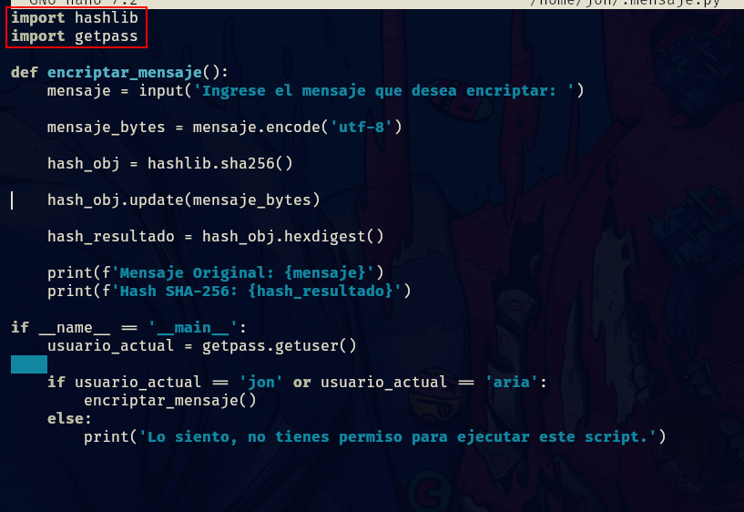
____
se están importando dos librerías pero no tienen su ruta absoluta por lo que se podría acontecer un Library Hijacking de python, lo que vamos hacer a continuación es comprobar las rutas donde python esta buscando estas librerías.

lo podemos hacer con el siguiente comando.

```python
python3 -c 'import sys; print(sys.path)'
```

______
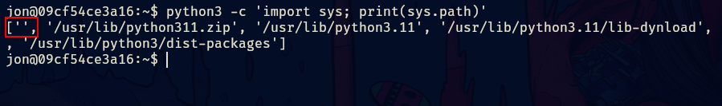
_____
esas comillas vacías nos indican que python primero busca por el directorio actual y si no encuentra nada prosigue con los demás directorios.

se evalúa de izquierda a derecha.

lo que haremos es crear un fichero .py con el nombre de una de las librerías que contiene el script con el siguiente contenido.

```python
import os
os.system("/bin/bash")
```

de esta forma cuando el script busque la librería que esta importando va a verificar primeramente nuestro directorio actual y si encuentra un fichero con el mismo nombre que el de la librería que busca pues utiliza ese.
_____
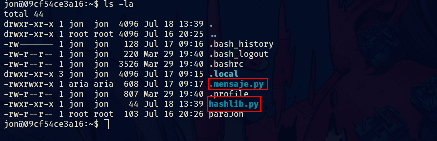
____
ahora ejecutamos el script como aria.
____
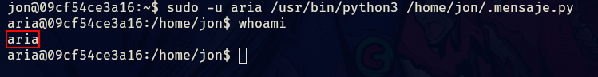
_____
ahora que somos aria solo nos falta un usuario al cual pivotar.
______
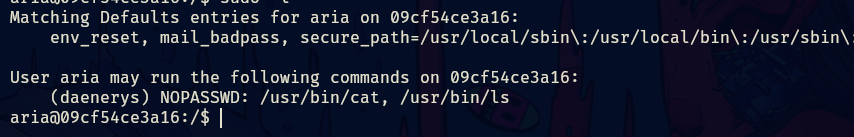
_____
aplicando el comando sudo -l vemos que podemos ejecutar cat y ls como daenerys, esto nos servirá para poder ver el contenido de su directorio, así podremos listar archivos y poder ver su contenido con cat.
_____
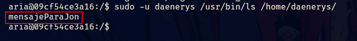
_____
tenemos un archivo, ahora veamos su contenido.
_____
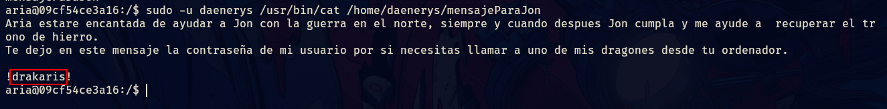
_____
obtenemos una credencial, ahora pivotaremos al usuario daenerys, y vemos como llegar a root.
_____
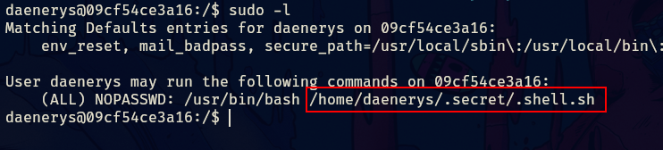
_____
tenemos un script en bash llamado shell vemos que permisos tenemos sobre el archivo.
____

_____
podemos modificar el script por lo que usaremos esto para escalar privilegios.
____
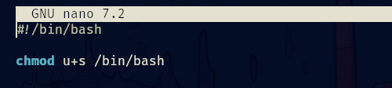
_____
guardamos, ejecutamos y aplicamos un bash -p y asi obtendremos root.
____
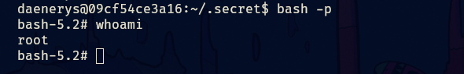
