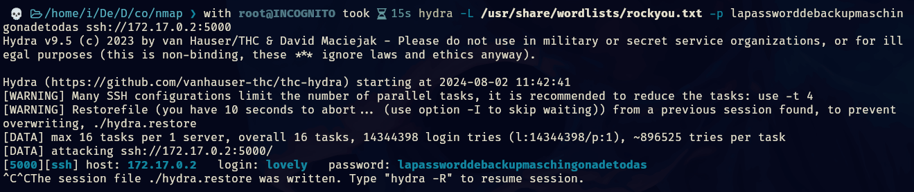

- Tags: #InformationLeakage #hydra 
_____
comenzamos la maquina con el tipico escaneo de nmap, y nos reporta lo siguiente.
_______

______
tenemos tres puertos abierto, y tenemos un ssh pero reasignado a otro puerto.

investigaremos la web para ver que obtenemos.
_____

_____
no obtenemos nada relevante por lo que investigaremos el código fuente.
_____

______
también podemos aplicar fuzzing para ver que encontramos.
_____

_____
si accedemos a ese recurso podremos visualizar lo siguiente.
____

____
obtenemos una password pero nos falta el usuario, por lo aplicaremos fuerza bruta con hydra para ver que nos reporta.
_____

______
ahora podemos conectarnos con ssh para después enumerar el sistema y ver como podemos escalar privilegios.
_____

_____
tenemos nano con permisos SUID por lo que podemos alterar el archivo passwd para inhabilitar la contraseña para ser usuario root, así podremos pivotar a root sin contraseña.
______

____
le quitamos la x, y ahora aplicamos un su root y automáticamente nos convertimos a root.
____
