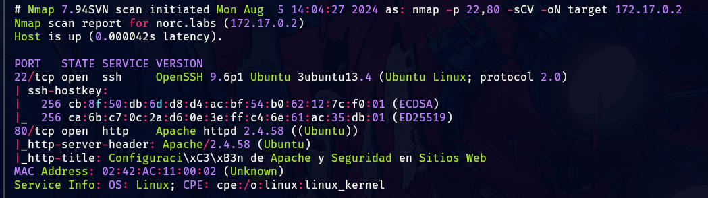
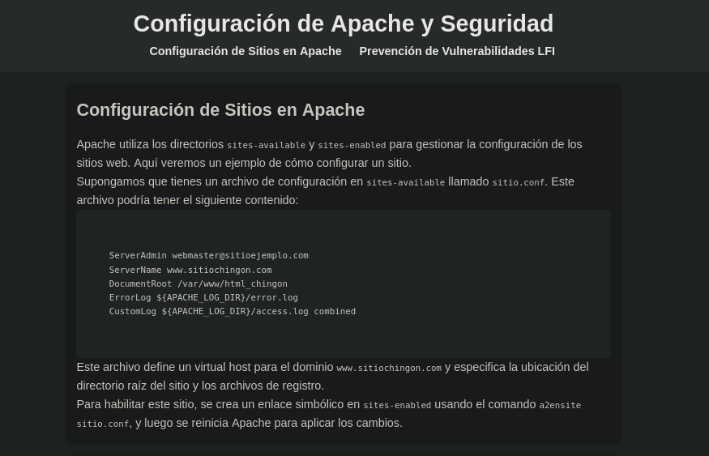
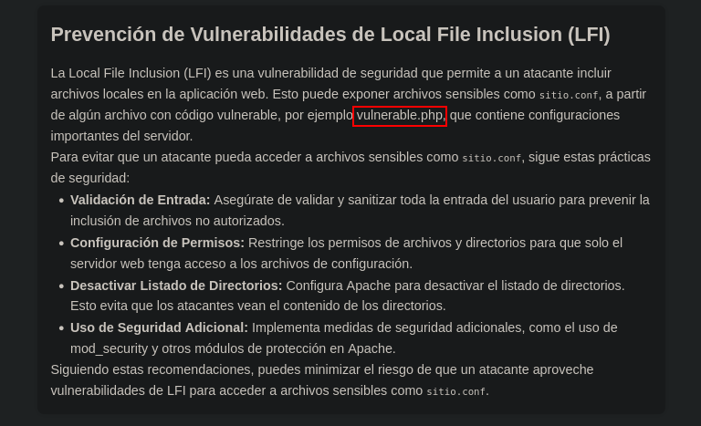
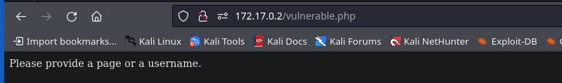
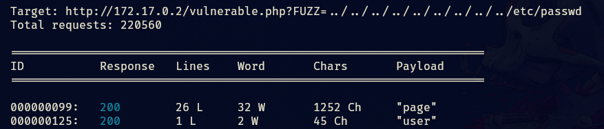
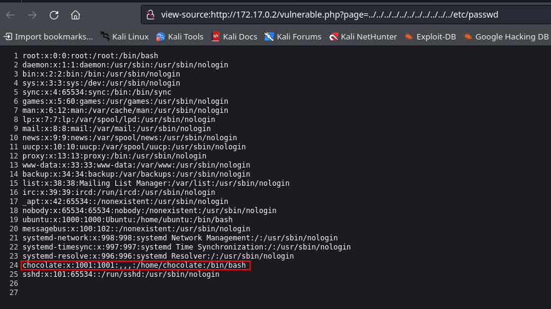
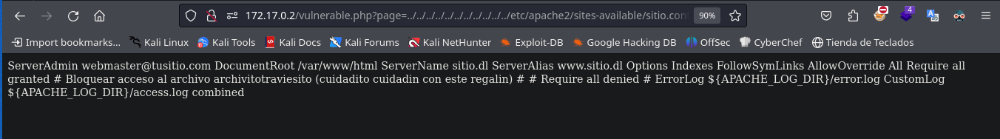
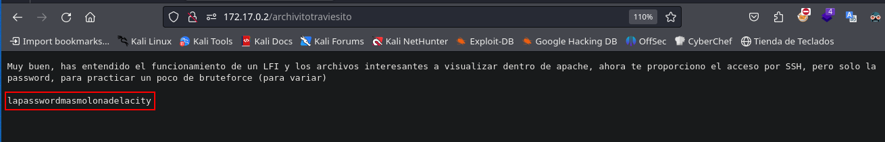
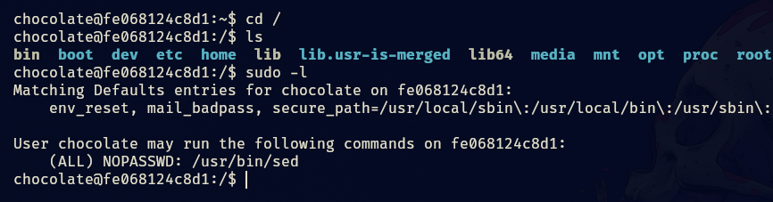
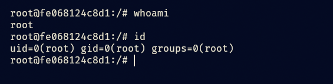

- Tags: #InformationLeakage #LFI #sed 
_______
comenzamos con los escaneos típicos de nmap los cuales nos permiten conocer los puertos abiertos, ademas de las versiones y servicios.
_____

_____
empezaremos investigando la pagina web para ve que encontramos.
_____

________
la pagina nos proporciona una serie de pista solo hay que unirlas, al parecer nos enfrentamos a un LFI.
_____

______
tenemos una fichero .php el cual verificaremos que exista.
_____

_____
nos aparece lo siguiente, si se trata de un LFI debemos encontrar la palabra que maneja la petición GET, para eso aplicaremos fuzzing.
_____

_____
usaremos el parámetro page, para ver si podemos llegar a ver el passwd.
_____

______
tenemos un posible usuario el cual si aplicamos fuerza bruta con hydra no obtendremos resultados, por lo que pienso que aun nos falta algo.

en la pagina web se menciona mucho un archivo sitio.conf el cual contiene información sensible, ahora mismo trataremos de identificar el archivo.
_______

______
el archivo se encontraba alojado en la siguiente dirección. `etc/apache2/sites-avalible/sitio.conf` y se identifico gracias a la pista de la pagina web.

podemos observar un mensaje que dice "bloquear acceso al archivo archivitotraviesito", veamos si el archivo existe.
______

_______
no tenemos que aplicar fuerza bruta, puesto que ya enumeramos un posible usuario por lo que intentaremos acceder y veremos que sucede.
_____

______
accedemos y vemos que podemos ejecutar sed como root y sin proporcionar contraseña, busquemos la forma de escalar privilegios.

esto ya lo hemos visto anteriormente por lo que aplicaremos el siguiente comando para pivotar a root.

```shell
sudo sed -n '1e exec bash 1>&0' /etc/hosts
```

_____



Fin.....